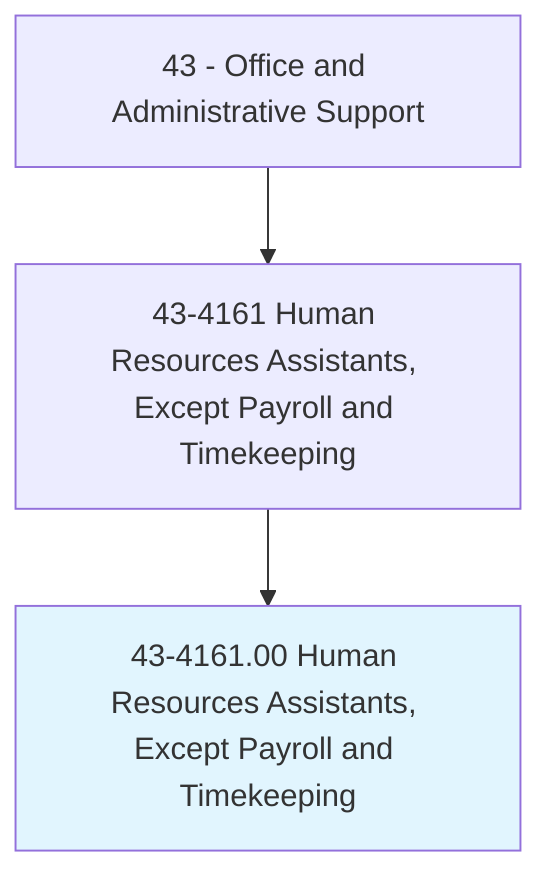
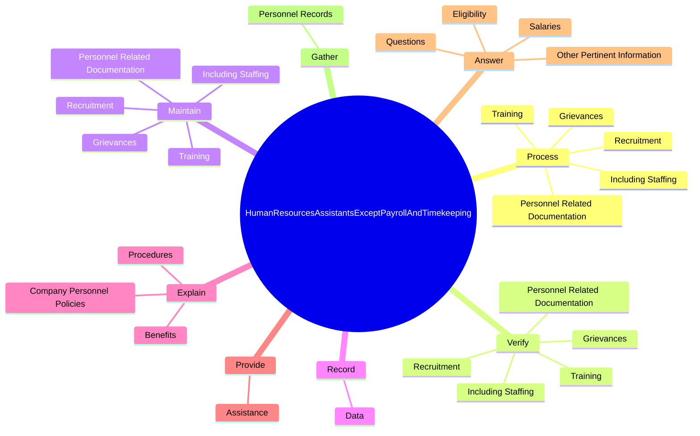
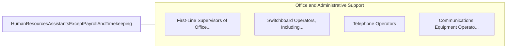

# Human Resources Assistants, Except Payroll and Timekeeping

> Compile and keep personnel records. Record data for each employee, such as address, weekly earnings, absences, amount of sales or production, supervisory reports, and date of and reason for termination. May prepare reports for employment records, file employment records, or search employee files and furnish information to authorized persons.

## Overview

Human Resources Assistants, Except Payroll and Timekeeping is an occupation within the Office and Administrative Support category. Compile and keep personnel records. Record data for each employee, such as address, weekly earnings, absences, amount of sales or production, supervisory reports, and date of and reason for termination.

## Classification Hierarchy

## Key Statistics

| Metric | Value |
|--------|-------|
| SOC Code | 43-4161.00 |
| Category | [Office and Administrative Support](/occupations/Administrative/index) |
| Task Count | 85 |
| Source | O*NET |

## Core Tasks

### process.PersonnelRelatedDocumentation

Human Resources Assistants, Except Payroll and Timekeeping process personnel related documentation as part of their core responsibilities.

**Actions:**
- `process.PersonnelRelatedDocumentation.of.Absence`
- `process.IncludingStaffing.of.Absence`
- `process.Recruitment.of.Absence`
- `process.Training.of.Absence`

### verify.PersonnelRelatedDocumentation

Human Resources Assistants, Except Payroll and Timekeeping verify personnel related documentation as part of their core responsibilities.

**Actions:**
- `verify.PersonnelRelatedDocumentation.of.Absence`
- `verify.IncludingStaffing.of.Absence`
- `verify.Recruitment.of.Absence`
- `verify.Training.of.Absence`

### maintain.PersonnelRelatedDocumentation

Human Resources Assistants, Except Payroll and Timekeeping maintain personnel related documentation as part of their core responsibilities.

**Actions:**
- `maintain.PersonnelRelatedDocumentation.of.Absence`
- `maintain.IncludingStaffing.of.Absence`
- `maintain.Recruitment.of.Absence`
- `maintain.Training.of.Absence`

## Skills & Competencies

### Technical Skills
- **Office Management** - Advanced
- **Data Entry** - Advanced
- **Records Management** - Advanced

### Soft Skills
- **Communication** - Essential
- **Problem Solving** - Essential
- **Critical Thinking** - Important
- **Teamwork** - Important
- **Adaptability** - Important

## Related Occupations

## Industries

This occupation is found across multiple industries. See [Industries](/industries) for sector-specific employment data.

## Career Progression

---

*Source: O*NET 43-4161.00 - ONETOccupation*
