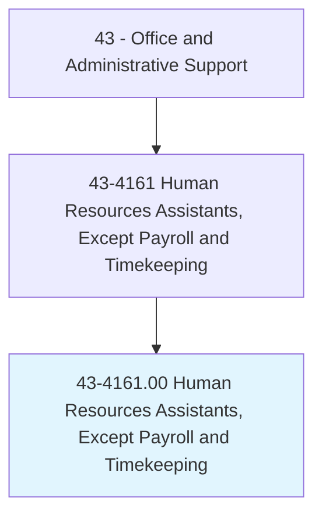
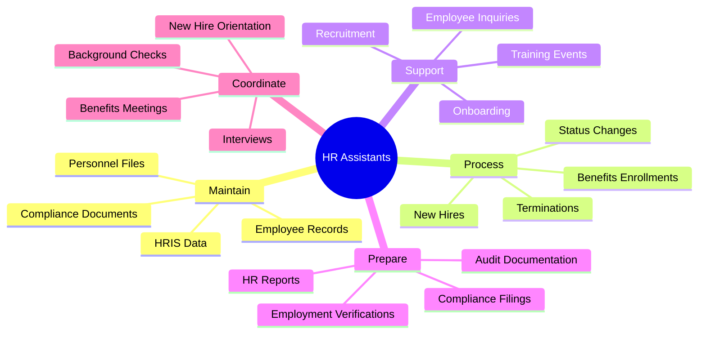
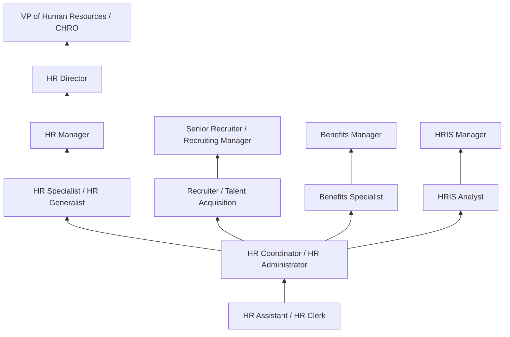
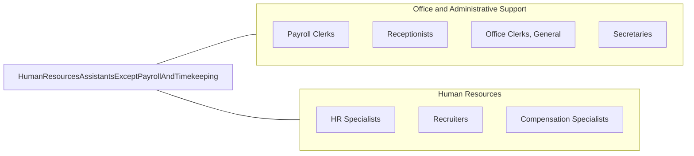

# Human Resources Assistants, Except Payroll and Timekeeping

> Compile and keep personnel records. Record data for each employee, such as address, weekly earnings, absences, amount of sales or production, supervisory reports, and date of and reason for termination.

## Overview

Human Resources Assistants maintain personnel records, compile employee data, and support HR operations. They process new hire paperwork, update employee files, track attendance and leave, prepare HR reports, assist with recruitment activities, and respond to employee inquiries about benefits and policies. Their administrative support enables HR professionals to focus on strategic workforce management.

These assistants work in HR departments across all industries, serving as the organizational backbone that keeps employee records accurate, benefits enrollment processed, and compliance documentation current. They handle sensitive personal information requiring strict confidentiality and compliance with employment laws including EEOC, FMLA, ADA, and various state regulations.

The role has evolved significantly with HRIS (Human Resource Information Systems) technology, shifting from paper-based recordkeeping to digital platforms that automate many routine functions while requiring new technical skills in data management and system administration. Modern HR assistants must balance technology proficiency with strong interpersonal skills to effectively support both HR leadership and the broader employee population.

## Classification Hierarchy



## Key Statistics

| Metric | Value |
|--------|-------|
| SOC Code | 43-4161.00 |
| Job Zone | 3 (Medium Preparation) |
| Category | [Office and Administrative Support](/occupations/Administrative/index) |
| Median Annual Salary | $44,700 |
| Salary Range | $32,000 - $62,000 |
| 10th Percentile | $32,500 |
| 90th Percentile | $61,800 |
| Employment | ~120,000 |
| Projected Growth | -5% (declining) |
| Annual Openings | ~14,000 |
| Core Tasks | 35 |
| Source | O*NET |

## Core Tasks



### maintain.EmployeeRecords

HR Assistants maintain accurate personnel records.

**Actions:**
- `maintain.Records.for.Employees`
- `update.Files.with.StatusChanges`
- `archive.Documents.following.RetentionPolicies`
- `ensure.Accuracy.of.HRISData`

### support.Recruitment

HR Assistants support the recruitment process.

**Actions:**
- `schedule.Interviews.for.Candidates`
- `coordinate.BackgroundChecks.through.Vendors`
- `process.Applications.in.ATS`
- `communicate.Updates.to.Candidates`

## Skills & Competencies

### Technical Skills
- **HRIS Systems (Workday, ADP, SAP)** - Expert (data entry, reporting, workflow)
- **Employee Records Management** - Expert (filing, retention, confidentiality)
- **Benefits Administration** - Advanced (enrollment, changes, questions)
- **Recruitment Support** - Advanced (ATS, scheduling, onboarding)
- **Employment Law Basics** - Advanced (EEOC, FMLA, ADA, I-9 compliance)
- **Data Entry and Reporting** - Expert (accuracy, metrics, analysis)
- **Microsoft Office** - Expert (Excel, Word, PowerPoint, Outlook)
- **Applicant Tracking Systems** - Advanced (iCIMS, Greenhouse, Taleo)

### Soft Skills
- **Confidentiality** - Critical (protecting sensitive information)
- **Organizational Skills** - Critical (managing multiple priorities)
- **Attention to Detail** - Critical (accurate recordkeeping)
- **Communication** - Critical (written and verbal)
- **Empathy** - Essential (employee interactions)
- **Discretion** - Critical (handling sensitive matters)
- **Professionalism** - Critical (representing HR function)
- **Problem Solving** - Essential (resolving employee issues)

## Education & Certifications

| Requirement | Details |
|-------------|---------|
| Typical Education | Associate's or bachelor's degree |
| Preferred Degree | Human Resources, Business Administration, Psychology |
| SHRM-CP | SHRM Certified Professional (entry-level) |
| PHR | Professional in Human Resources (HRCI) |
| HRIS Certification | System-specific credentials (Workday, ADP) |
| HR Certificate Programs | University or professional association programs |
| Continuing Education | SHRM credits, webinars, conferences |
| Background Check | Required for access to personnel records |

## Career Progression



### Career Pathway Details

| Level | Title | Years Experience | Key Responsibilities |
|-------|-------|------------------|----------------------|
| Entry | HR Assistant / HR Clerk | 0-2 years | Data entry, filing, basic employee support |
| Mid | HR Coordinator | 2-4 years | Full-cycle support, recruitment coordination |
| Senior | HR Specialist / Generalist | 4-7 years | Employee relations, policy interpretation, investigations |
| Management | HR Manager | 7-12 years | Team leadership, strategic initiatives, compliance |
| Director | HR Director | 12-15 years | Department leadership, business partnership |
| Executive | VP of HR / CHRO | 15+ years | Enterprise HR strategy, executive leadership |

### Specialization Paths

| Specialization | Focus Area | Additional Skills Needed |
|----------------|------------|--------------------------|
| Recruiting | Talent acquisition | Sourcing, interviewing, employer branding |
| Benefits | Compensation and benefits | Benefits design, vendor management, compliance |
| HRIS | Technology | System administration, reporting, integration |
| Training | Learning and development | Instructional design, facilitation, LMS |
| Employee Relations | Workplace issues | Investigation, conflict resolution, policy |

## Industry Variations

| Setting | Focus | Unique Aspects |
|---------|-------|----------------|
| Corporate | Multi-department HR support | Large employee populations; complex benefits; global operations; HRIS integration |
| Government | Civil service HR | Union environments; merit systems; regulatory compliance; clearances |
| Healthcare | Clinical staffing support | Credentialing; licensing verification; shift scheduling; compliance-heavy |
| Manufacturing | Plant HR operations | Safety records; union relations; shift management; hourly workforce |
| Education | Academic HR | Faculty hiring; tenure processes; academic calendars; student workers |
| Non-Profit | Mission-driven HR | Limited resources; grant-funded positions; volunteer management |

### Corporate HR

Large corporations maintain specialized HR teams where assistants may focus on specific functions (recruitment, benefits, HRIS). Complex organizational structures require understanding of multiple business units, manager hierarchies, and approval workflows. Global operations add complexity with multi-country compliance and systems.

### Healthcare HR

Healthcare HR assistants handle credentialing verification, licensure tracking, and compliance documentation for clinical staff. Joint Commission and CMS requirements create specific recordkeeping obligations. Shift scheduling and per-diem staff management add operational complexity.

### Manufacturing HR

Manufacturing HR assistants support hourly workforces with time and attendance tracking, safety documentation, and union contract administration. Shift scheduling, overtime management, and OSHA recordkeeping are common responsibilities.

## Technology & Tools

### HRIS Platforms
- **Workday** - Enterprise HCM platform
- **ADP** - Payroll and HR platform (Workforce Now, Vantage)
- **BambooHR** - SMB-focused HR platform
- **SAP SuccessFactors** - Enterprise talent management
- **UKG (Kronos)** - Workforce management and HR

### Recruiting Technology
- **Applicant Tracking** - iCIMS, Greenhouse, Lever, Taleo
- **Job Boards** - Indeed, LinkedIn, ZipRecruiter
- **Background Checks** - Sterling, HireRight, Checkr
- **Assessment Tools** - pre-employment testing platforms

### Benefits Administration
- **Benefits Platforms** - Benefitfocus, Employee Navigator
- **Open Enrollment** - Annual enrollment tools
- **COBRA Administration** - Compliance platforms

### Productivity Tools
- **Microsoft 365** - Office applications, SharePoint, Teams
- **Document Management** - Personnel file systems
- **E-Signature** - DocuSign, Adobe Sign for HR documents
- **Reporting** - Excel, Power BI, HRIS reports

## Related Occupations



### Related Occupation Comparison

| Occupation | Similarity | Key Difference |
|------------|------------|----------------|
| Payroll Clerks | High | Payroll focus vs broader HR support |
| HR Specialists | High | Strategic/advisory vs administrative support |
| Recruiters | Medium | Talent acquisition vs general HR support |
| Administrative Assistants | Medium | General office vs HR-specific functions |

## Industries

- [Professional Services](/industries/ProfessionalServices) - High Employment
- [Healthcare](/industries/Healthcare/index) - High Employment
- [Manufacturing](/industries/Manufacturing/index) - Moderate Employment
- [Government](/industries/PublicAdministration) - Moderate Employment
- [Education](/industries/Education) - Moderate Employment
- [Financial Services](/industries/Finance/index) - Moderate Employment

## Departments

This occupation typically works in:
- Human Resources - Core HR operations and support
- Benefits Administration - Employee benefits and enrollment
- Recruiting / Talent Acquisition - Recruitment support
- Employee Relations - Workplace issue support
- Compliance - Employment law compliance
- HRIS / HR Technology - System administration

## Work Environment

### Physical Setting
- Office environment within HR department
- Desk-based work with computer equipment
- Private office or HR suite for confidentiality
- Some positions offer remote work opportunities

### Work Schedule
- Typically Monday-Friday, standard business hours
- Extended hours during open enrollment
- Peak activity around new hire classes and terminations
- Year-end reporting and compliance deadlines

### Work Characteristics
- High volume of employee inquiries
- Sensitive and confidential information handling
- Deadline-driven (benefits deadlines, reporting)
- Multi-tasking across multiple functions
- Collaboration with HR team and other departments

### Unique Considerations
- Access to sensitive personnel information
- Background check typically required for position
- Confidentiality agreements
- Neutral stance in employee matters
- Professional boundaries with co-workers

## Compliance and Legal Framework

### Key Employment Laws

| Law | Focus | HR Assistant Responsibilities |
|-----|-------|------------------------------|
| EEOC / Title VII | Anti-discrimination | Proper recordkeeping, posting requirements |
| FMLA | Family and medical leave | Leave tracking, eligibility documentation |
| ADA | Disability accommodation | Reasonable accommodation records |
| I-9 Compliance | Work authorization | Employment eligibility verification |
| HIPAA | Health information | Benefits information protection |

### Recordkeeping Requirements
- Personnel files maintained and secured
- Retention schedules followed (7+ years for many records)
- Separation of medical information
- Access controls and audit trails
- Document destruction procedures

## GraphDL Semantic Structure

```graphdl
Human Resources Assistants, Except Payroll and Timekeeping perform:
- maintain.Records.for.Employees
- process.NewHires.through.Onboarding
- support.Recruitment.with.Coordination
- prepare.Reports.for.HRManagement
- respond.To.EmployeeInquiries
- coordinate.Benefits.Enrollment.for.Employees
- ensure.Compliance.with.EmploymentLaws
- administer.HRIS.Systems.for.DataAccuracy
```

---

*Source: O*NET 43-4161.00 - ONETOccupation*
