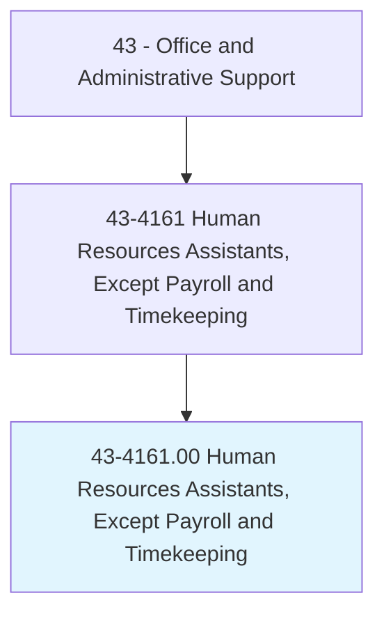
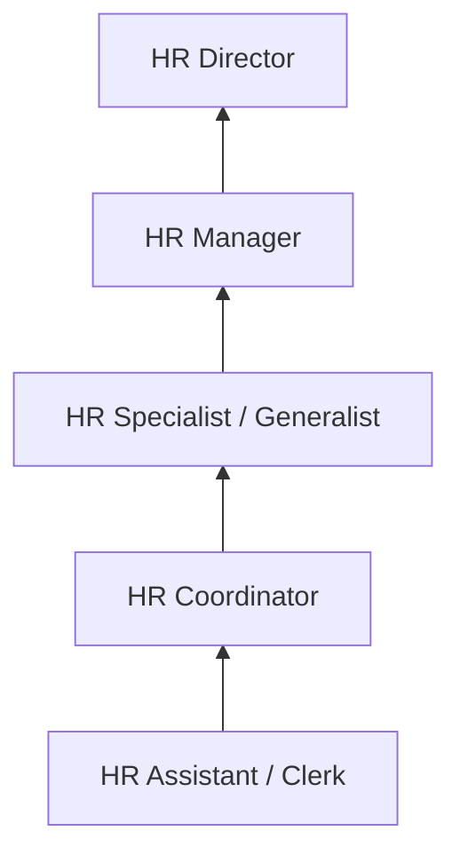
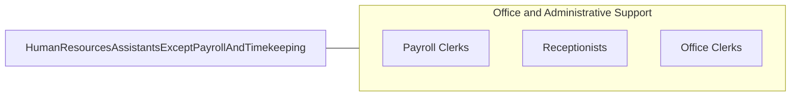

# Human Resources Assistants, Except Payroll and Timekeeping

> Compile and keep personnel records. Record data for each employee, such as address, weekly earnings, absences, amount of sales or production, supervisory reports, and date of and reason for termination.

## Overview

Human Resources Assistants maintain personnel records, compile employee data, and support HR operations. They process new hire paperwork, update employee files, track attendance and leave, prepare HR reports, assist with recruitment activities, and respond to employee inquiries about benefits and policies. Their administrative support enables HR professionals to focus on strategic workforce management.

These assistants work in HR departments across all industries, serving as the organizational backbone that keeps employee records accurate, benefits enrollment processed, and compliance documentation current. They handle sensitive personal information requiring strict confidentiality and compliance with employment laws.

The role has evolved with HRIS (Human Resource Information Systems) technology, shifting from paper-based recordkeeping to digital platforms that automate many routine functions while requiring new technical skills in data management and system administration.

## Classification Hierarchy

## Key Statistics

| Metric | Value |
|--------|-------|
| SOC Code | 43-4161.00 |
| Job Zone | 3 (Medium Preparation) |
| Category | [Office and Administrative Support](/occupations/Administrative/index) |
| Median Annual Salary | $44,700 |
| Employment | ~120,000 |
| Projected Growth | -5% (declining) |
| Core Tasks | 35 |
| Source | O*NET |

## Core Tasks

Core task data with GraphDL semantic actions for this occupation is maintained in the data pipeline. See [O*NET 43-4161.00](https://www.onetonline.org/link/summary/43-4161.00) for detailed task information.

## Skills & Competencies

### Technical Skills
- **HRIS Systems (Workday, ADP, SAP)** - Advanced
- **Employee Records Management** - Advanced
- **Benefits Administration** - Intermediate
- **Recruitment Support** - Intermediate
- **Employment Law Basics** - Intermediate
- **Data Entry and Reporting** - Advanced

### Soft Skills
- **Confidentiality** - Critical
- **Organizational Skills** - Critical
- **Attention to Detail** - Critical
- **Communication** - Essential
- **Empathy** - Important
- **Discretion** - Critical

## Education & Certifications

| Requirement | Details |
|-------------|--------|
| Typical Education | Associate's or bachelor's degree |
| SHRM-CP | SHRM Certified Professional |
| PHR | Professional in Human Resources |
| HRIS Certification | System-specific credentials |

## Career Progression

## Industry Variations

| Setting | Focus | Unique Aspects |
|---------|-------|----------------|
| Corporate | Multi-department HR support | Large employee populations; complex benefits; global operations |
| Government | Civil service HR | Union environments; merit systems; regulatory compliance |
| Healthcare | Clinical staffing support | Credentialing; licensing verification; shift scheduling |
| Manufacturing | Plant HR operations | Safety records; union relations; shift management |

## Technology & Tools

- **HRIS** - Workday, ADP, BambooHR, SAP SuccessFactors
- **Recruiting** - iCIMS, Greenhouse, LinkedIn
- **Benefits** - Benefits administration platforms
- **Onboarding** - Digital onboarding tools

## Related Occupations

## Departments

This occupation typically works in:
- [Human Resources](/departments/HumanResources) - HR operations
- [Benefits Administration](/departments/Benefits) - Employee benefits
- [Recruiting](/departments/Recruiting) - Talent acquisition support
- [Compliance](/departments/Compliance) - Employment law compliance

---

*Source: O*NET 43-4161.00 - ONETOccupation*
