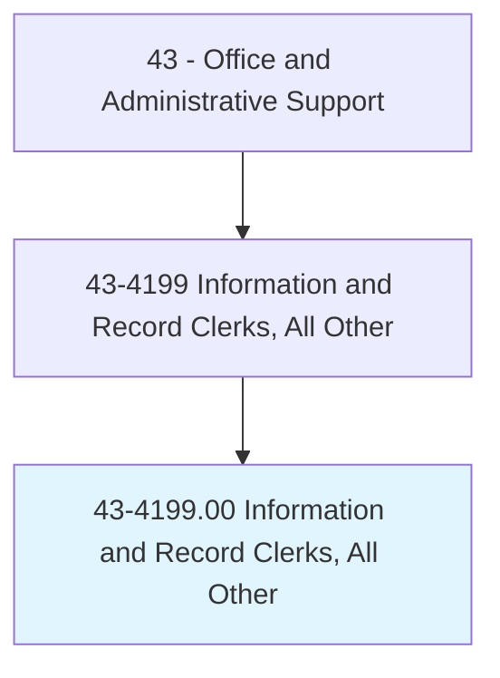
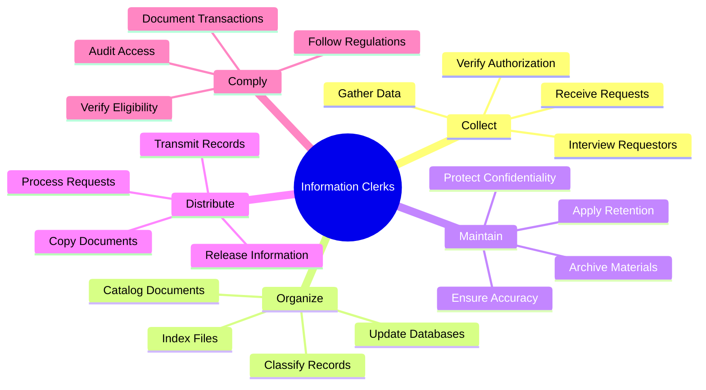
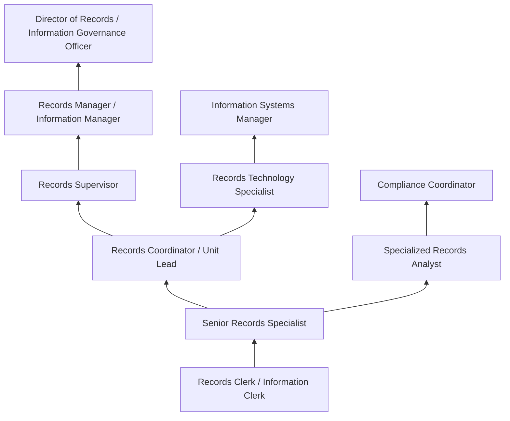
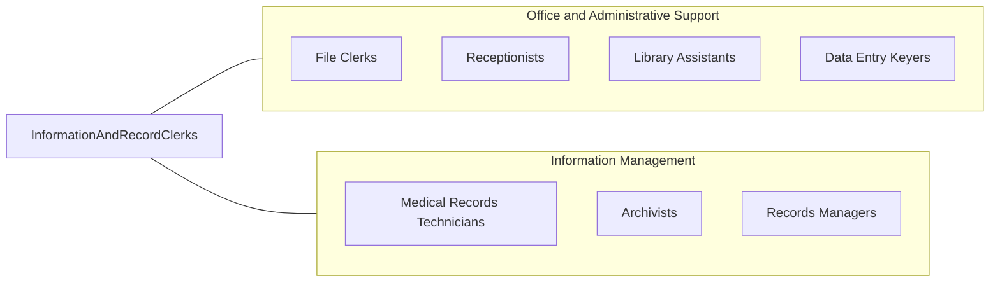

# Information and Record Clerks, All Other

> All information and record clerks not listed separately.

## Overview

Information and Record Clerks, All Other encompasses specialized clerical workers who collect, organize, maintain, and distribute information and records in capacities not classified elsewhere in the Standard Occupational Classification system. This residual category includes diverse positions such as medical records specialists who process health information requests, police records clerks who manage criminal justice documentation, vital records processors who handle birth and death certificates, academic records coordinators who maintain student transcripts, registration clerks who process enrollments and memberships, and information desk attendants in specialized settings requiring domain expertise.

These professionals serve as custodians of organizational knowledge, maintaining accurate and accessible records across specialized domains that require understanding of industry-specific regulations, terminology, and procedures. Their work directly supports compliance requirements, operational decision-making, legal proceedings, and customer service by ensuring that the right information reaches authorized recipients in a timely and secure manner. Each role combines general clerical competencies with domain-specific expertise that distinguishes it from standard file clerk or general office positions.

The category reflects the diverse and evolving nature of recordkeeping needs across industries, from criminal justice records subject to CJIS security requirements to academic transcripts governed by FERPA privacy protections, from voter registration files managed under election law to environmental compliance documentation required by regulatory agencies. As information management has become more complex and regulated, these specialized clerk positions have become increasingly important to organizational operations, though the specific titles and responsibilities vary significantly by industry and employer.

## Classification Hierarchy



## Key Statistics

| Metric | Value |
|--------|-------|
| SOC Code | 43-4199.00 |
| Job Zone | 2 (Some Preparation) |
| Category | [Office and Administrative Support](/occupations/Administrative/index) |
| Median Annual Salary | $40,500 |
| Salary Range | $28,000 - $58,000 |
| 10th Percentile | $28,500 |
| 90th Percentile | $57,800 |
| Employment | ~85,000 |
| Projected Growth | 2% (slower than average) |
| Annual Openings | ~10,000 |
| Core Tasks | Varies by position |
| Source | O*NET |

## Core Tasks



### manage.RecordsSystems

Information Clerks maintain organized record systems.

**Actions:**
- `organize.Records.per.ClassificationScheme`
- `maintain.Files.in.SecureRepositories`
- `update.Databases.with.NewInformation`
- `verify.Accuracy.of.DataEntries`

### process.InformationRequests

Information Clerks respond to requests for records.

**Actions:**
- `receive.Requests.from.AuthorizedParties`
- `verify.Authorization.per.RegulationRequirements`
- `retrieve.Records.from.StorageSystems`
- `release.Information.following.Procedures`

## Skills & Competencies

### Technical Skills
- **Records Management Systems** - Expert (electronic and physical systems)
- **Database Management** - Advanced (queries, data entry, reporting)
- **Data Entry and Verification** - Advanced (accuracy, speed, validation)
- **Information Retrieval** - Advanced (search, indexing, classification)
- **Regulatory Compliance** - Advanced (HIPAA, FERPA, CJIS, FOIA as applicable)
- **Document Imaging and Scanning** - Intermediate (OCR, digital conversion)
- **Office Software (Microsoft Office)** - Advanced (Excel, Word, Access)
- **Specialized Industry Software** - Intermediate to Advanced (varies by setting)

### Soft Skills
- **Attention to Detail** - Critical (accuracy in record handling)
- **Organizational Skills** - Critical (managing large volumes of records)
- **Confidentiality** - Critical (protecting sensitive information)
- **Communication** - Essential (explaining procedures, responding to requests)
- **Accuracy** - Critical (error-free data management)
- **Customer Service** - Essential (assisting requestors professionally)
- **Problem Solving** - Important (resolving discrepancies, locating records)
- **Time Management** - Important (meeting request deadlines)

## Education & Certifications

| Requirement | Details |
|-------------|---------|
| Typical Education | High school diploma; some college preferred |
| Preferred Education | Associate's degree in records management or related field |
| ARMA CRM (Certified Records Manager) | Professional records management credential |
| AHIMA RHIT (Registered Health Information Technician) | Healthcare records certification |
| HIPAA Training | Required for healthcare settings |
| CJIS Security Training | Required for criminal justice records |
| FERPA Training | Required for educational records |
| Industry-Specific Certification | Domain-dependent credentials |

## Career Progression



### Career Pathway Details

| Level | Title | Years Experience | Key Responsibilities |
|-------|-------|------------------|----------------------|
| Entry | Records Clerk / Information Clerk | 0-2 years | Basic filing, data entry, request processing |
| Mid | Senior Records Specialist | 2-4 years | Complex records, training, quality review |
| Lead | Records Coordinator | 4-6 years | Unit coordination, process improvement |
| Supervisory | Records Supervisor | 6-10 years | Staff supervision, compliance oversight |
| Management | Records Manager | 10-15 years | Department management, policy development |
| Director | Director of Records / IGO | 15+ years | Strategic governance, enterprise records |

### Specialization Paths

| Specialization | Focus Area | Additional Requirements |
|----------------|------------|-------------------------|
| Health Information | Medical records, coding support | RHIT certification, HIPAA expertise |
| Criminal Justice Records | Police records, CJIS | Security clearance, CJIS training |
| Academic Records | Student transcripts, FERPA | AACRAO membership, registrar training |
| Vital Records | Birth/death certificates | State certification, legal knowledge |

## Industry Variations

| Setting | Focus | Unique Aspects |
|---------|-------|----------------|
| Healthcare | Medical records, health information | HIPAA compliance; EHR systems; release of information; coding support |
| Law Enforcement | Criminal records, incident reports | CJIS compliance; background checks; FOIA processing; chain of custody |
| Education | Student records, transcripts | FERPA compliance; enrollment processing; academic records; graduation verification |
| Government | Vital records, registration | Birth/death certificates; voter registration; public records access; notarization |
| Courts | Legal records, case files | Court docket management; public access; sealed records; e-filing |

### Healthcare Records

Health information clerks and medical records specialists manage protected health information (PHI) under HIPAA regulations. They process release of information requests from patients, insurance companies, attorneys, and other healthcare providers, verify authorization, redact sensitive information when required, and maintain detailed logs of all disclosures. They work with electronic health record (EHR) systems and may support medical coding operations.

### Criminal Justice Records

Police records clerks and criminal justice records specialists handle sensitive law enforcement data subject to Criminal Justice Information Services (CJIS) security requirements. They process background check requests, manage arrest records, handle expungement and sealing orders, respond to Freedom of Information Act (FOIA) requests while protecting exempt information, and maintain chain of custody documentation for evidence records.

### Educational Records

Academic records clerks and registrar assistants manage student records protected by the Family Educational Rights and Privacy Act (FERPA). They process transcript requests, verify enrollment and graduation for employers and other institutions, maintain academic histories, process grade changes and degree audits, and ensure proper release authorization for all disclosures.

### Vital Records

Vital records clerks in state and local health departments process requests for birth certificates, death certificates, marriage licenses, and other life event documentation. They verify identity, apply appropriate state regulations regarding access and amendments, maintain security of blank certificate stock, and coordinate with funeral homes, hospitals, and courts.

## Technology & Tools

### Records Management Systems
- **EDMS (Electronic Document Management Systems)** - OpenText, Hyland OnBase, Laserfiche
- **EHR/HIS Systems** - Epic, Cerner, Meditech (healthcare)
- **RMS (Records Management Systems)** - Hexagon, Tyler Technologies (law enforcement)
- **SIS (Student Information Systems)** - Banner, PeopleSoft, Workday (education)

### Database and Office Tools
- **Database Software** - Microsoft Access, SQL databases
- **Office Suites** - Microsoft 365, Google Workspace
- **Scanning/Imaging** - Document scanners, OCR software
- **Microfilm/Microfiche** - Legacy retrieval systems (archives)

### Compliance and Security
- **Access Control** - Identity verification systems
- **Audit Logging** - Disclosure tracking
- **Encryption** - Data protection for electronic transmission
- **Redaction Tools** - Information sanitization software

### Communication
- **Phone Systems** - Multi-line, call logging
- **Email** - Secure email for record transmission
- **Customer Portals** - Self-service request systems
- **Fax** - Secure fax for legal/medical documents

## Related Occupations



### Related Occupation Comparison

| Occupation | Similarity | Key Difference |
|------------|------------|----------------|
| File Clerks | High | General filing vs specialized domains |
| Medical Records Technicians | High | Coding/clinical vs clerical functions |
| Library Assistants | Medium | Public access vs restricted records |
| Archivists | Medium | Historical preservation vs current records |

## Industries

- [Healthcare](/industries/Healthcare/index) - High Employment
- [Government](/industries/PublicAdministration) - High Employment
- [Education](/industries/Education) - Moderate Employment
- [Legal Services](/industries/ProfessionalServices/Legal) - Moderate Employment
- [Financial Services](/industries/Finance) - Moderate Employment

## Departments

This occupation typically works in:
- Records Management - Information governance and storage
- Administration - Office operations support
- Compliance - Regulatory records maintenance
- Customer Service - Public information requests
- Health Information Management - Healthcare records (healthcare settings)

## Work Environment

### Physical Setting
- Office environment with file storage areas
- Desk with computer, phone, scanning equipment
- Access to secure file rooms or vaults
- Climate-controlled archives for sensitive materials
- May work in back-office or public-facing areas

### Work Schedule
- Standard Monday-Friday business hours (most settings)
- Some evening/weekend for public-facing positions
- Predictable schedule in most environments
- Occasional deadline pressure for request backlogs
- Full-time and part-time positions available

### Work Characteristics
- Detail-oriented work requiring concentration
- High volume of requests in busy settings
- Regular interaction with requestors and staff
- Computer-intensive data entry and retrieval
- Confidentiality and security awareness constant

### Physical Demands
- Primarily sedentary desk work
- Some lifting of file boxes and materials (up to 25 lbs)
- Extended computer use
- Walking to retrieve physical records
- Standing at service counters (public-facing roles)

## Performance Metrics

### Key Performance Indicators

| Metric | Description | Typical Target |
|--------|-------------|----------------|
| Request Turnaround | Time to fulfill information requests | 1-5 business days |
| Accuracy Rate | Error-free records and responses | >99% |
| Compliance Adherence | Following regulations and procedures | 100% |
| Filing Backlog | Unprocessed documents | Minimal |
| Customer Satisfaction | Requestor feedback | >90% positive |

### Quality Standards
- Zero unauthorized disclosures
- Accurate and complete record entries
- Timely response to all requests
- Proper authorization verification
- Complete audit trail documentation

## Regulatory Compliance

### Key Regulations by Domain

| Regulation | Domain | Clerk Responsibility |
|------------|--------|---------------------|
| HIPAA | Healthcare | PHI protection, disclosure logging |
| FERPA | Education | Student record privacy |
| CJIS | Criminal Justice | Security protocols, access control |
| FOIA | Government | Public records access |
| State Privacy Laws | Various | Jurisdiction-specific requirements |

### Documentation Requirements
- Authorization verification records
- Disclosure logs and audit trails
- Amendment and correction documentation
- Retention schedule compliance
- Destruction certificates

## GraphDL Semantic Structure

```graphdl
Information and Record Clerks perform:
- organize.Records.per.ClassificationScheme
- maintain.Files.in.SecureRepositories
- process.Requests.from.AuthorizedParties
- verify.Authorization.per.Regulations
- retrieve.Records.from.StorageSystems
- release.Information.following.Procedures
- protect.Confidentiality.of.SensitiveData
- document.Transactions.for.Compliance
```

---

*Source: O*NET 43-4199.00 - ONETOccupation*
