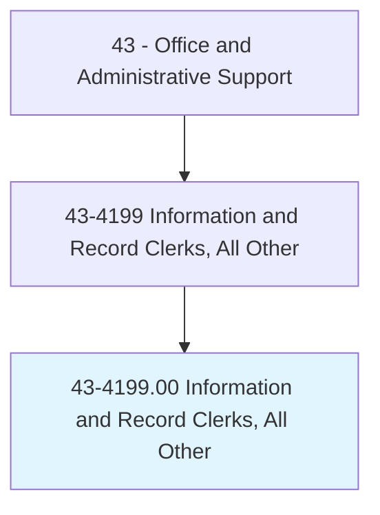
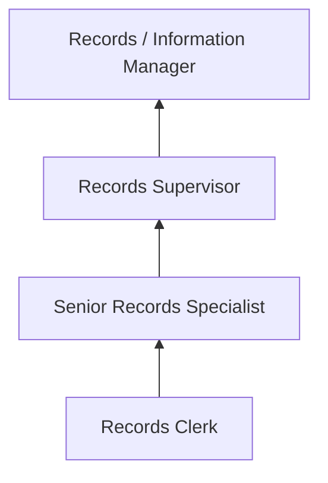

# Information and Record Clerks, All Other

> All information and record clerks not listed separately.

## Overview

Information and Record Clerks, All Other encompasses specialized clerical workers who collect, organize, maintain, and distribute information and records in capacities not classified elsewhere. This includes positions such as medical records specialists, police records clerks, registration clerks, vital records processors, and information desk attendants in specialized settings.

These professionals manage organizational knowledge by maintaining accurate, accessible records across specialized domains. Their work supports compliance, operations, and decision-making by ensuring that the right information is available to the right people at the right time. Each role requires domain-specific knowledge combined with general clerical skills.

The category reflects the diversity of recordkeeping needs across industries, from criminal justice records to academic transcripts, from voter registration to environmental compliance documentation.

## Classification Hierarchy

## Key Statistics

| Metric | Value |
|--------|-------|
| SOC Code | 43-4199.00 |
| Job Zone | 2 (Some Preparation) |
| Category | [Office and Administrative Support](/occupations/Administrative/index) |
| Median Annual Salary | $40,500 |
| Employment | ~85,000 |
| Projected Growth | 2% (slower than average) |
| Core Tasks | Varies |
| Source | O*NET |

## Core Tasks

Core task data with GraphDL semantic actions for this occupation is maintained in the data pipeline. See [O*NET 43-4199.00](https://www.onetonline.org/link/summary/43-4199.00) for detailed task information.

## Skills & Competencies

### Technical Skills
- **Records Management Systems** - Advanced
- **Data Entry and Verification** - Advanced
- **Information Retrieval** - Advanced
- **Database Management** - Intermediate
- **Regulatory Compliance** - Intermediate

### Soft Skills
- **Attention to Detail** - Critical
- **Organizational Skills** - Critical
- **Confidentiality** - Critical
- **Communication** - Essential
- **Accuracy** - Critical

## Education & Certifications

| Requirement | Details |
|-------------|--------|
| Typical Education | High school diploma; some college preferred |
| Records Management Training | ARMA courses |
| HIPAA Training | Required for healthcare settings |
| Industry-Specific Certification | Domain-dependent |

## Career Progression

## Industry Variations

| Setting | Focus | Unique Aspects |
|---------|-------|----------------|
| Healthcare | Medical records, health information | HIPAA; EHR systems; coding support; release of information |
| Law Enforcement | Criminal records, incident reports | CJIS compliance; background checks; FOIA processing |
| Education | Student records, transcripts | FERPA compliance; enrollment processing; academic records |
| Government | Vital records, registration | Birth/death certificates; voter registration; public access |

## Technology & Tools

- **Records Systems** - Electronic records management, databases
- **Scanning** - Document imaging, OCR
- **Communication** - Phone, email, in-person
- **Office Software** - Microsoft Office, Google Workspace

## Related Occupations

## Departments

This occupation typically works in:
- Records Management - Information governance
- Administration - Office operations
- Compliance - Regulatory records
- Customer Service - Public information

---

*Source: O*NET 43-4199.00 - ONETOccupation*
