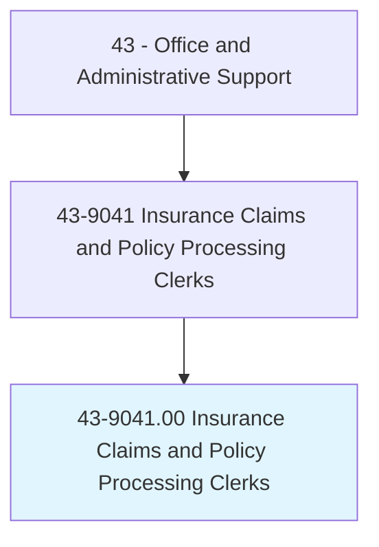
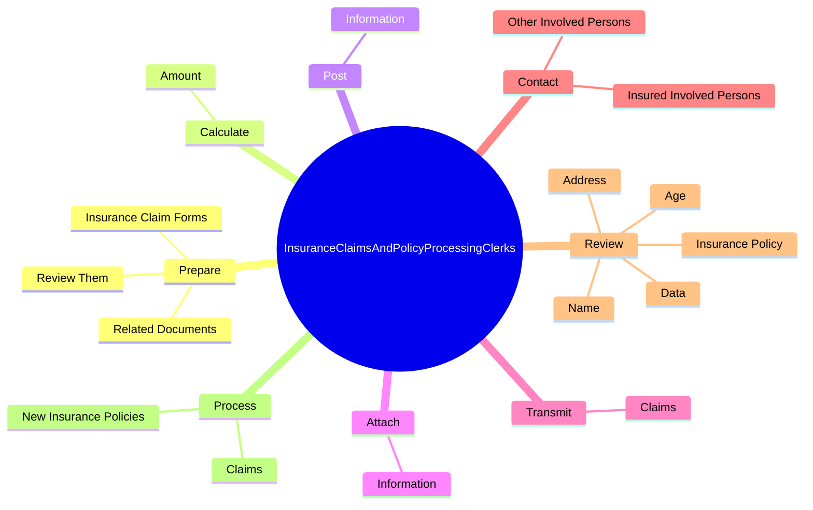
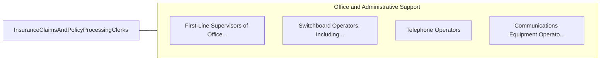

# Insurance Claims and Policy Processing Clerks

> Process new insurance policies, modifications to existing policies, and claims forms. Obtain information from policyholders to verify the accuracy and completeness of information on claims forms, applications and related documents, and company records. Update existing policies and company records to reflect changes requested by policyholders and insurance company representatives.

## Overview

Insurance Claims and Policy Processing Clerks is an occupation within the Office and Administrative Support category. Process new insurance policies, modifications to existing policies, and claims forms. Obtain information from policyholders to verify the accuracy and completeness of information on claims forms, applications and related documents, and company records.

## Classification Hierarchy

## Key Statistics

| Metric | Value |
|--------|-------|
| SOC Code | 43-9041.00 |
| Category | [Office and Administrative Support](/occupations/Administrative/index) |
| Task Count | 144 |
| Source | O*NET |

## Core Tasks

### prepare.InsuranceClaimForms

Insurance Claims and Policy Processing Clerks prepare insurance claim forms as part of their core responsibilities.

**Actions:**
- `prepare.InsuranceClaimForms.for.Completeness`
- `prepare.RelatedDocuments.for.Completeness`
- `prepare.ReviewThem.for.Completeness`

### calculate.Amount

Insurance Claims and Policy Processing Clerks calculate amount as part of their core responsibilities.

**Actions:**
- `calculate.Amount.of.Claim`

### post.Information

Insurance Claims and Policy Processing Clerks post information as part of their core responsibilities.

**Actions:**
- `post.Information.to.claim.File`

## Skills & Competencies

### Technical Skills
- **Office Management** - Advanced
- **Data Entry** - Advanced
- **Records Management** - Advanced

### Soft Skills
- **Communication** - Essential
- **Problem Solving** - Essential
- **Critical Thinking** - Important
- **Teamwork** - Important
- **Adaptability** - Important

## Related Occupations

## Industries

This occupation is found across multiple industries. See [Industries](/industries) for sector-specific employment data.

## Career Progression

---

*Source: O*NET 43-9041.00 - ONETOccupation*
