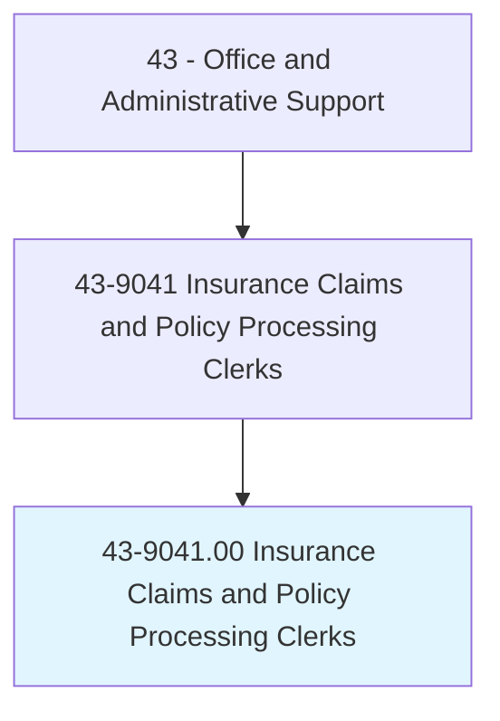
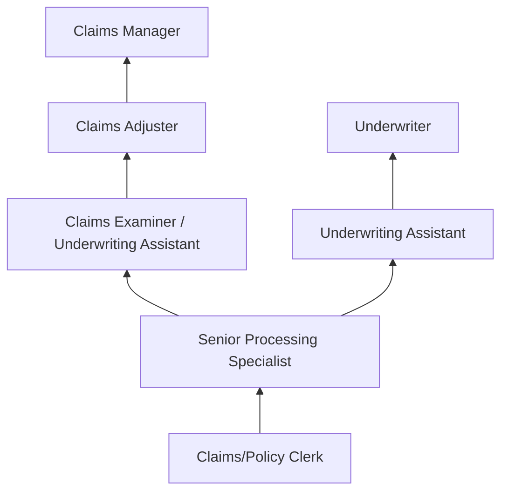
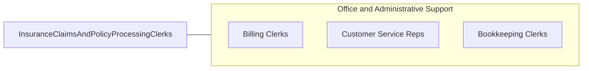

# Insurance Claims and Policy Processing Clerks

> Process new insurance policies, modifications to existing policies, and claims forms. Obtain information from policyholders to verify the accuracy and completeness of information on claims forms, applications and related documents, and company records.

## Overview

Insurance Claims and Policy Processing Clerks handle the administrative backbone of insurance operations, processing new policy applications, endorsements, renewals, cancellations, and claims. They verify policyholder information, update records, calculate premiums, process payments, and ensure that all documentation meets regulatory and company standards.

Working in insurance companies, agencies, and third-party administrators, these clerks manage the paperwork that keeps insurance coverage active and claims moving through the system. Claims processing clerks review initial claims filings for completeness, enter data into claims management systems, request additional documentation, and track claim status through resolution. Policy processing clerks handle the lifecycle of insurance contracts from application to termination.

The role requires knowledge of insurance terminology, policy types, coverage provisions, and regulatory requirements. While automation has streamlined many routine processing functions, complex claims, policy exceptions, and customer interactions continue to require skilled human professionals.

## Classification Hierarchy

## Key Statistics

| Metric | Value |
|--------|-------|
| SOC Code | 43-9041.00 |
| Job Zone | 3 (Medium Preparation) |
| Category | [Office and Administrative Support](/occupations/Administrative/index) |
| Median Annual Salary | $44,800 |
| Employment | ~280,000 |
| Projected Growth | -7% (declining) |
| Core Tasks | 55 |
| Source | O*NET |

## Core Tasks

Core task data with GraphDL semantic actions for this occupation is maintained in the data pipeline. See [O*NET 43-9041.00](https://www.onetonline.org/link/summary/43-9041.00) for detailed task information.

## Skills & Competencies

### Technical Skills
- **Insurance Policy Administration** - Advanced
- **Claims Processing Systems** - Advanced
- **Insurance Terminology and Coverage** - Advanced
- **Regulatory Compliance** - Intermediate
- **Data Entry and Verification** - Advanced
- **Customer Communication** - Advanced

### Soft Skills
- **Attention to Detail** - Critical
- **Accuracy** - Critical
- **Organizational Skills** - Essential
- **Communication** - Essential
- **Empathy** - Important
- **Problem Solving** - Important

## Education & Certifications

| Requirement | Details |
|-------------|--------|
| Typical Education | High school diploma; associate's preferred |
| Insurance Industry Certifications | INS, AIS, CPCU coursework |
| State Insurance License | Required for some positions |
| Claims Adjuster Training | Company-specific programs |

## Career Progression

## Industry Variations

| Setting | Focus | Unique Aspects |
|---------|-------|----------------|
| Property & Casualty | Auto, home, commercial claims | Physical damage assessment; liability analysis; catastrophe surges |
| Health Insurance | Medical claims processing | CPT/ICD coding; provider networks; utilization review |
| Life Insurance | Death benefit claims, policy admin | Beneficiary verification; underwriting support; annuity processing |
| Workers Compensation | Workplace injury claims | Medical management; return-to-work; regulatory reporting |

## Technology & Tools

- **Policy Admin Systems** - Guidewire, Duck Creek, Majesco
- **Claims Management** - Guidewire ClaimCenter, Xactimate
- **Document Management** - Imaging and workflow systems
- **Communication** - Phone, email, policyholder portals

## Related Occupations

## Departments

This occupation typically works in:
- Claims Department - Claims processing and management
- Underwriting - Policy administration
- Customer Service - Policyholder support
- Compliance - Regulatory filings

---

*Source: O*NET 43-9041.00 - ONETOccupation*
