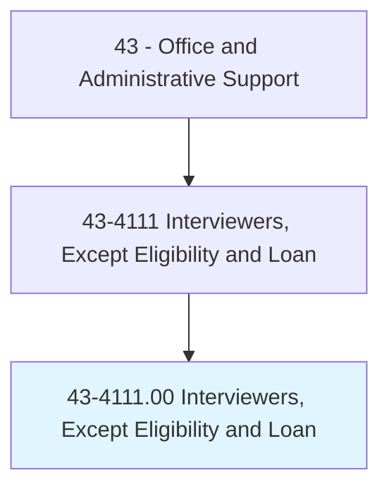
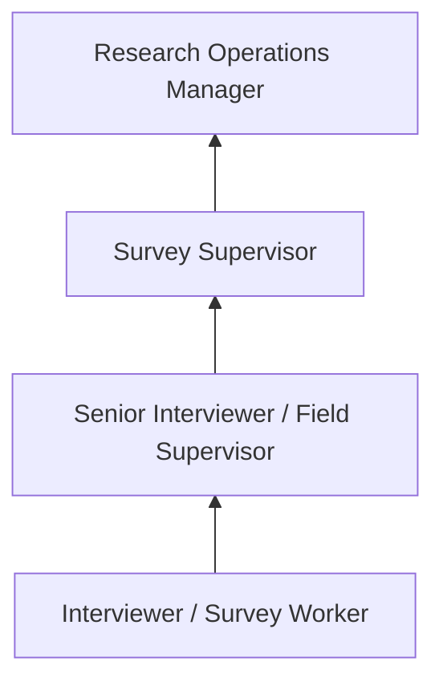
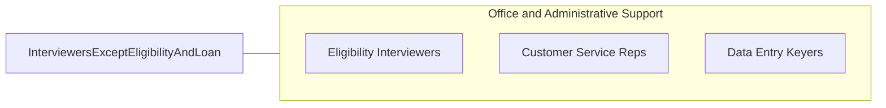

# Interviewers, Except Eligibility and Loan

> Interview persons by telephone, mail, in person, or by other means for the purpose of completing forms, applications, or questionnaires. Ask specific questions, record answers, and assist persons with completing form.

## Overview

Interviewers conduct structured interviews with individuals to collect information for various purposes including surveys, market research, census data collection, patient intake, and administrative applications. They follow predetermined questionnaires, ask specific questions, record responses accurately, and assist respondents with form completion.

These professionals work in market research firms, polling organizations, healthcare facilities, government agencies, and social service organizations. Their work generates the data that organizations use for decision-making, policy development, product research, and compliance reporting. Interview quality directly impacts data accuracy and research validity.

The role requires strong interpersonal skills to establish rapport with diverse respondents, clear communication to ensure questions are understood, and meticulous recording to maintain data integrity. Computer-assisted interviewing (CATI/CAPI) systems have modernized the profession but not eliminated the need for skilled human interviewers.

## Classification Hierarchy

## Key Statistics

| Metric | Value |
|--------|-------|
| SOC Code | 43-4111.00 |
| Job Zone | 2 (Some Preparation) |
| Category | [Office and Administrative Support](/occupations/Administrative/index) |
| Median Annual Salary | $37,400 |
| Employment | ~56,000 |
| Projected Growth | -7% (declining) |
| Core Tasks | 30 |
| Source | O*NET |

## Core Tasks

Core task data with GraphDL semantic actions for this occupation is maintained in the data pipeline. See [O*NET 43-4111.00](https://www.onetonline.org/link/summary/43-4111.00) for detailed task information.

## Skills & Competencies

### Technical Skills
- **Interview Techniques** - Advanced
- **Data Collection Methods** - Advanced
- **Survey and Questionnaire Tools** - Advanced
- **Data Entry** - Advanced
- **CATI/CAPI Systems** - Intermediate

### Soft Skills
- **Communication** - Critical
- **Active Listening** - Critical
- **Patience** - Essential
- **Attention to Detail** - Essential
- **Neutral Questioning** - Essential
- **Cultural Sensitivity** - Important

## Education & Certifications

| Requirement | Details |
|-------------|--------|
| Typical Education | High school diploma |
| Interview Training | Company-specific methodology |
| CATI/CAPI Training | System-specific certification |
| Research Ethics | IRB protocols (for research roles) |

## Career Progression

## Industry Variations

| Setting | Focus | Unique Aspects |
|---------|-------|----------------|
| Market Research | Consumer surveys, focus groups | Diverse respondents; brand awareness; product testing |
| Healthcare | Patient intake, health assessments | Medical terminology; sensitivity; HIPAA compliance |
| Government | Census, social surveys | Large-scale operations; diverse populations; standardized protocols |
| Polling | Political and opinion research | Sampling methodology; neutrality; rapid turnaround |

## Technology & Tools

- **Survey Tools** - Qualtrics, SurveyMonkey, CATI software
- **Data Collection** - Tablets, phone systems
- **CRM** - Contact management systems
- **Analysis** - SPSS, SAS (for data review)

## Related Occupations

## Departments

This occupation typically works in:
- [Research Department](/departments/Research) - Survey and data collection
- Customer Service - Intake processing
- Administration - Form completion support
- Healthcare - Patient intake

---

*Source: O*NET 43-4111.00 - ONETOccupation*
