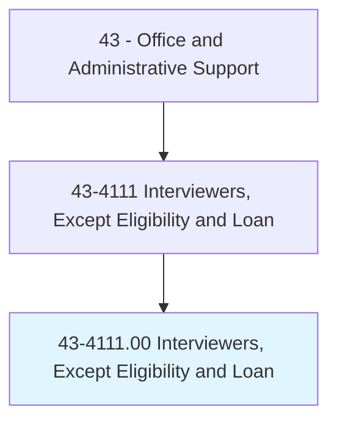
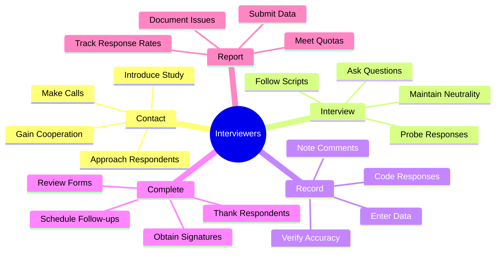
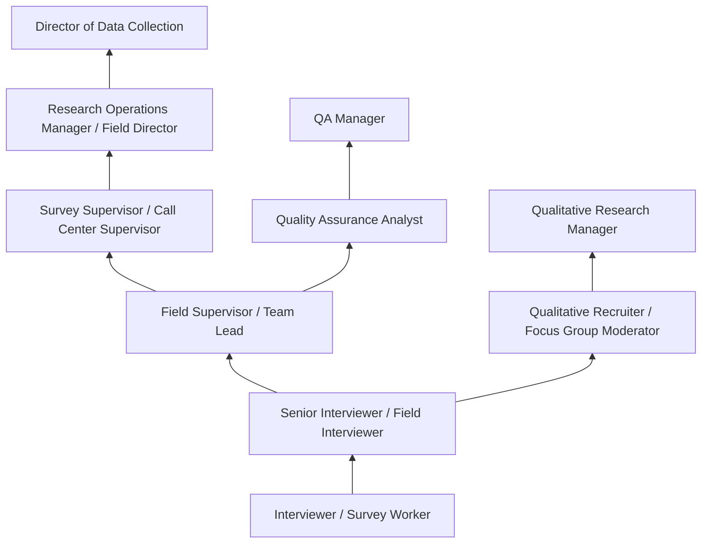
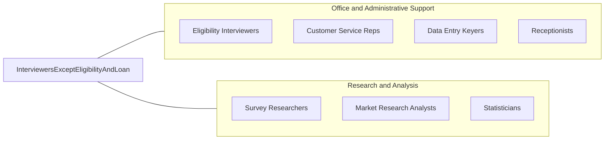

# Interviewers, Except Eligibility and Loan

> Interview persons by telephone, mail, in person, or by other means for the purpose of completing forms, applications, or questionnaires. Ask specific questions, record answers, and assist persons with completing form.

## Overview

Interviewers, Except Eligibility and Loan conduct structured interviews with individuals to collect information for surveys, market research, census data collection, patient intake, opinion polling, and administrative applications. They follow predetermined questionnaires and scripts, ask specific questions in a neutral manner, accurately record responses using paper forms or computer systems, and assist respondents with understanding questions and completing required documentation.

These professionals work in market research firms, polling organizations, healthcare facilities, government agencies, social service organizations, and call centers. Their work generates the primary data that organizations use for strategic decision-making, policy development, product research, political analysis, and regulatory compliance. Interview quality directly impacts data accuracy, research validity, and the conclusions drawn from collected information. A skilled interviewer can achieve higher response rates, more accurate data, and better respondent experience than automated alternatives.

The role requires strong interpersonal skills to establish rapport with diverse respondents who may be busy, suspicious, or reluctant to participate. Clear communication ensures questions are understood as intended, while meticulous recording maintains data integrity. Computer-assisted interviewing systems (CATI for telephone, CAPI for in-person) have modernized the profession, but the human ability to build rapport, probe for clarification, and adapt to respondent needs ensures continued demand for skilled interviewers despite technological advances and increased use of online surveys.

## Classification Hierarchy



## Key Statistics

| Metric | Value |
|--------|-------|
| SOC Code | 43-4111.00 |
| Job Zone | 2 (Some Preparation) |
| Category | [Office and Administrative Support](/occupations/Administrative/index) |
| Median Annual Salary | $37,400 |
| Salary Range | $26,000 - $55,000 |
| 10th Percentile | $26,500 |
| 90th Percentile | $54,800 |
| Employment | ~56,000 |
| Projected Growth | -7% (declining) |
| Annual Openings | ~7,000 |
| Core Tasks | 30 |
| Source | O*NET |

## Core Tasks



### conduct.StructuredInterviews

Interviewers administer questionnaires to respondents.

**Actions:**
- `contact.Respondents.per.SamplingProtocol`
- `administer.Questionnaires.using.Scripts`
- `record.Responses.in.DataSystems`
- `maintain.Neutrality.during.Questioning`

### ensure.DataQuality

Interviewers maintain accuracy and completeness.

**Actions:**
- `verify.Accuracy.of.RecordedResponses`
- `probe.Unclear.answers.for.Clarification`
- `review.Forms.for.Completeness`
- `document.RefusalsAndIssues.for.Analysis`

## Skills & Competencies

### Technical Skills
- **Interview Techniques** - Expert (structured questioning, probing, rapport)
- **Data Collection Methods** - Advanced (sampling, quotas, protocols)
- **CATI/CAPI Systems** - Advanced (computer-assisted interviewing)
- **Survey and Questionnaire Tools** - Advanced (skip patterns, routing)
- **Data Entry** - Advanced (accuracy, speed, coding)
- **CRM and Contact Management** - Intermediate (tracking, scheduling)
- **Recording and Documentation** - Advanced (accurate verbatim capture)
- **Multi-Language Skills** - Valuable (bilingual interviewers in demand)

### Soft Skills
- **Communication** - Critical (clear articulation, active listening)
- **Active Listening** - Critical (understanding responses, detecting hesitation)
- **Patience** - Essential (working with reluctant or slow respondents)
- **Attention to Detail** - Essential (accurate recording)
- **Neutral Questioning** - Essential (avoiding bias, leading)
- **Cultural Sensitivity** - Important (working with diverse populations)
- **Persistence** - Important (achieving response rates)
- **Adaptability** - Important (handling unexpected situations)

## Education & Certifications

| Requirement | Details |
|-------------|---------|
| Typical Education | High school diploma |
| Preferred Education | Some college, especially in social sciences |
| Interview Training | Company-specific methodology (1-2 weeks typical) |
| CATI/CAPI Training | System-specific certification |
| Research Ethics Training | IRB protocols (for research roles) |
| HIPAA Training | Required for healthcare intake positions |
| Bilingual Certification | Valuable for diverse populations |
| MRA Certification | Market Research Association credentials |

## Career Progression



### Career Pathway Details

| Level | Title | Years Experience | Key Responsibilities |
|-------|-------|------------------|----------------------|
| Entry | Interviewer / Survey Worker | 0-1 years | Administer questionnaires, meet quotas |
| Mid | Senior Interviewer / Field Interviewer | 1-3 years | Complex surveys, difficult respondents, training peers |
| Lead | Field Supervisor / Team Lead | 3-5 years | Supervise interviewers, quality monitoring |
| Supervisory | Survey Supervisor | 5-8 years | Operations management, scheduling, performance |
| Management | Research Operations Manager | 8-12 years | Multi-project oversight, client relationships |
| Director | Director of Data Collection | 12+ years | Strategic planning, methodology, technology |

### Specialization Paths

| Specialization | Focus Area | Additional Skills |
|----------------|------------|-------------------|
| Market Research | Consumer surveys, brand research | Product knowledge, marketing concepts |
| Healthcare Intake | Patient registration, assessments | Medical terminology, HIPAA, sensitivity |
| Political Polling | Opinion research, exit polling | Political neutrality, rapid turnaround |
| Census/Government | Large-scale data collection | Standardized protocols, diverse populations |
| Qualitative Recruiting | Focus group/interview recruitment | Screening, scheduling, relationship building |

## Industry Variations

| Setting | Focus | Unique Aspects |
|---------|-------|----------------|
| Market Research | Consumer surveys, focus group recruiting | Diverse respondents; brand awareness; product testing; incentive management |
| Healthcare | Patient intake, health risk assessments | Medical terminology; sensitivity; HIPAA compliance; emotional topics |
| Government/Census | Census, social surveys, statistics | Large-scale operations; diverse populations; standardized protocols |
| Political Polling | Opinion research, exit polling | Sampling methodology; neutrality; rapid turnaround; media deadlines |
| Social Research | Academic/nonprofit surveys | IRB protocols; sensitive topics; longitudinal studies |

### Market Research Interviewing

Market research interviewers work for research firms conducting consumer surveys, product testing, brand awareness studies, and customer satisfaction research. They contact respondents by phone or in-person at malls, events, and door-to-door, administer surveys using CATI or tablet systems, and may recruit participants for focus groups and in-depth interviews. Speed, quota achievement, and data quality are key performance metrics.

### Healthcare Patient Intake

Healthcare interviewers conduct patient intake, health risk assessments, patient satisfaction surveys, and clinical trial screenings. They gather sensitive health information, explain procedures, and complete registration forms while demonstrating empathy and maintaining HIPAA compliance. Medical terminology knowledge and comfort with discussing health conditions are essential.

### Government and Census

Government survey interviewers work for agencies like the Census Bureau, Bureau of Labor Statistics, and state research offices. They conduct large-scale surveys following strict standardized protocols, work with diverse populations including non-English speakers, and may interview in homes, institutions, or by phone. Civil service employment provides stability and benefits.

### Political Polling

Political pollsters conduct rapid-turnaround opinion surveys, voter preference studies, and election exit polling. They must maintain strict neutrality, work with scientific sampling methods, and often operate under intense deadline pressure during election seasons. Accuracy is paramount given public scrutiny of polling results.

## Technology & Tools

### Survey and Interview Systems
- **CATI Systems** - Voxco, Confirmit, NIPO, WinCATI
- **CAPI Systems** - Blaise, SurveyToGo, Dooblo
- **Online Platforms** - Qualtrics, SurveyMonkey, Decipher
- **Panel Management** - SSI, Dynata panel systems

### Data Collection Hardware
- **Tablets** - iPad, Android tablets for field work
- **Phones** - Predictive dialers, softphones, headsets
- **Recording** - Audio recording equipment (with consent)
- **Smartphones** - Mobile data collection apps

### Communication and Management
- **CRM Systems** - Contact management, callback scheduling
- **Scheduling** - Appointment booking systems
- **Reporting** - Dashboard and quota tracking
- **Quality Monitoring** - Call recording, screen capture

### Analysis Support
- **Coding Tools** - Open-end response coding
- **SPSS/SAS** - Basic familiarity for data review
- **Excel** - Response tracking, productivity analysis

## Related Occupations



### Related Occupation Comparison

| Occupation | Similarity | Key Difference |
|------------|------------|----------------|
| Eligibility Interviewers | High | Benefits determination vs data collection |
| Customer Service Reps | Medium | Service delivery vs information gathering |
| Survey Researchers | Medium | Design and analysis vs data collection |
| Market Research Analysts | Medium | Analysis and reporting vs interviewing |

## Industries

- [Professional Services (Market Research)](/industries/ProfessionalServices) - High Employment
- [Healthcare](/industries/Healthcare/index) - Moderate Employment
- [Government](/industries/PublicAdministration) - Moderate Employment
- [Nonprofit/Social Research](/industries/ProfessionalServices) - Moderate Employment
- [Media and Polling](/industries/Information) - Low Employment

## Departments

This occupation typically works in:
- [Research Department](/departments/Research) - Survey and data collection
- Market Research - Consumer insights
- Customer Service - Patient/client intake
- Healthcare Administration - Registration and intake
- Human Resources - Employee surveys (internal)

## Work Environment

### Physical Setting
- Call center with individual workstations (phone surveys)
- Field locations including homes, businesses, malls (in-person)
- Healthcare facilities (intake roles)
- Home-based remote work (increasingly common)
- Research lab settings (academic)

### Work Schedule
- Varied hours to reach respondents (evenings/weekends common)
- Shift work in call centers
- Project-based with variable intensity
- Census and election work highly seasonal
- Part-time positions widely available

### Work Characteristics
- Repetitive questioning with structured scripts
- High call/contact volume expectations
- Rejection and refusals are common
- Performance metrics tracked closely
- Supervision through monitoring and quality review

### Mental Demands
- Maintaining engagement through repetition
- Dealing with reluctant or hostile respondents
- Meeting quota pressure
- Sensitivity to emotional or personal topics
- Maintaining neutrality and avoiding bias

## Performance Metrics

### Key Performance Indicators

| Metric | Description | Typical Target |
|--------|-------------|----------------|
| Response Rate | Completed interviews / contacts | 30-60% (varies) |
| Completion Rate | Finished surveys / started | >85% |
| Interviews per Hour | Productivity measure | 2-6 (varies by length) |
| Data Quality Score | Accuracy of recorded data | >95% |
| Refusal Conversion | Turning refusals into completes | 20-40% |
| Schedule Adherence | On-time, on-shift | >95% |

### Quality Standards
- Accurate verbatim recording of responses
- Proper skip pattern following
- No leading or biased questioning
- Complete and legible forms
- Appropriate probing techniques

## Research Ethics

### Key Ethical Principles

| Principle | Application |
|-----------|-------------|
| Informed Consent | Explain study purpose and voluntary participation |
| Confidentiality | Protect respondent identity and responses |
| Right to Refuse | Accept refusals without pressure |
| No Harm | Avoid topics or methods that cause distress |
| Accuracy | Record responses faithfully without alteration |

### Compliance Requirements
- IRB approval compliance (research settings)
- HIPAA protection (healthcare)
- TCPA regulations (telephone calling)
- Do Not Call list adherence
- Data security and privacy laws

## GraphDL Semantic Structure

```graphdl
Interviewers, Except Eligibility and Loan perform:
- contact.Respondents.per.SamplingProtocol
- administer.Questionnaires.using.Scripts
- record.Responses.in.DataSystems
- maintain.Neutrality.during.Questioning
- probe.Answers.for.Clarification
- verify.Accuracy.of.CollectedData
- achieve.Quotas.for.StudyCompletion
- report.Issues.to.Supervisors
```

---

*Source: O*NET 43-4111.00 - ONETOccupation*
