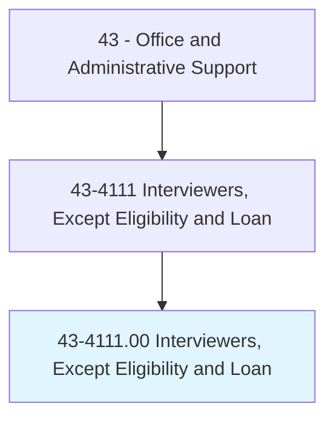
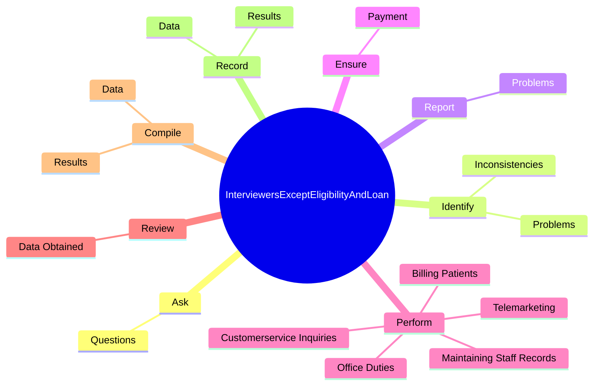
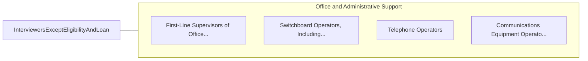

# Interviewers, Except Eligibility and Loan

> Interview persons by telephone, mail, in person, or by other means for the purpose of completing forms, applications, or questionnaires. Ask specific questions, record answers, and assist persons with completing form. May sort, classify, and file forms.

## Overview

Interviewers, Except Eligibility and Loan is an occupation within the Office and Administrative Support category. Interview persons by telephone, mail, in person, or by other means for the purpose of completing forms, applications, or questionnaires. Ask specific questions, record answers, and assist persons with completing form.

## Classification Hierarchy

## Key Statistics

| Metric | Value |
|--------|-------|
| SOC Code | 43-4111.00 |
| Category | [Office and Administrative Support](/occupations/Administrative/index) |
| Task Count | 99 |
| Source | O*NET |

## Core Tasks

### ask.Questions

Interviewers, Except Eligibility and Loan ask questions as part of their core responsibilities.

**Actions:**
- `ask.Questions.in.AccordanceWithInstructions.to.obtain.VariousSpecifiedInformation`
- `ask.Questions.in.PersonsName`
- `ask.Questions.in.Address`
- `ask.Questions.in.Age`

### identify.Problems

Interviewers, Except Eligibility and Loan identify problems as part of their core responsibilities.

**Actions:**
- `identify.Problems.in.ObtainingValidData`
- `identify.Inconsistencies.in.IntervieweesResponses.by.MeansOfAppropriateQuestioning`
- `identify.Inconsistencies.in.Explanation`

### report.Problems

Interviewers, Except Eligibility and Loan report problems as part of their core responsibilities.

**Actions:**
- `report.Problems.in.ObtainingValidData`

## Skills & Competencies

### Technical Skills
- **Office Management** - Advanced
- **Data Entry** - Advanced
- **Records Management** - Advanced

### Soft Skills
- **Communication** - Essential
- **Problem Solving** - Essential
- **Critical Thinking** - Important
- **Teamwork** - Important
- **Adaptability** - Important

## Related Occupations

## Industries

This occupation is found across multiple industries. See [Industries](/industries) for sector-specific employment data.

## Career Progression

---

*Source: O*NET 43-4111.00 - ONETOccupation*
