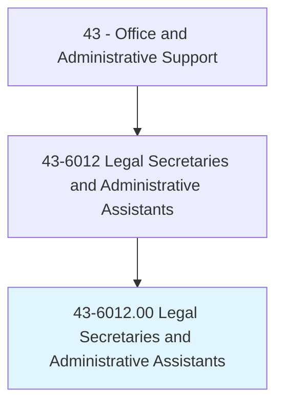
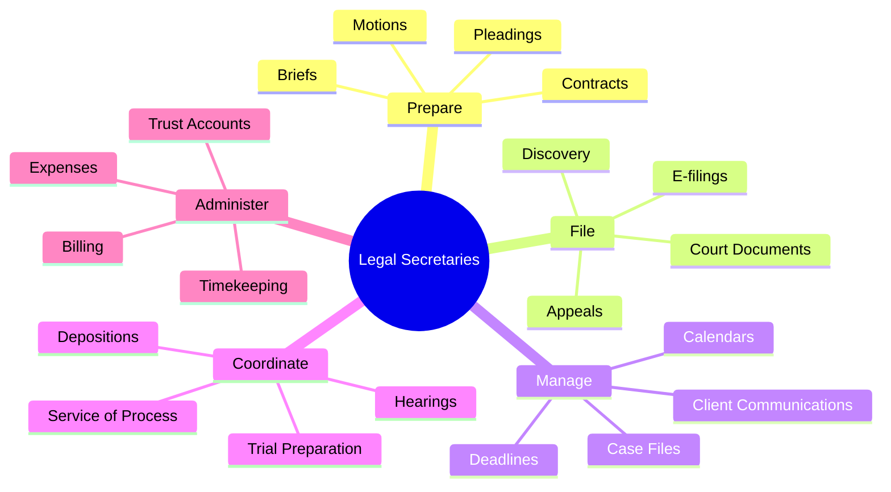
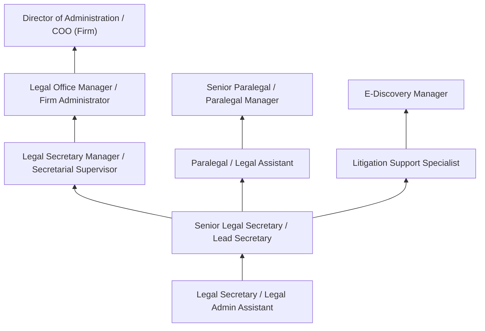
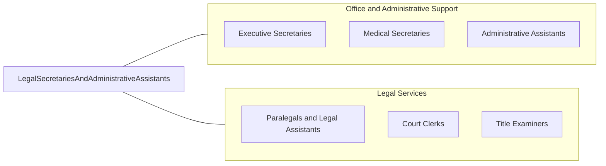

# Legal Secretaries and Administrative Assistants

> Perform secretarial duties using legal terminology, procedures, and documents. Prepare legal papers and correspondence, such as summonses, complaints, motions, and subpoenas. May also assist with legal research.

## Overview

Legal Secretaries provide specialized administrative support to attorneys and legal professionals, preparing legal documents, managing court filing deadlines, maintaining case files, scheduling depositions and hearings, and handling correspondence using proper legal terminology and procedures. They are essential to the efficient operation of law firms, corporate legal departments, government legal offices, and courts, serving as the organizational foundation that keeps legal practices running smoothly.

The role requires comprehensive knowledge of legal terminology, court procedures, filing requirements, document formatting standards, and jurisdictional rules that vary by court and practice area. Legal secretaries prepare pleadings, contracts, discovery materials, motions, briefs, and appellate documents, often working under tight court-imposed deadlines where missing a filing deadline can have severe consequences for clients. Many handle client billing and timekeeping, trust account administration, conflict checking, and calendar management for multiple attorneys across different cases and courts.

Modern legal secretaries increasingly use electronic filing systems (PACER, CM/ECF, state court portals), legal research databases, document management platforms, and practice management software. The role has evolved from traditional typing and transcription toward comprehensive legal support, with many legal secretaries contributing substantively to case management, research, and client communication. In smaller firms, legal secretaries often handle responsibilities that larger firms divide among paralegals, legal assistants, and administrative staff.

## Classification Hierarchy



## Key Statistics

| Metric | Value |
|--------|-------|
| SOC Code | 43-6012.00 |
| Job Zone | 3 (Medium Preparation) |
| Category | [Office and Administrative Support](/occupations/Administrative/index) |
| Median Annual Salary | $52,250 |
| Salary Range | $35,000 - $75,000 |
| 10th Percentile | $35,500 |
| 90th Percentile | $74,800 |
| Employment | ~165,000 |
| Projected Growth | -12% (declining) |
| Annual Openings | ~18,000 |
| Core Tasks | 48 |
| Source | O*NET |

## Core Tasks



### prepare.LegalDocuments

Legal Secretaries prepare legal documents and correspondence.

**Actions:**
- `prepare.Pleadings.for.Filing`
- `draft.Correspondence.to.Clients`
- `format.Documents.per.CourtRules`
- `proofread.Materials.for.Accuracy`

### manage.CaseDeadlines

Legal Secretaries manage court deadlines and calendars.

**Actions:**
- `calendar.Deadlines.for.Court`
- `track.Statutes.of.Limitations`
- `schedule.Hearings.with.Courts`
- `coordinate.Depositions.with.Parties`

## Skills & Competencies

### Technical Skills
- **Legal Document Preparation** - Expert (pleadings, motions, briefs, contracts)
- **Court Filing Procedures** - Expert (federal, state, local court rules)
- **Legal Terminology** - Expert (litigation, corporate, specialty areas)
- **E-filing Systems (PACER, CM/ECF)** - Expert (federal and state portals)
- **Case Management Software** - Advanced (Clio, PracticePanther, Litify)
- **Legal Research Tools** - Intermediate (Westlaw, LexisNexis, PACER)
- **Trust Account Administration** - Advanced (IOLTA compliance)
- **Document Management** - Advanced (iManage, NetDocuments)

### Soft Skills
- **Attention to Detail** - Critical (legal documents must be perfect)
- **Organizational Skills** - Critical (managing multiple cases and deadlines)
- **Confidentiality** - Critical (attorney-client privilege, sensitive information)
- **Time Management** - Critical (court deadlines are non-negotiable)
- **Communication** - Essential (attorneys, clients, courts, opposing counsel)
- **Composure Under Pressure** - Essential (deadline intensity)
- **Discretion** - Critical (client confidentiality)
- **Problem Solving** - Important (procedural issues, scheduling conflicts)

## Education & Certifications

| Requirement | Details |
|-------------|---------|
| Typical Education | Associate's degree or certificate in legal studies |
| Preferred Education | Bachelor's degree or paralegal certificate |
| Certified Legal Secretary (CLS) | NALS entry-level certification |
| Professional Legal Secretary (PLS) | NALS advanced credential |
| Certified Legal Secretary Specialist | NALS specialty credentials |
| Notary Public | Required in many legal settings |
| State Bar Certification | Some states offer legal secretary credentials |
| Continuing Education | Court rule updates, software training |

## Career Progression



### Career Pathway Details

| Level | Title | Years Experience | Key Responsibilities |
|-------|-------|------------------|----------------------|
| Entry | Legal Secretary / Admin Assistant | 0-2 years | Basic document preparation, filing, calendaring |
| Mid | Senior Legal Secretary | 2-5 years | Complex documents, multiple attorneys, specialized practice |
| Lead | Legal Secretary Manager | 5-8 years | Team supervision, training, workflow management |
| Management | Legal Office Manager | 8-12 years | Firm operations, HR, vendor management, budgets |
| Director | Director of Administration | 12+ years | Strategic planning, technology, firm leadership |

### Specialization by Practice Area

| Practice Area | Focus | Special Skills |
|---------------|-------|----------------|
| Litigation | Court filings, discovery | Trial preparation, e-discovery, deadlines |
| Corporate/Transactional | Contracts, closings | Due diligence, entity formation, SEC filings |
| Real Estate | Closings, title work | Title searches, escrow, recording |
| Intellectual Property | Patents, trademarks | USPTO procedures, docketing, prosecution |
| Family Law | Domestic relations | Sensitive client matters, court forms |
| Immigration | USCIS filings | Form preparation, visa tracking, compliance |

## Industry Variations

| Setting | Focus | Unique Aspects |
|---------|-------|----------------|
| Large Law Firms (BigLaw) | Specialized practice support | Multiple attorneys; complex matters; specialized secretaries; overtime |
| Mid-Size Law Firms | General practice support | Broader responsibilities; multiple practice areas; some specialization |
| Small/Solo Practices | Full-service support | All administrative functions; close attorney relationship; varied duties |
| Corporate Legal | In-house counsel support | Contract management; compliance; board governance; corporate records |
| Government Legal | Prosecutor/defender offices | High caseloads; standardized procedures; civil service benefits |
| Courts | Judicial support | Judge calendars; courtroom preparation; confidential proceedings |

### Large Law Firm Practice

Large firm legal secretaries typically support 2-4 attorneys within a specific practice group (litigation, corporate, IP, etc.). Work involves complex, high-stakes matters with extensive document preparation, tight deadlines, and significant overtime during trials or deal closings. Specialization allows deep expertise in practice-specific procedures and terminology.

### Small/Solo Practice

Small firm and solo practice legal secretaries handle comprehensive administrative duties, often serving as office manager, receptionist, paralegal, and bookkeeper in addition to traditional secretarial functions. They develop broad knowledge across multiple practice areas and close working relationships with attorneys and clients.

### Corporate Legal Department

Corporate legal secretaries support in-house counsel with contract management, board meeting preparation, compliance documentation, corporate governance, and coordination with outside counsel. They understand the company's business operations and legal needs across departments.

### Government Legal

Government legal secretaries work in prosecutor offices, public defender agencies, attorney general offices, and agency legal departments. High caseloads, standardized procedures, and civil service employment provide stable careers with benefits, though salaries may be lower than private practice.

## Technology & Tools

### Practice Management Software
- **Clio** - Cloud-based practice management
- **PracticePanther** - Small/mid-firm platform
- **Litify** - Enterprise legal management
- **MyCase** - Client-focused practice management
- **Smokeball** - Productivity and automation

### Document Management
- **iManage** - Enterprise document management
- **NetDocuments** - Cloud document management
- **Worldox** - Desktop document management
- **Microsoft SharePoint** - Collaboration and storage

### E-Filing and Research
- **PACER/CM/ECF** - Federal court filing
- **State E-filing Portals** - State court systems
- **Westlaw** - Legal research and forms
- **LexisNexis** - Research and analytics
- **Fastcase** - Legal research alternative

### Billing and Time
- **Tabs3** - Time and billing software
- **Juris** - Enterprise billing
- **TimeSolv** - Cloud time tracking
- **Sage Timeslips** - Time and billing

## Related Occupations



### Related Occupation Comparison

| Occupation | Similarity | Key Difference |
|------------|------------|----------------|
| Paralegals | High | Substantive legal work vs administrative support |
| Executive Secretaries | Medium | General executive vs legal specialty |
| Court Clerks | Medium | Court operations vs attorney support |
| Legal Assistants | High | Titles often used interchangeably |

## Industries

- [Legal Services](/industries/ProfessionalServices/Legal) - High Employment
- [Government](/industries/PublicAdministration) - Moderate Employment
- [Corporate Legal Departments](/industries/ProfessionalServices) - Moderate Employment
- [Financial Services](/industries/Finance) - Moderate Employment
- [Real Estate](/industries/RealEstate) - Low Employment

## Departments

This occupation typically works in:
- [Legal Department](/departments/Legal) - Attorney support
- Litigation - Case management and court filings
- Corporate Legal - Transactional support
- Compliance - Regulatory documentation
- Court Administration - Judicial support

## Work Environment

### Physical Setting
- Law firm office environment
- Desk-based work with computer and phone
- Access to legal files and document storage
- Professional office attire expected
- Some remote work opportunities (increasing)

### Work Schedule
- Standard business hours with significant overtime
- Deadline-driven schedule around court dates
- Extended hours during trial preparation
- Quarter-end and year-end billing pressures
- Some weekend work for urgent matters

### Work Characteristics
- High-pressure deadline environment
- Multi-tasking across multiple cases and attorneys
- Confidential and privileged information handling
- Detail-intensive document preparation
- Frequent communication with courts and clients

### Unique Considerations
- Court deadlines are absolute (missing can harm clients)
- Attorney-client privilege requires strict confidentiality
- Professional appearance and demeanor expected
- Overtime common during trials and closings
- Stress management important for longevity

## Performance Standards

### Key Performance Indicators

| Metric | Description | Typical Standard |
|--------|-------------|------------------|
| Filing Accuracy | Error-free court filings | 100% required |
| Deadline Compliance | Meetings all court deadlines | 100% required |
| Document Turnaround | Time from request to completion | Same day/next day |
| Calendar Accuracy | Correct scheduling | 100% required |
| Client Service | Responsiveness and professionalism | High satisfaction |

### Quality Standards
- Zero tolerance for missed court deadlines
- Accurate legal document formatting
- Proper citation and reference formatting
- Complete and accurate billing entries
- Professional client communication

## GraphDL Semantic Structure

```graphdl
Legal Secretaries and Administrative Assistants perform:
- prepare.Documents.for.CourtFiling
- manage.Calendars.for.Attorneys
- file.Pleadings.with.Courts
- coordinate.Depositions.for.Cases
- maintain.Files.for.ClientMatters
- process.Billing.for.Services
- communicate.With.Clients.and.Courts
- support.Attorneys.across.PracticeAreas
```

---

*Source: O*NET 43-6012.00 - ONETOccupation*
