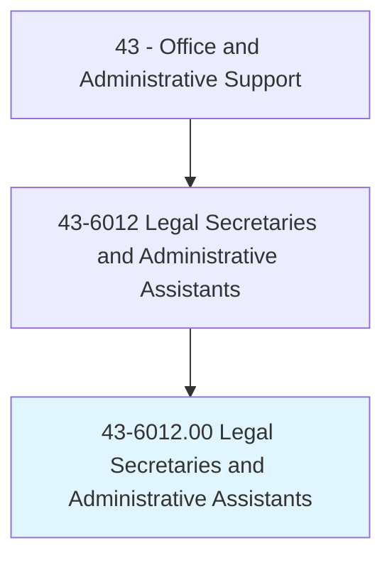
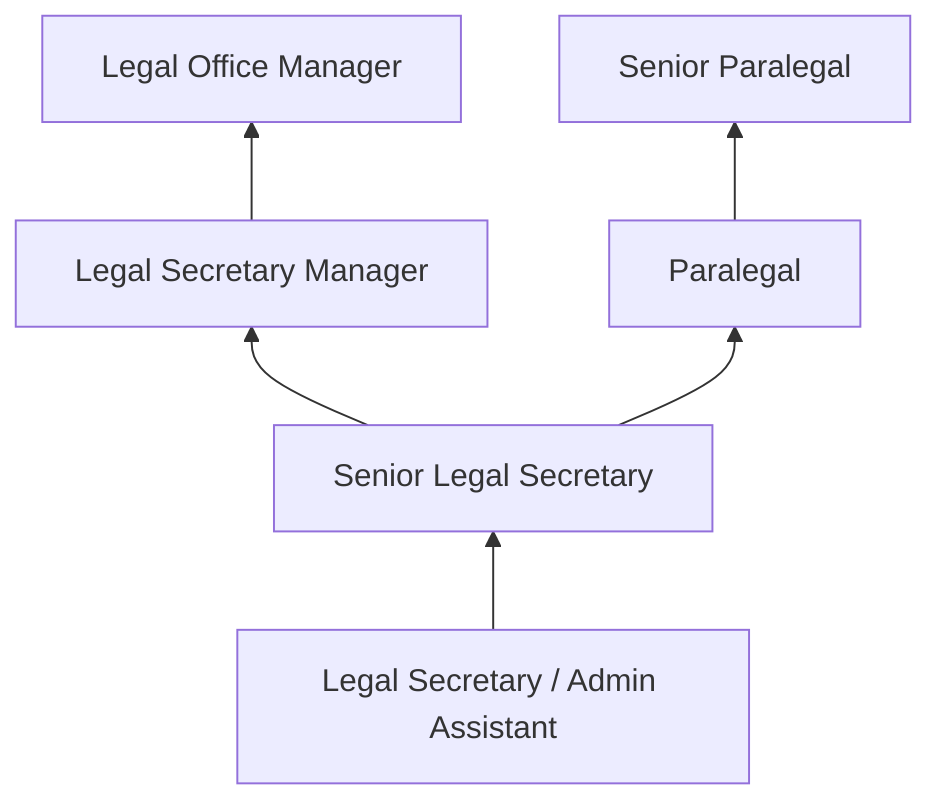
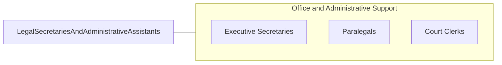

# Legal Secretaries and Administrative Assistants

> Perform secretarial duties using legal terminology, procedures, and documents. Prepare legal papers and correspondence, such as summonses, complaints, motions, and subpoenas. May also assist with legal research.

## Overview

Legal Secretaries provide specialized administrative support to attorneys and legal professionals, preparing legal documents, managing court filing deadlines, maintaining case files, scheduling depositions and hearings, and handling correspondence using legal terminology and procedures. They are essential to the efficient operation of law firms, corporate legal departments, and government legal offices.

The role requires knowledge of legal terminology, court procedures, filing requirements, and document formatting standards specific to the jurisdiction. Legal secretaries prepare pleadings, contracts, discovery materials, and appellate documents, often working under tight court-imposed deadlines. Many handle client billing, trust account administration, and calendar management for multiple attorneys.

Modern legal secretaries increasingly use electronic filing systems, legal research databases, and document management platforms, evolving from traditional typing-focused roles into legal support professionals who contribute substantively to case management.

## Classification Hierarchy

## Key Statistics

| Metric | Value |
|--------|-------|
| SOC Code | 43-6012.00 |
| Job Zone | 3 (Medium Preparation) |
| Category | [Office and Administrative Support](/occupations/Administrative/index) |
| Median Annual Salary | $52,250 |
| Employment | ~165,000 |
| Projected Growth | -12% (declining) |
| Core Tasks | 48 |
| Source | O*NET |

## Core Tasks

Core task data with GraphDL semantic actions for this occupation is maintained in the data pipeline. See [O*NET 43-6012.00](https://www.onetonline.org/link/summary/43-6012.00) for detailed task information.

## Skills & Competencies

### Technical Skills
- **Legal Document Preparation** - Expert
- **Court Filing Procedures** - Expert
- **Legal Terminology** - Expert
- **Case Management Software** - Advanced
- **Legal Research Tools** - Intermediate
- **E-filing Systems (PACER, CM/ECF)** - Advanced
- **Trust Account Administration** - Intermediate

### Soft Skills
- **Attention to Detail** - Critical
- **Organizational Skills** - Critical
- **Confidentiality** - Critical
- **Time Management (Deadlines)** - Critical
- **Communication** - Essential
- **Composure Under Pressure** - Essential

## Education & Certifications

| Requirement | Details |
|-------------|--------|
| Typical Education | Associate's degree or certificate in legal studies |
| Certified Legal Secretary (CLS) | NALS certification |
| Professional Legal Secretary (PLS) | NALS advanced credential |
| Notary Public | Required in many legal settings |
| Paralegal Certificate | Enhances advancement opportunities |

## Career Progression

## Industry Variations

| Setting | Focus | Unique Aspects |
|---------|-------|----------------|
| Law Firms | Litigation, corporate, IP support | Multiple attorney support; billable entries; court deadlines |
| Corporate Legal | In-house counsel support | Contract management; compliance; board governance |
| Government | Prosecutor/public defender offices | High caseloads; standardized procedures; civil service |
| Courts | Judicial support | Judge calendars; courtroom preparation; confidential proceedings |

## Technology & Tools

- **Legal Software** - Clio, PracticePanther, Litify
- **Document Management** - iManage, NetDocuments
- **E-filing** - PACER, CM/ECF, state portals
- **Research** - Westlaw, LexisNexis
- **Billing** - Time and billing systems

## Related Occupations

## Departments

This occupation typically works in:
- [Legal Department](/departments/Legal) - Attorney support
- Litigation - Case management
- Corporate Legal - Transactional support
- Court Administration - Judicial support

---

*Source: O*NET 43-6012.00 - ONETOccupation*
