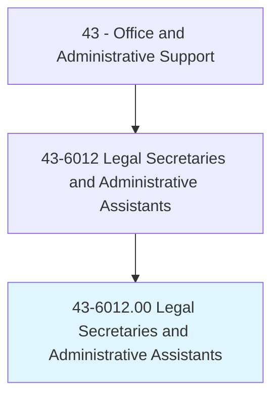
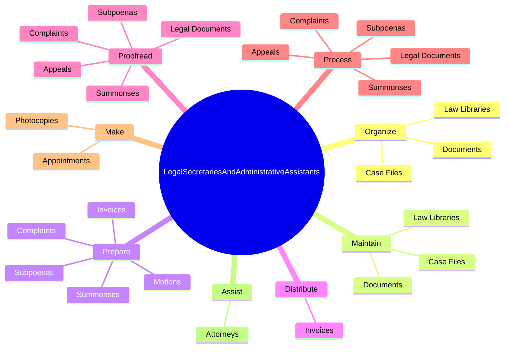
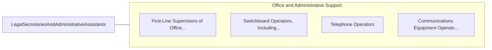

# Legal Secretaries and Administrative Assistants

> Perform secretarial duties using legal terminology, procedures, and documents. Prepare legal papers and correspondence, such as summonses, complaints, motions, and subpoenas. May also assist with legal research.

## Overview

Legal Secretaries and Administrative Assistants is an occupation within the Office and Administrative Support category. Perform secretarial duties using legal terminology, procedures, and documents. Prepare legal papers and correspondence, such as summonses, complaints, motions, and subpoenas.

## Classification Hierarchy

## Key Statistics

| Metric | Value |
|--------|-------|
| SOC Code | 43-6012.00 |
| Category | [Office and Administrative Support](/occupations/Administrative) |
| Task Count | 58 |
| Source | O*NET |

## Core Tasks

### organize.LawLibraries

Legal Secretaries and Administrative Assistants organize law libraries as part of their core responsibilities.

**Actions:**
- `organize.LawLibraries`
- `organize.Documents`
- `organize.CaseFiles`

### maintain.LawLibraries

Legal Secretaries and Administrative Assistants maintain law libraries as part of their core responsibilities.

**Actions:**
- `maintain.LawLibraries`
- `maintain.Documents`
- `maintain.CaseFiles`

### prepare.Invoices

Legal Secretaries and Administrative Assistants prepare invoices as part of their core responsibilities.

**Actions:**
- `prepare.Invoices.to.bill.Clients`
- `prepare.Invoices.to.pay.AccountExpenses`
- `prepare.Summonses`
- `prepare.Subpoenas`

## Skills & Competencies

### Technical Skills
- **Office Management** - Advanced
- **Data Entry** - Advanced
- **Records Management** - Advanced

### Soft Skills
- **Communication** - Essential
- **Problem Solving** - Essential
- **Critical Thinking** - Important
- **Teamwork** - Important
- **Adaptability** - Important

## Related Occupations

## Industries

This occupation is found across multiple industries. See [Industries](/industries) for sector-specific employment data.

## Career Progression

---

*Source: O*NET 43-6012.00 - ONETOccupation*
