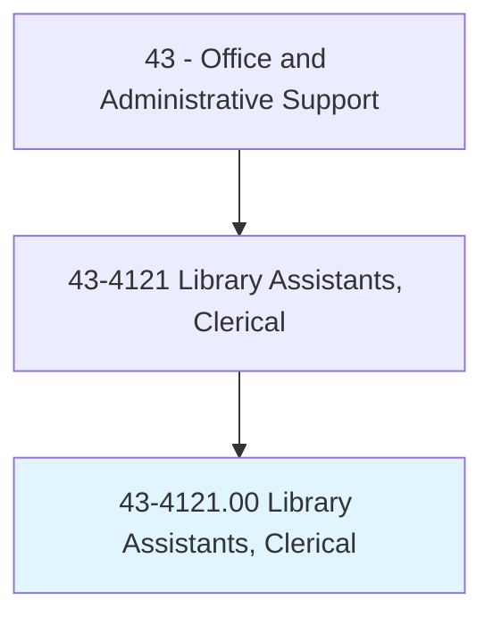
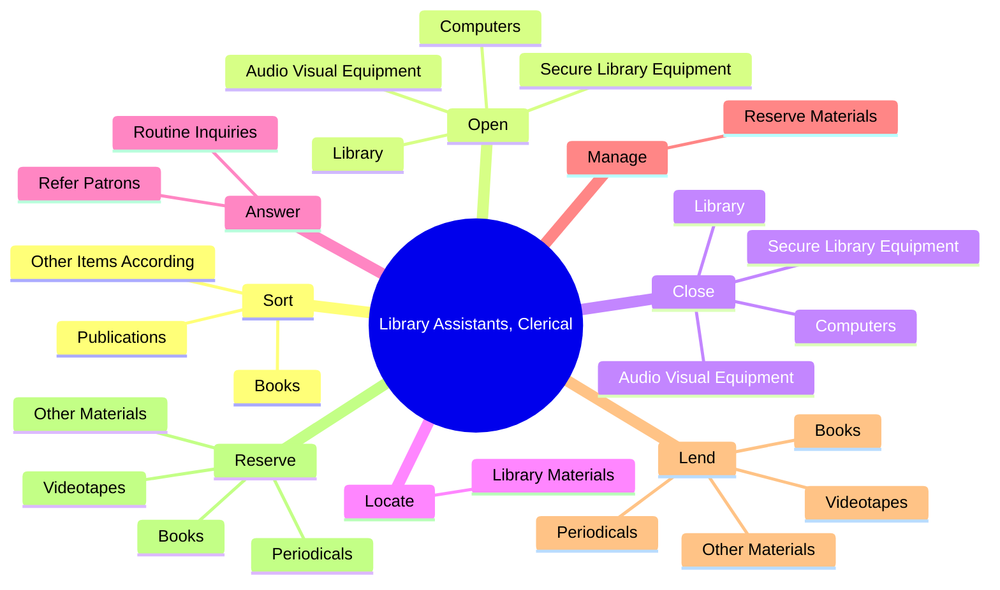

# Library Assistants, Clerical

> Compile records, and sort, shelve, issue, and receive library materials such as books, electronic media, pictures, cards, slides and microfilm. Locate library materials for loan and replace material in shelving area, stacks, or files according to identification number and title. Register patrons to permit them to borrow books, periodicals, and other library materials.

## Overview

Library Assistants, Clerical is an occupation within the Office and Administrative Support category. Compile records, and sort, shelve, issue, and receive library materials such as books, electronic media, pictures, cards, slides and microfilm. Locate library materials for loan and replace material in shelving area, stacks, or files according to identification number and title.

## Classification Hierarchy

## Key Statistics

| Metric | Value |
|--------|-------|
| SOC Code | 43-4121.00 |
| Category | [Office and Administrative Support](/occupations/Administrative/index) |
| Task Count | 177 |
| Source | O*NET |

## Core Tasks

### sort.Books

Library Assistants, Clerical sort books as part of their core responsibilities.

**Actions:**
- `sort.Books.to.established.Procedure`
- `sort.Publications.to.established.Procedure`
- `sort.Publications.to.return.ThemToShelves`
- `sort.Publications.to.files`

### open.Library

Library Assistants, Clerical open library as part of their core responsibilities.

**Actions:**
- `open.Library.during.SpecifiedHours`
- `open.SecureLibraryEquipment`
- `open.Computers`
- `open.AudioVisualEquipment`

### close.Library

Library Assistants, Clerical close library as part of their core responsibilities.

**Actions:**
- `close.Library.during.SpecifiedHours`
- `close.SecureLibraryEquipment`
- `close.Computers`
- `close.AudioVisualEquipment`

## Skills & Competencies

### Technical Skills
- **Office Management** - Advanced
- **Data Entry** - Advanced
- **Records Management** - Advanced

### Soft Skills
- **Communication** - Essential
- **Problem Solving** - Essential
- **Critical Thinking** - Important
- **Teamwork** - Important
- **Adaptability** - Important

## Related Occupations

## Industries

This occupation is found across multiple industries. See [Industries](/industries) for sector-specific employment data.

## Career Progression

---

*Source: O*NET 43-4121.00 - ONETOccupation*
