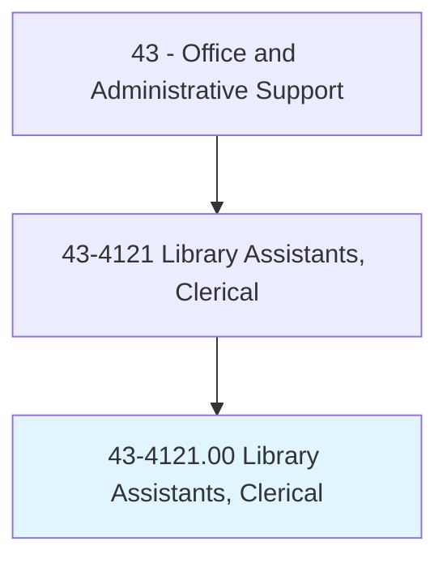
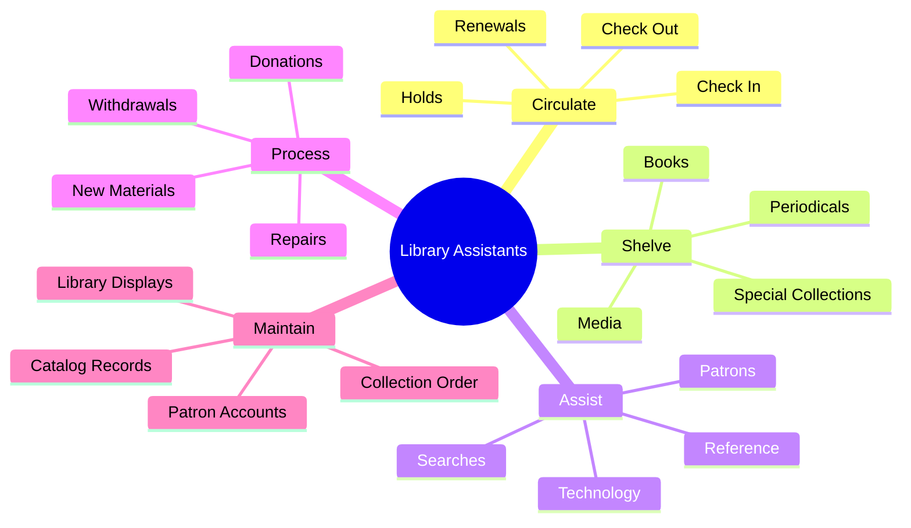
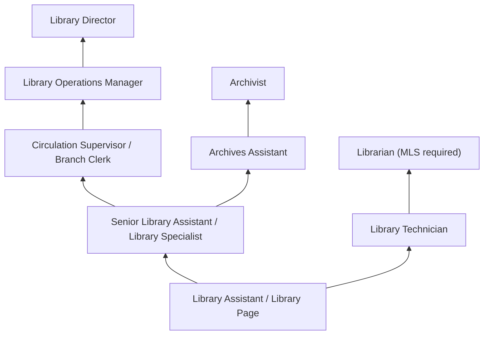
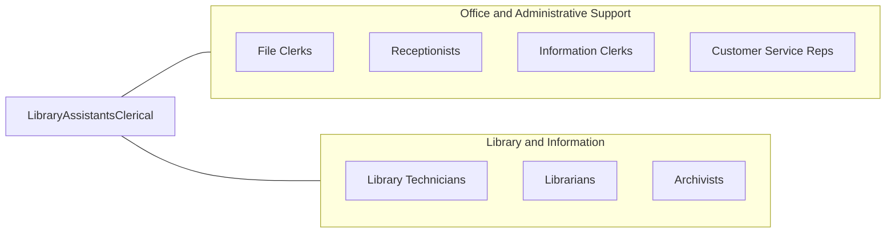

# Library Assistants, Clerical

> Compile records, and sort, shelve, issue, and receive library materials such as books, electronic media, pictures, cards, slides and microfilm. Locate library materials for loan and replace material in shelving area, stacks, or files according to identification number and title.

## Overview

Library Assistants perform clerical functions in libraries, including shelving books, processing check-outs and returns, maintaining catalog records, assisting patrons with finding materials, and handling interlibrary loan requests. They support librarians by managing the physical and digital operations that keep library collections accessible and organized.

Working in public, academic, school, and special libraries, these assistants manage circulation desks, register new patrons, collect fines, process holds and reservations, and maintain the physical order of collections. They use integrated library systems (ILS) to track materials and may assist with programming, displays, and community outreach events. Library assistants are often the first point of contact for patrons, requiring strong customer service skills alongside organizational abilities.

The role has expanded with digital resources, requiring assistants to help patrons access e-books, databases, online journals, and digital services alongside traditional print materials. Modern library assistants must navigate both physical and virtual collections, providing technical support for devices and digital literacy assistance to community members of all ages.

## Classification Hierarchy



## Key Statistics

| Metric | Value |
|--------|-------|
| SOC Code | 43-4121.00 |
| Job Zone | 2 (Some Preparation) |
| Category | [Office and Administrative Support](/occupations/Administrative/index) |
| Median Annual Salary | $31,800 |
| Salary Range | $22,000 - $46,000 |
| 10th Percentile | $22,500 |
| 90th Percentile | $45,800 |
| Employment | ~93,000 |
| Projected Growth | -6% (declining) |
| Annual Openings | ~12,000 |
| Core Tasks | 35 |
| Source | O*NET |

## Core Tasks



### circulate.Materials

Library Assistants manage the circulation of library materials.

**Actions:**
- `circulate.Books.to.Patrons`
- `process.Returns.from.Borrowers`
- `renew.Materials.for.ExtendedLoans`
- `manage.Holds.for.RequestedItems`

### assist.Patrons

Library Assistants provide patron assistance.

**Actions:**
- `assist.Patrons.with.Searches`
- `help.Users.access.DigitalResources`
- `answer.Questions.about.LibraryServices`
- `guide.Patrons.to.Materials`

## Skills & Competencies

### Technical Skills
- **Library Catalog Systems (ILS)** - Expert (Koha, SirsiDynix, Innovative)
- **Dewey Decimal / LC Classification** - Expert (shelving, call numbers)
- **Circulation Procedures** - Expert (loans, returns, fines, holds)
- **Database Navigation** - Advanced (research databases, catalog search)
- **Collection Maintenance** - Advanced (weeding, shifting, displays)
- **Digital Resource Access** - Advanced (e-books, audiobooks, databases)
- **Microsoft Office** - Advanced (Word, Excel, Outlook)
- **Technology Support** - Intermediate (computers, printers, devices)

### Soft Skills
- **Customer Service** - Critical (welcoming, helpful patron interaction)
- **Organizational Skills** - Critical (maintaining collection order)
- **Attention to Detail** - Critical (accurate shelving, records)
- **Patience** - Essential (assisting diverse patrons)
- **Communication** - Essential (clear explanations, friendly manner)
- **Adaptability** - Essential (varied patron needs and technologies)
- **Discretion** - Important (patron privacy, confidentiality)
- **Physical Stamina** - Important (shelving, standing, walking)

## Education & Certifications

| Requirement | Details |
|-------------|---------|
| Typical Education | High school diploma; some college preferred |
| Preferred Education | Associate's degree or library science coursework |
| Library Support Staff Certification | ALA-APA LSSC credential |
| Technology Training | ILS system certification |
| Continuing Education | Conference attendance, webinars, workshops |
| Background Check | Required for public library positions |
| First Aid/CPR | May be required for public settings |
| Bilingual Skills | Highly valued in diverse communities |

## Career Progression



### Career Pathway Details

| Level | Title | Years Experience | Key Responsibilities |
|-------|-------|------------------|----------------------|
| Entry | Library Page / Clerk | 0-1 years | Shelving, basic circulation, patron assistance |
| Mid | Library Assistant | 1-3 years | Full circulation, patron services, collection maintenance |
| Senior | Senior Library Assistant | 3-5 years | Complex transactions, training, special projects |
| Supervisory | Circulation Supervisor | 5-8 years | Team oversight, scheduling, policy implementation |
| Management | Library Operations Manager | 8-12 years | Multi-branch operations, budget support |
| Director | Library Director | 12+ years | Strategic leadership, community relations (often requires MLS) |

### Transition to Librarian

| Path | Requirements | Timeframe |
|------|--------------|-----------|
| Library Technician | Additional coursework | 1-2 years |
| MLS Degree | Master's in Library Science | 2-3 years |
| Librarian | MLS + experience | 3-5 years total |

## Industry Variations

| Setting | Focus | Unique Aspects |
|---------|-------|----------------|
| Public Libraries | Community lending services | Diverse patrons; programming support; community outreach; social services referrals |
| Academic Libraries | University research support | Student services; research databases; reserves management; instruction support |
| School Libraries | K-12 media center support | Age-appropriate guidance; curriculum integration; reading programs; student supervision |
| Special Libraries | Corporate, law, medical | Subject expertise; specialized collections; targeted services; professional users |
| Archives | Historical collections | Preservation; research assistance; finding aids; donor relations |
| Digital Libraries | Online services | Remote support; digital collections; virtual reference |

### Public Library Focus

Public library assistants serve diverse community members from children to seniors, including patrons experiencing homelessness, new immigrants, job seekers, and families. They support programming for all ages, maintain community spaces, and often serve as informal social service connectors. Evening and weekend hours are standard.

### Academic Library Focus

Academic library assistants support students and faculty with research needs, manage course reserves, and assist with database access. They work within semester schedules with peak periods around exams and paper deadlines. Understanding of academic research processes is valuable.

### School Library Focus

School library assistants (often called library media assistants) work with students under librarian supervision, supporting curriculum, promoting reading, and teaching information literacy. They manage classroom visits, maintain age-appropriate collections, and help students with research projects.

### Special Library Focus

Special libraries in law firms, corporations, hospitals, and government agencies require assistants with subject knowledge. These positions often have higher salaries and more specialized duties focused on professional information needs.

## Technology & Tools

### Integrated Library Systems (ILS)
- **Koha** - Open-source ILS for all library types
- **SirsiDynix Symphony** - Enterprise library platform
- **Innovative** - Sierra and Polaris systems
- **OCLC WorldShare** - Cloud-based library management
- **Follett Destiny** - School library management

### Digital Resources
- **OverDrive/Libby** - E-book and audiobook lending
- **Hoopla** - Digital media borrowing
- **Kanopy** - Streaming video for libraries
- **Database Platforms** - EBSCO, ProQuest, Gale

### Cataloging and Metadata
- **MARC Records** - Bibliographic record format
- **OCLC Connexion** - Cataloging and metadata
- **RDA** - Resource Description and Access standards

### Circulation Technology
- **Self-Checkout Stations** - Patron self-service
- **RFID Systems** - Materials tracking and security
- **Automated Materials Handling** - Returns sorting
- **Mobile Apps** - Library services apps

## Related Occupations



### Related Occupation Comparison

| Occupation | Similarity | Key Difference |
|------------|------------|----------------|
| Library Technicians | High | More technical duties, often requires degree |
| Librarians | Medium | Professional degree, reference/collection development |
| File Clerks | Medium | Records focus vs patron service |
| Receptionists | Medium | General office vs library setting |

## Industries

- [Libraries](/industries/ArtsEntertainment/Museums) - High Employment
- [Educational Services](/industries/Education) - High Employment
- [Government](/industries/PublicAdministration/LocalGovernment) - Moderate Employment
- [Legal Services](/industries/ProfessionalServices/Legal) - Low Employment
- [Healthcare](/industries/Healthcare/index) - Low Employment

## Departments

This occupation typically works in:
- Library Services - Circulation and collections
- Information Services - Reference support
- Community Programs - Event and program coordination
- Technical Services - Cataloging and processing support
- Children's Services - Youth program support
- Digital Services - Technology assistance

## Work Environment

### Physical Setting
- Library facility with stacks, reading rooms, service desks
- Public areas with patron interaction
- Behind-the-scenes processing areas
- Climate-controlled for collection preservation
- Standing and walking throughout building

### Work Schedule
- Variable hours including evenings and weekends
- Public library hours extend to community needs
- Academic libraries may have extended hours during exams
- Some part-time positions common
- Holiday closures vary by library type

### Physical Demands
- Standing for extended periods at circulation desk
- Walking throughout library stacks
- Lifting and carrying books (up to 25 lbs)
- Bending, reaching, and shelving at various heights
- Pushing book carts

### Work Characteristics
- Continuous patron interaction
- Quiet environment expectations
- Multi-tasking between desk and shelving duties
- Team collaboration with library staff
- Independent work during shelving

## Library Values and Ethics

### Intellectual Freedom
Library assistants support patron privacy and intellectual freedom:
- Confidentiality of patron reading records
- Non-judgmental service to all patrons
- Equal access to information resources
- Protection of patron privacy

### Equitable Access
- Welcoming service to all community members
- Assistance for patrons with disabilities
- Support for diverse literacy levels
- Technology access and assistance

## GraphDL Semantic Structure

```graphdl
Library Assistants, Clerical perform:
- circulate.Materials.to.Patrons
- shelve.Books.according.to.ClassificationSystem
- assist.Patrons.with.Searches
- process.Returns.for.Reshelving
- maintain.CatalogRecords.for.Accuracy
- register.NewPatrons.for.LibraryCards
- collect.Fines.from.Patrons
- support.Programs.for.Community
```

---

*Source: O*NET 43-4121.00 - ONETOccupation*
