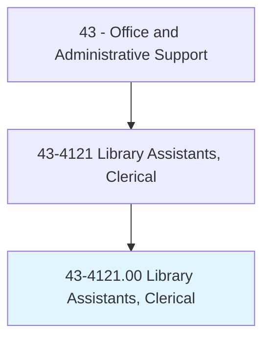
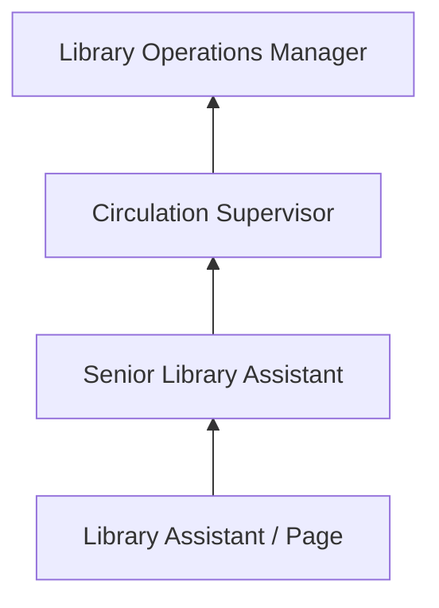
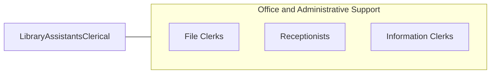

# Library Assistants, Clerical

> Compile records, and sort, shelve, issue, and receive library materials such as books, electronic media, pictures, cards, slides and microfilm. Locate library materials for loan and replace material in shelving area, stacks, or files according to identification number and title.

## Overview

Library Assistants perform clerical functions in libraries, including shelving books, processing check-outs and returns, maintaining catalog records, assisting patrons with finding materials, and handling interlibrary loan requests. They support librarians by managing the physical and digital operations that keep library collections accessible and organized.

Working in public, academic, school, and special libraries, these assistants manage circulation desks, register new patrons, collect fines, process holds and reservations, and maintain the physical order of collections. They use integrated library systems (ILS) to track materials and may assist with programming, displays, and community outreach events.

The role has expanded with digital resources, requiring assistants to help patrons access e-books, databases, and online services alongside traditional print materials.

## Classification Hierarchy

## Key Statistics

| Metric | Value |
|--------|-------|
| SOC Code | 43-4121.00 |
| Job Zone | 2 (Some Preparation) |
| Category | [Office and Administrative Support](/occupations/Administrative/index) |
| Median Annual Salary | $31,800 |
| Employment | ~93,000 |
| Projected Growth | -6% (declining) |
| Core Tasks | 35 |
| Source | O*NET |

## Core Tasks

Core task data with GraphDL semantic actions for this occupation is maintained in the data pipeline. See [O*NET 43-4121.00](https://www.onetonline.org/link/summary/43-4121.00) for detailed task information.

## Skills & Competencies

### Technical Skills
- **Library Catalog Systems (ILS)** - Advanced
- **Dewey Decimal / LC Classification** - Advanced
- **Circulation Procedures** - Advanced
- **Database Navigation** - Intermediate
- **Collection Maintenance** - Advanced

### Soft Skills
- **Customer Service** - Critical
- **Organizational Skills** - Critical
- **Attention to Detail** - Essential
- **Patience** - Essential
- **Communication** - Essential

## Education & Certifications

| Requirement | Details |
|-------------|--------|
| Typical Education | High school diploma; library science coursework helpful |
| Library Support Staff Certification | ALA-APA credential |
| Technology Training | ILS system certification |

## Career Progression

## Industry Variations

| Setting | Focus | Unique Aspects |
|---------|-------|----------------|
| Public Libraries | Community lending services | Diverse patrons; programming support; community outreach |
| Academic Libraries | University research support | Student services; research databases; reserves management |
| School Libraries | K-12 media center support | Age-appropriate guidance; curriculum integration; reading programs |
| Special Libraries | Corporate, law, medical | Subject expertise; specialized collections; targeted services |

## Technology & Tools

- **ILS** - Koha, SirsiDynix, Innovative Interfaces
- **Digital Resources** - OverDrive, Libby, database platforms
- **Cataloging** - MARC records, OCLC
- **Circulation** - Self-checkout systems, RFID

## Related Occupations

## Departments

This occupation typically works in:
- Library Services - Circulation and collections
- Information Services - Reference support
- Community Programs - Event coordination
- Technical Services - Cataloging support

---

*Source: O*NET 43-4121.00 - ONETOccupation*
