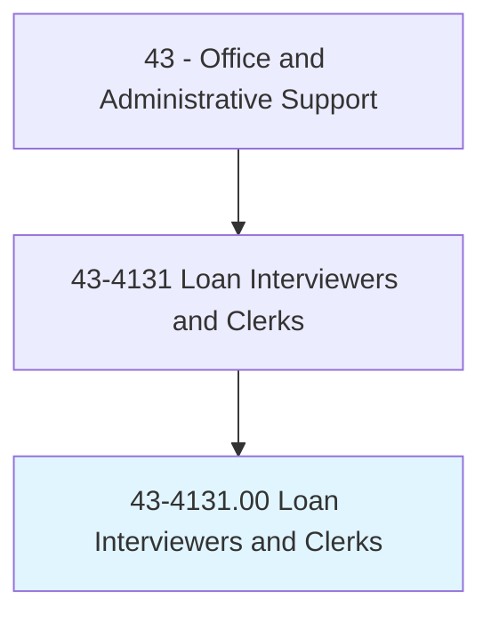
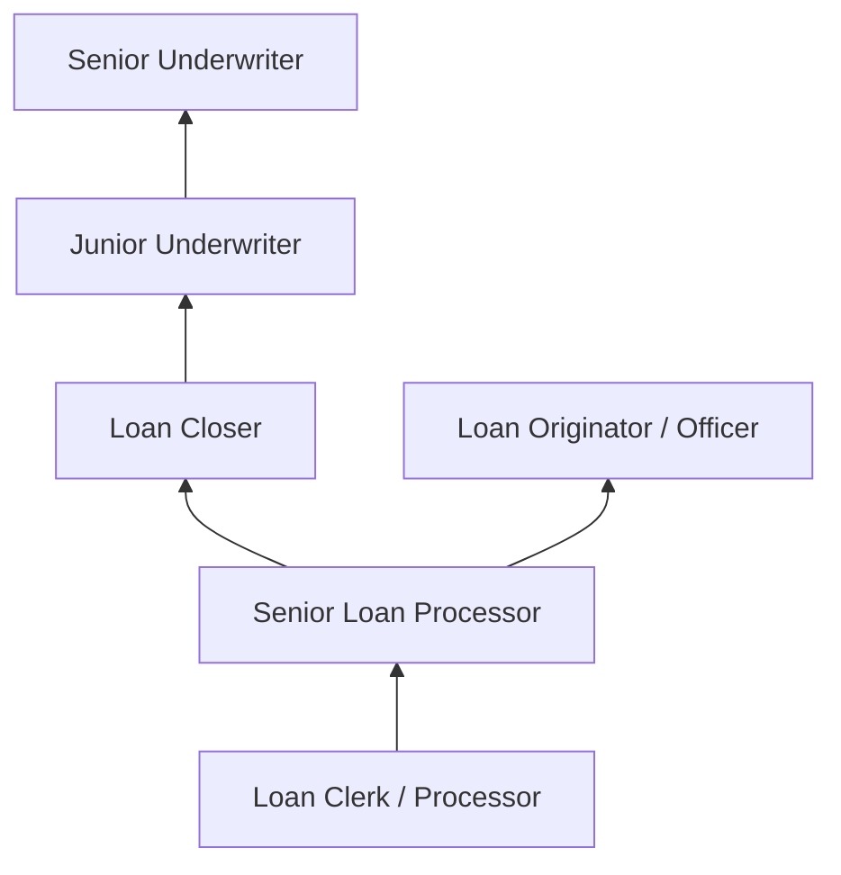
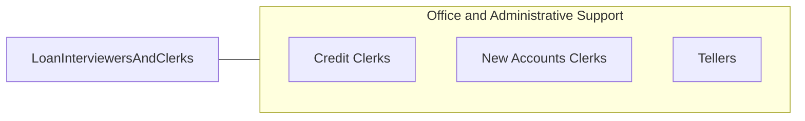

# Loan Interviewers and Clerks

> Interview loan applicants to elicit information; investigate applicants' backgrounds and verify references; prepare loan request papers; and forward findings, reports, and documents to appraisal department.

## Overview

Loan Interviewers and Clerks are the frontline processors in lending operations, interviewing applicants, collecting financial documentation, verifying employment and credit information, preparing loan packages, and supporting underwriters through the loan approval process. They work in banks, credit unions, mortgage companies, and other lending institutions.

These professionals guide applicants through the loan process, explaining documentation requirements, collecting income verification, asset statements, and credit authorizations. They enter application data into loan origination systems, order credit reports and appraisals, ensure regulatory disclosures are provided, and track loan files through processing milestones to closing.

The role requires knowledge of lending regulations (TILA, RESPA, ECOA), loan products, and documentation requirements. While automated underwriting systems have streamlined many processes, the human element of applicant interaction, document collection, and exception handling remains essential.

## Classification Hierarchy

## Key Statistics

| Metric | Value |
|--------|-------|
| SOC Code | 43-4131.00 |
| Job Zone | 3 (Medium Preparation) |
| Category | [Office and Administrative Support](/occupations/Administrative/index) |
| Median Annual Salary | $46,200 |
| Employment | ~125,000 |
| Projected Growth | -7% (declining) |
| Core Tasks | 50 |
| Source | O*NET |

## Core Tasks

Core task data with GraphDL semantic actions for this occupation is maintained in the data pipeline. See [O*NET 43-4131.00](https://www.onetonline.org/link/summary/43-4131.00) for detailed task information.

## Skills & Competencies

### Technical Skills
- **Loan Processing and Documentation** - Advanced
- **Loan Origination Systems (LOS)** - Advanced
- **Credit Analysis** - Intermediate
- **Regulatory Compliance (TILA, RESPA, ECOA)** - Advanced
- **Financial Documentation Review** - Advanced
- **Mortgage Products Knowledge** - Advanced

### Soft Skills
- **Attention to Detail** - Critical
- **Communication** - Critical
- **Customer Service** - Essential
- **Organizational Skills** - Essential
- **Confidentiality** - Critical
- **Problem Solving** - Important

## Education & Certifications

| Requirement | Details |
|-------------|--------|
| Typical Education | High school diploma; associate's preferred |
| NMLS Registration | Required for mortgage loan originators |
| Mortgage Loan Processor Certification | Industry credential |
| Compliance Training | Annual regulatory training required |

## Career Progression

## Industry Variations

| Setting | Focus | Unique Aspects |
|---------|-------|----------------|
| Residential Mortgage | Home purchase and refinance | Complex documentation; real estate coordination; closing management |
| Commercial Lending | Business loans | Financial statement analysis; collateral evaluation; relationship banking |
| Consumer Lending | Auto, personal loans | Faster processing; credit scoring focus; point-of-sale lending |
| Student Loans | Education financing | Federal program compliance; FAFSA; disbursement schedules |

## Technology & Tools

- **LOS** - Encompass, Calyx, BytePro
- **Credit** - Equifax, Experian, TransUnion portals
- **Compliance** - HMDA reporting, disclosure generation
- **Communication** - Phone, email, customer portals

## Related Occupations

## Departments

This occupation typically works in:
- [Lending Operations](/departments/Lending) - Loan processing
- [Underwriting](/departments/Underwriting) - Credit evaluation support
- [Compliance](/departments/Compliance) - Regulatory documentation
- [Customer Service](/departments/CustomerService) - Applicant support

---

*Source: O*NET 43-4131.00 - ONETOccupation*
