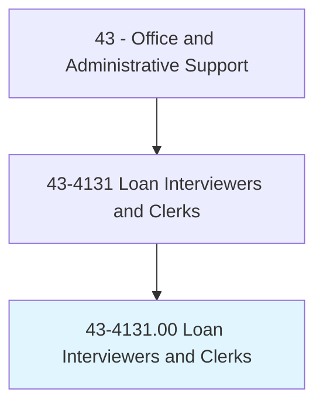
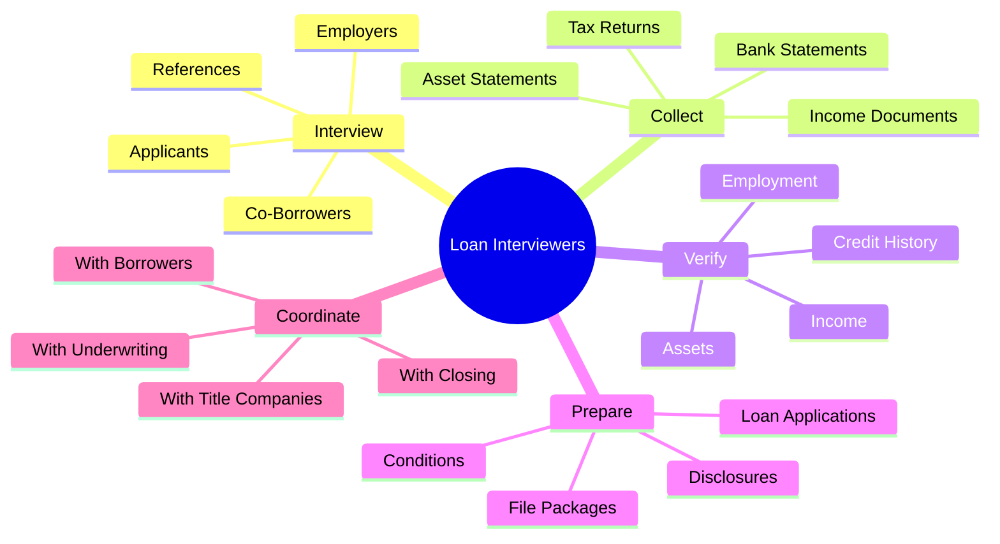
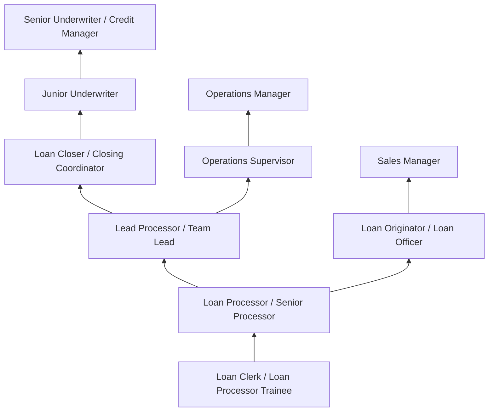
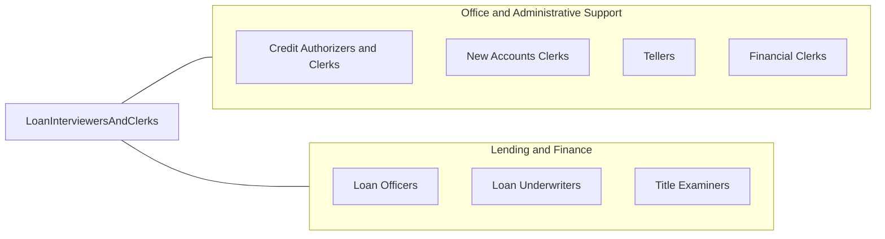

# Loan Interviewers and Clerks

> Interview loan applicants to elicit information; investigate applicants' backgrounds and verify references; prepare loan request papers; and forward findings, reports, and documents to appraisal department.

## Overview

Loan Interviewers and Clerks are the frontline processors in lending operations, interviewing applicants, collecting financial documentation, verifying employment and credit information, preparing loan packages, and supporting underwriters through the loan approval process. They work in banks, credit unions, mortgage companies, and other lending institutions.

These professionals guide applicants through the loan process, explaining documentation requirements, collecting income verification, asset statements, and credit authorizations. They enter application data into loan origination systems, order credit reports and appraisals, ensure regulatory disclosures are provided, and track loan files through processing milestones to closing.

The role requires knowledge of lending regulations (TILA, RESPA, ECOA), loan products, and documentation requirements. While automated underwriting systems have streamlined many processes, the human element of applicant interaction, document collection, and exception handling remains essential. Loan clerks serve as the communication bridge between borrowers, loan officers, underwriters, and closing teams, keeping all parties informed of loan status and requirements.

## Classification Hierarchy



## Key Statistics

| Metric | Value |
|--------|-------|
| SOC Code | 43-4131.00 |
| Job Zone | 3 (Medium Preparation) |
| Category | [Office and Administrative Support](/occupations/Administrative/index) |
| Median Annual Salary | $46,200 |
| Salary Range | $32,000 - $68,000 |
| 10th Percentile | $32,500 |
| 90th Percentile | $67,800 |
| Employment | ~125,000 |
| Projected Growth | -7% (declining) |
| Annual Openings | ~15,000 |
| Core Tasks | 50 |
| Source | O*NET |

## Core Tasks



### interview.Applicants

Loan Interviewers gather information from loan applicants.

**Actions:**
- `interview.Applicants.for.LoanInformation`
- `collect.Documentation.from.Borrowers`
- `explain.Requirements.to.Applicants`
- `answer.Questions.about.LoanProcess`

### verify.Information

Loan Interviewers verify applicant information.

**Actions:**
- `verify.Employment.with.Employers`
- `verify.Income.through.Documentation`
- `verify.Assets.via.Statements`
- `order.CreditReports.for.Analysis`

## Skills & Competencies

### Technical Skills
- **Loan Processing and Documentation** - Expert (file preparation, condition clearing)
- **Loan Origination Systems (LOS)** - Expert (Encompass, Calyx, BytePro)
- **Credit Analysis** - Advanced (credit report interpretation, DTI calculation)
- **Regulatory Compliance (TILA, RESPA, ECOA)** - Expert (disclosures, timelines)
- **Financial Documentation Review** - Expert (income, asset, tax verification)
- **Mortgage Products Knowledge** - Expert (conventional, FHA, VA, jumbo)
- **AUS Systems** - Advanced (DU, LP automated underwriting)
- **Title and Insurance** - Intermediate (title review, insurance requirements)

### Soft Skills
- **Attention to Detail** - Critical (document accuracy, calculation precision)
- **Communication** - Critical (borrower interaction, team coordination)
- **Customer Service** - Critical (guiding anxious borrowers)
- **Organizational Skills** - Critical (managing multiple files)
- **Confidentiality** - Critical (protecting financial information)
- **Problem Solving** - Essential (resolving documentation issues)
- **Patience** - Essential (working with inexperienced borrowers)
- **Time Management** - Essential (meeting rate lock and closing deadlines)

## Education & Certifications

| Requirement | Details |
|-------------|---------|
| Typical Education | High school diploma; associate's preferred |
| Preferred Degree | Finance, Business, or related field |
| NMLS Registration | Required if taking applications (MLO functions) |
| Mortgage Loan Processor Certification | MBA or industry credential |
| FHA/VA Training | Program-specific certification |
| Compliance Training | Annual TILA-RESPA, ECOA, fair lending training |
| Continuing Education | Required for NMLS registration (annual) |
| Background Check | Required for mortgage industry employment |

## Career Progression



### Career Pathway Details

| Level | Title | Years Experience | Key Responsibilities |
|-------|-------|------------------|----------------------|
| Entry | Loan Clerk / Processor Trainee | 0-1 years | Data entry, document collection, basic file prep |
| Mid | Loan Processor | 1-3 years | Full-cycle processing, condition clearing, coordination |
| Senior | Senior Processor / Lead | 3-5 years | Complex files, mentoring, exception handling |
| Specialist | Loan Closer | 4-6 years | Closing document preparation, funding coordination |
| Advanced | Junior Underwriter | 5-8 years | Credit analysis, file approval decisions |
| Management | Operations Manager | 8-12 years | Department oversight, workflow management |

### Transition to Underwriting

| Path | Requirements | Timeframe |
|------|--------------|-----------|
| Processing Experience | 3-5 years as processor | Prerequisite |
| Underwriting Training | Formal training program | 6-12 months |
| Credit Analysis Skills | Demonstrated ability | Ongoing |
| DE/SAR Certification | FHA underwriting authority | After training |

## Industry Variations

| Setting | Focus | Unique Aspects |
|---------|-------|----------------|
| Residential Mortgage | Home purchase and refinance | Complex documentation; real estate coordination; closing management; market cycles |
| Commercial Lending | Business loans | Financial statement analysis; collateral evaluation; relationship banking; business cycles |
| Consumer Lending | Auto, personal loans | Faster processing; credit scoring focus; point-of-sale lending; dealer relationships |
| Student Loans | Education financing | Federal program compliance; FAFSA; disbursement schedules; school certification |
| Credit Union Lending | Member lending | Member relationships; varied products; community focus; flexible criteria |
| Non-QM Lending | Alternative documentation | Bank statement loans; asset-based; self-employed borrowers; manual underwriting |

### Residential Mortgage Processing

Mortgage loan processors handle complex documentation for home purchases and refinances. They coordinate with real estate agents, title companies, appraisers, and insurance providers. Rate lock management, closing date coordination, and TRID compliance create deadline pressure. Purchase transactions are particularly time-sensitive.

### Commercial Loan Processing

Commercial loan clerks analyze business financial statements, tax returns, and entity documents. They work with more complex ownership structures, guarantor requirements, and collateral documentation. Loan sizes are larger and approval processes often involve committee review.

### Consumer Loan Processing

Consumer loan processors handle faster-moving files for auto loans, personal loans, and credit cards. Many processes are automated, but clerks handle exceptions, verify income, and coordinate with dealers or merchants. Same-day decisions and funding are common.

## Technology & Tools

### Loan Origination Systems (LOS)
- **Encompass** - Industry-leading mortgage LOS (ICE Mortgage Technology)
- **Calyx** - Point, Path mortgage software
- **BytePro** - Byte Software mortgage platform
- **MeridianLink** - Consumer lending platform
- **nCino** - Commercial banking platform

### Automated Underwriting Systems (AUS)
- **Desktop Underwriter (DU)** - Fannie Mae automated underwriting
- **Loan Product Advisor (LP)** - Freddie Mac automated underwriting
- **FHA TOTAL Scorecard** - FHA automated underwriting
- **GUS** - VA automated underwriting

### Verification and Documentation
- **Credit Bureaus** - Equifax, Experian, TransUnion tri-merge
- **VOE/VOI Services** - The Work Number, income verification
- **Asset Verification** - Plaid, Finicity, FormFree
- **Document Management** - File scanning, indexing, storage

### Compliance and Disclosure
- **Disclosure Generation** - TRID compliance tools
- **eSign/eClose** - DocuSign, SureClose, Pavaso
- **HMDA Reporting** - Home Mortgage Disclosure Act tools
- **Quality Control** - Pre-funding QC systems

## Related Occupations



### Related Occupation Comparison

| Occupation | Similarity | Key Difference |
|------------|------------|----------------|
| Loan Officers | High | Sales/origination vs processing focus |
| Underwriters | High | Decision-making vs file preparation |
| Credit Clerks | Medium | General credit vs mortgage specialty |
| Title Examiners | Medium | Title focus vs overall loan processing |

## Industries

- [Commercial Banking](/industries/Finance/Banking) - High Employment
- [Mortgage Companies](/industries/Finance/MortgageBanking) - High Employment
- [Credit Unions](/industries/Finance/CreditUnions) - Moderate Employment
- [Real Estate Credit](/industries/Finance/RealEstateCredit) - Moderate Employment
- [Consumer Lending](/industries/Finance/ConsumerLending) - Moderate Employment

## Departments

This occupation typically works in:
- Lending Operations - Loan processing and production
- Underwriting Support - Credit evaluation assistance
- Compliance - Regulatory documentation and disclosures
- Customer Service - Applicant support and communication
- Closing - Loan closing coordination
- Post-Closing - Document review and shipping

## Work Environment

### Physical Setting
- Office environment in lending operations center
- Desk-based work with computer equipment
- Some positions offer remote/work-from-home
- Call center environments for high-volume operations
- Branch locations for retail lending

### Work Schedule
- Typically Monday-Friday, standard business hours
- Extended hours during high-volume periods
- Rate lock expirations and closing deadlines create urgency
- Monthly/quarterly volume cycles
- Year-end may be slower (holiday impact)

### Work Characteristics
- High phone and email volume with borrowers
- Multi-tasking across multiple loan files
- Deadline pressure around rate locks and closings
- Detailed documentation requirements
- Team collaboration with originators and underwriters

### Volume and Pace
- Market conditions significantly impact volume
- Refinance waves during rate drops
- Seasonal patterns in home purchases
- Pipeline management critical
- Work-from-home increasingly common

## Regulatory Framework

### Key Lending Regulations

| Regulation | Purpose | Processor Responsibility |
|------------|---------|-------------------------|
| TILA-RESPA (TRID) | Disclosure requirements | Timely disclosure delivery |
| ECOA | Fair lending | Non-discriminatory processing |
| FCRA | Credit reporting | Proper credit authorization |
| HMDA | Data collection | Accurate demographic recording |
| Flood Insurance | Hazard protection | SFHA determination |

### Documentation Requirements
- Uniform Residential Loan Application (URLA/1003)
- Tax returns and transcripts (4506-C)
- Pay stubs and W-2s
- Bank statements
- Gift letters and source documentation
- Title commitment and survey
- Appraisal report
- Insurance binder

## GraphDL Semantic Structure

```graphdl
Loan Interviewers and Clerks perform:
- interview.Applicants.for.LoanInformation
- collect.Documents.from.Borrowers
- verify.Employment.with.Employers
- order.CreditReports.for.Evaluation
- prepare.LoanFiles.for.Underwriting
- coordinate.Closing.with.TitleCompany
- ensure.Compliance.with.Regulations
- communicate.Status.to.AllParties
```

---

*Source: O*NET 43-4131.00 - ONETOccupation*
