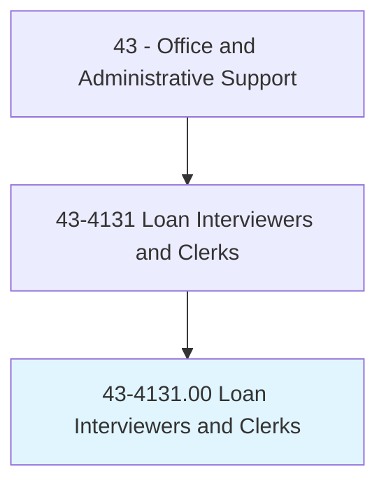
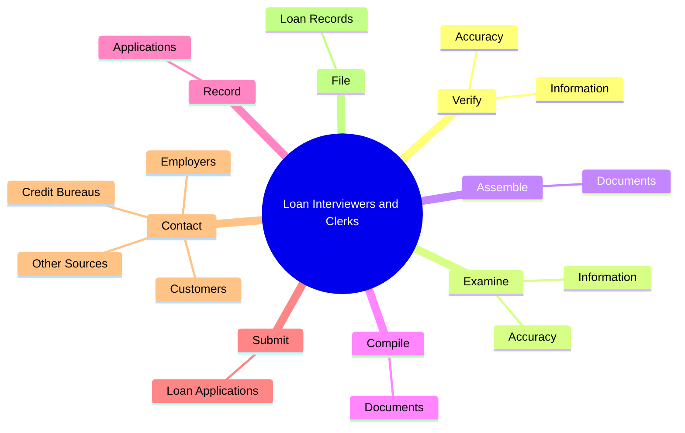
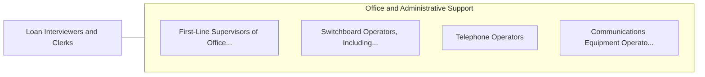

# Loan Interviewers and Clerks

> Interview loan applicants to elicit information; investigate applicants' backgrounds and verify references; prepare loan request papers; and forward findings, reports, and documents to appraisal department. Review loan papers to ensure completeness, and complete transactions between loan establishment, borrowers, and sellers upon approval of loan.

## Overview

Loan Interviewers and Clerks is an occupation within the Office and Administrative Support category. Interview loan applicants to elicit information; investigate applicants' backgrounds and verify references; prepare loan request papers; and forward findings, reports, and documents to appraisal department. 

## Classification Hierarchy

## Key Statistics

| Metric | Value |
|--------|-------|
| SOC Code | 43-4131.00 |
| Category | [Office and Administrative Support](/occupations/Administrative/index) |
| Task Count | 86 |
| Source | O*NET |

## Core Tasks

### verify.Information

Loan Interviewers and Clerks verify information as part of their core responsibilities.

**Actions:**
- `verify.Information.of.LoanApplication`
- `verify.Information.of.ClosingDocuments`
- `verify.Accuracy.of.LoanApplication`
- `verify.Accuracy.of.ClosingDocuments`

### examine.Information

Loan Interviewers and Clerks examine information as part of their core responsibilities.

**Actions:**
- `examine.Information.of.LoanApplication`
- `examine.Information.of.ClosingDocuments`
- `examine.Accuracy.of.LoanApplication`
- `examine.Accuracy.of.ClosingDocuments`

### assemble.Documents

Loan Interviewers and Clerks assemble documents as part of their core responsibilities.

**Actions:**
- `assemble.Documents.for.LoanClosings`
- `assemble.Documents.for.TitleAbstracts`
- `assemble.Documents.for.InsuranceForms`
- `assemble.Documents.for.LoanForms`

## Skills & Competencies

### Technical Skills
- **Office Management** - Advanced
- **Data Entry** - Advanced
- **Records Management** - Advanced

### Soft Skills
- **Communication** - Essential
- **Problem Solving** - Essential
- **Critical Thinking** - Important
- **Teamwork** - Important
- **Adaptability** - Important

## Related Occupations

## Industries

This occupation is found across multiple industries. See [Industries](/industries) for sector-specific employment data.

## Career Progression

---

*Source: O*NET 43-4131.00 - ONETOccupation*
