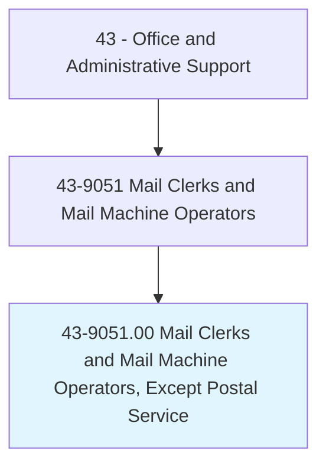
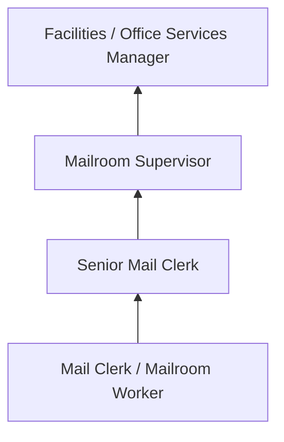
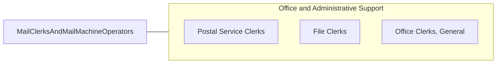

# Mail Clerks and Mail Machine Operators, Except Postal Service

> Prepare incoming and outgoing mail for distribution. Use hand or mail handling machines to time stamp, open, read, sort, and route incoming mail; and address, seal, stamp, fold, stuff, and affix postage to outgoing mail or packages.

## Overview

Mail Clerks and Mail Machine Operators handle internal and external mail operations for organizations outside the postal service, including corporations, government agencies, universities, and mail processing firms. They sort, route, and distribute incoming correspondence and packages while preparing outgoing mail for dispatch through postal and courier services.

These workers operate mail processing equipment such as postage meters, letter folders, envelope stuffers, and sorting machines. In large organizations, they manage mailrooms that handle thousands of pieces daily, coordinating with departments for timely distribution and maintaining logs of registered, certified, and priority mail.

The role has contracted as digital communication has replaced physical mail, but remains necessary for legal documents, packages, marketing materials, and regulated correspondence that requires physical delivery.

## Classification Hierarchy

## Key Statistics

| Metric | Value |
|--------|-------|
| SOC Code | 43-9051.00 |
| Job Zone | 1 (Little or No Preparation) |
| Category | [Office and Administrative Support](/occupations/Administrative/index) |
| Median Annual Salary | $33,200 |
| Employment | ~55,000 |
| Projected Growth | -13% (declining) |
| Core Tasks | 25 |
| Source | O*NET |

## Core Tasks

Core task data with GraphDL semantic actions for this occupation is maintained in the data pipeline. See [O*NET 43-9051.00](https://www.onetonline.org/link/summary/43-9051.00) for detailed task information.

## Skills & Competencies

### Technical Skills
- **Mail Processing Equipment** - Advanced
- **Postage Metering Systems** - Advanced
- **Sorting and Distribution** - Advanced
- **Package Tracking Systems** - Intermediate
- **Records Management** - Intermediate

### Soft Skills
- **Organizational Skills** - Critical
- **Attention to Detail** - Critical
- **Physical Stamina** - Essential
- **Time Management** - Essential
- **Reliability** - Critical

## Education & Certifications

| Requirement | Details |
|-------------|---------|
| Typical Education | High school diploma or less |
| Equipment Training | On-the-job for postage meters, sorters |
| Hazardous Materials Awareness | For package handling |
| Security Clearance | Required in government settings |

## Career Progression

## Industry Variations

| Setting | Focus | Unique Aspects |
|---------|-------|----------------|
| Corporate | Internal distribution | Campus-wide delivery; executive mail; package reception |
| Government | Classified handling | Security screening; chain of custody; confidential materials |
| Universities | Multi-building campus | Student mail; academic correspondence; bulk mailings |
| Fulfillment Centers | Outbound processing | High volume; automation; shipping logistics |

## Technology & Tools

- **Mail Equipment** - Pitney Bowes, Neopost postage meters
- **Sorting** - Automated mail sorters, barcode scanners
- **Tracking** - FedEx/UPS/USPS tracking systems
- **Office** - Spreadsheets, distribution logs

## Related Occupations

## Departments

This occupation typically works in:
- Mailroom / Office Services - Mail processing
- [Facilities](/departments/Operations) - Building operations
- Administration - Office support
- Shipping - Package handling

---

*Source: O*NET 43-9051.00 - ONETOccupation*
