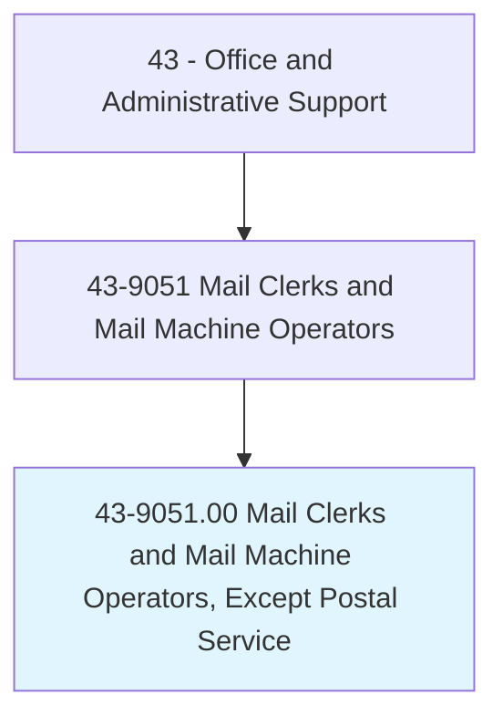
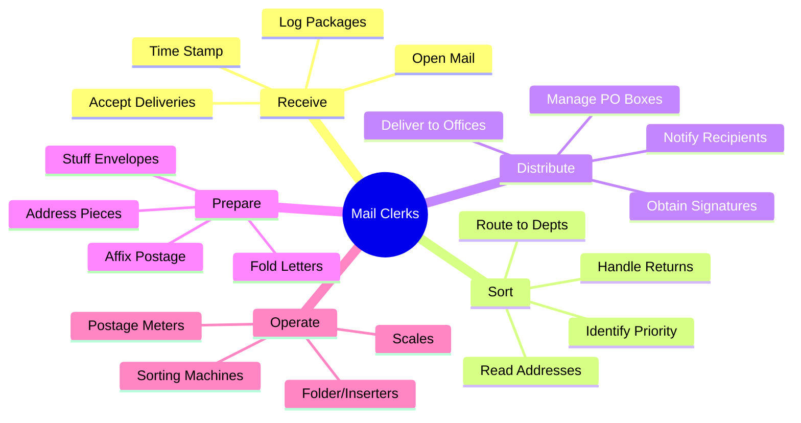
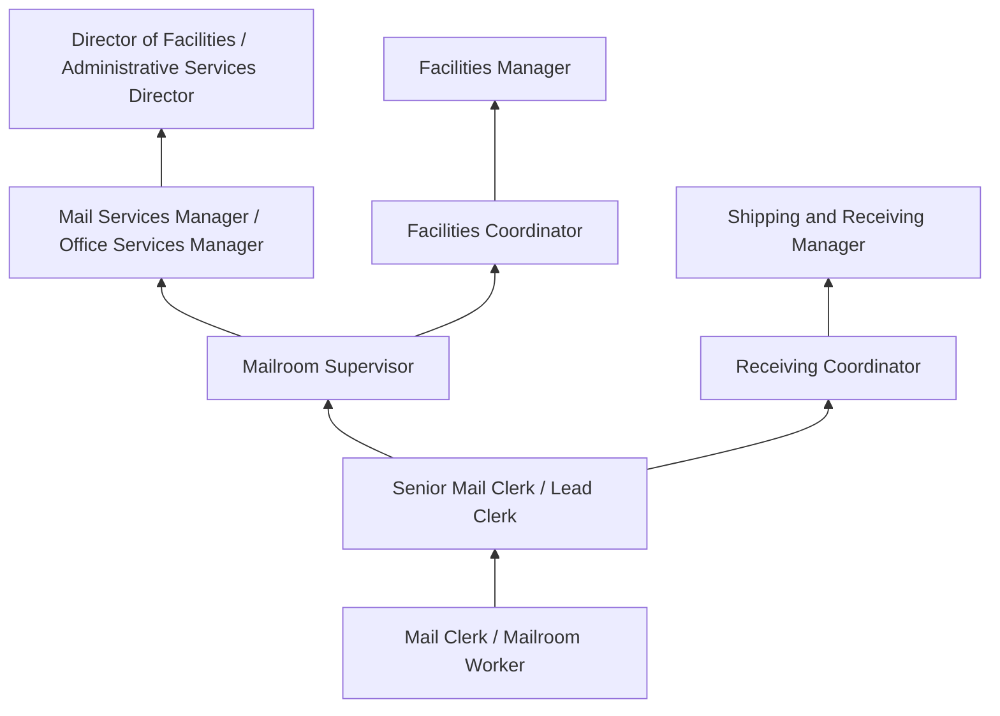
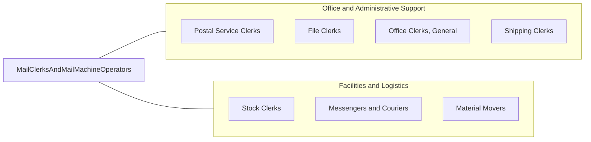

# Mail Clerks and Mail Machine Operators, Except Postal Service

> Prepare incoming and outgoing mail for distribution. Use hand or mail handling machines to time stamp, open, read, sort, and route incoming mail; and address, seal, stamp, fold, stuff, and affix postage to outgoing mail or packages.

## Overview

Mail Clerks and Mail Machine Operators handle internal and external mail operations for organizations outside the postal service, including corporations, government agencies, universities, hospitals, mail processing facilities, and fulfillment centers. They receive, sort, and distribute incoming mail and packages to appropriate departments and individuals while preparing outgoing correspondence for dispatch through postal and commercial courier services.

These workers operate a variety of mail processing equipment including postage meters, letter folders, envelope stuffers, inserters, address printers, mail sorters, and package scales. In large organizations, they manage central mailrooms that process thousands of pieces daily, coordinating with departments for timely distribution, maintaining logs of registered, certified, and priority mail, and managing relationships with postal and courier services. They also receive and route packages from carriers like UPS, FedEx, and DHL, tracking deliveries and notifying recipients.

The occupation has contracted significantly as email and digital communication have replaced physical correspondence for routine business communication. However, the role remains necessary for legal documents requiring physical signatures, packages and parcels driven by e-commerce, marketing materials, regulated correspondence in healthcare and finance, and organizations with security requirements for physical mail handling. Many mailroom operations have expanded to include receiving services, office supply management, and general facilities support.

## Classification Hierarchy



## Key Statistics

| Metric | Value |
|--------|-------|
| SOC Code | 43-9051.00 |
| Job Zone | 1 (Little or No Preparation) |
| Category | [Office and Administrative Support](/occupations/Administrative/index) |
| Median Annual Salary | $33,200 |
| Salary Range | $24,000 - $48,000 |
| 10th Percentile | $24,500 |
| 90th Percentile | $47,800 |
| Employment | ~55,000 |
| Projected Growth | -13% (declining) |
| Annual Openings | ~7,000 |
| Core Tasks | 25 |
| Source | O*NET |

## Core Tasks



### process.IncomingMail

Mail Clerks receive and distribute incoming correspondence.

**Actions:**
- `receive.Deliveries.from.CarrierServices`
- `sort.Mail.by.DepartmentAndRecipient`
- `distribute.Correspondence.to.InternalAddresses`
- `log.Packages.for.TrackingPurposes`

### prepare.OutgoingMail

Mail Clerks ready correspondence for dispatch.

**Actions:**
- `process.Outgoing.through.PostageMeters`
- `prepare.Packages.for.ShipmentPickup`
- `schedule.Pickups.with.CarrierServices`
- `maintain.Records.of.Mailings`

## Skills & Competencies

### Technical Skills
- **Mail Processing Equipment** - Advanced (meters, folders, inserters, sorters)
- **Postage Metering Systems** - Advanced (Pitney Bowes, Neopost, Quadient)
- **Sorting and Distribution** - Advanced (addressing, routing, zip codes)
- **Package Tracking Systems** - Intermediate (FedEx, UPS, USPS systems)
- **Records Management** - Intermediate (logs, certified mail tracking)
- **Shipping Software** - Intermediate (multi-carrier platforms)
- **Office Equipment** - Intermediate (copiers, scanners, scales)
- **Basic Computer Skills** - Intermediate (email, spreadsheets, databases)

### Soft Skills
- **Organizational Skills** - Critical (managing high volumes efficiently)
- **Attention to Detail** - Critical (accurate sorting and logging)
- **Physical Stamina** - Essential (standing, walking, lifting)
- **Time Management** - Essential (meeting distribution schedules)
- **Reliability** - Critical (consistent daily performance)
- **Discretion** - Important (handling confidential mail)
- **Customer Service** - Important (interacting with staff)
- **Problem Solving** - Important (resolving delivery issues)

## Education & Certifications

| Requirement | Details |
|-------------|---------|
| Typical Education | High school diploma or less |
| Equipment Training | On-the-job for postage meters, sorters, inserters |
| Hazardous Materials Awareness | For package handling (suspicious items) |
| Security Clearance | Required in government settings |
| USPS/Carrier Training | Understanding postal regulations |
| Forklift Certification | For warehouse mailroom operations |
| Valid Driver's License | For inter-building delivery routes |

## Career Progression



### Career Pathway Details

| Level | Title | Years Experience | Key Responsibilities |
|-------|-------|------------------|----------------------|
| Entry | Mail Clerk / Mailroom Worker | 0-1 years | Basic sorting, distribution, equipment operation |
| Mid | Senior Mail Clerk / Lead | 1-3 years | Training, complex operations, vendor contact |
| Supervisory | Mailroom Supervisor | 3-6 years | Staff supervision, scheduling, quality control |
| Management | Mail Services Manager | 6-10 years | Operations management, budgets, vendor contracts |
| Director | Director of Administrative Services | 10+ years | Multi-function facilities oversight |

### Specialization Paths

| Specialization | Focus Area | Additional Skills |
|----------------|------------|-------------------|
| Print/Copy Center | Reproduction services | Print equipment, binding, finishing |
| Shipping/Receiving | Warehouse operations | Freight, inventory, logistics |
| Facilities Support | General building services | Maintenance coordination, vendor management |
| Records/Archives | Document storage | Records management, retrieval systems |

## Industry Variations

| Setting | Focus | Unique Aspects |
|---------|-------|----------------|
| Corporate | Internal distribution | Campus-wide delivery; executive mail; package reception; conference materials |
| Government | Classified handling | Security screening; chain of custody; confidential materials; bomb detection |
| Universities | Multi-building campus | Student mail; academic correspondence; bulk mailings; central mail services |
| Healthcare | Patient correspondence | HIPAA considerations; lab specimens; pharmacy shipments; time-sensitive materials |
| Fulfillment Centers | Outbound processing | High volume; automation; shipping logistics; manifest preparation |

### Corporate Mailrooms

Corporate mail clerks manage internal mail distribution for office buildings and campuses, delivering to individual desks or department mailboxes on regular routes. They handle incoming mail and packages from multiple carriers, maintain logs of certified and registered mail, prepare outgoing correspondence, and may manage conference room supplies, office supply distribution, and copy center operations as part of integrated office services.

### Government Mail Facilities

Government mailrooms operate under heightened security protocols, screening mail for hazardous materials, biological threats, and explosives using X-ray equipment and detection systems. Clerks maintain strict chain of custody for classified and sensitive materials, process large volumes of citizen correspondence, and follow specific protocols for handling suspicious packages. Security clearances are typically required.

### University Mail Centers

University mail operations serve diverse populations including academic departments, administrative offices, residence halls, and individual students. Clerks handle high volumes during academic year starts, manage student PO box systems, process inter-campus mail across multiple buildings, and support mass mailings for admissions, development, and communications offices.

### Healthcare Mail Services

Healthcare facility mailrooms handle time-sensitive materials including lab specimens, pharmacy supplies, medical records, and regulatory correspondence. HIPAA compliance requires careful handling of patient information, while hazardous materials procedures apply to clinical specimens. Clerks coordinate with clinical departments to ensure timely delivery of critical items.

## Technology & Tools

### Mail Processing Equipment
- **Postage Meters** - Pitney Bowes, Quadient (formerly Neopost), FP Mailing
- **Folder/Inserters** - Bell and Howell, Pitney Bowes, Quadient
- **Envelope Sealers** - Desktop and high-volume sealers
- **Address Printers** - Inkjet addressing systems
- **Mail Sorters** - Automated sorting machines

### Shipping and Tracking
- **Multi-Carrier Software** - ShipStation, Pitney Bowes SendPro, Stamps.com
- **FedEx/UPS Systems** - Carrier-specific shipping and tracking
- **USPS Systems** - Click-N-Ship, Business Gateway
- **Package Tracking** - Delivery confirmation, signature capture

### Scales and Measurement
- **Postal Scales** - Integrated with metering systems
- **Dimensional Weight** - DIM weight calculation devices
- **Package Scales** - Heavy-duty for freight

### Security and Scanning
- **X-Ray Screening** - Mail scanning equipment (government)
- **Metal Detectors** - Security screening
- **Barcode Scanners** - Package tracking and logging
- **Document Imaging** - For digital mail routing

## Related Occupations



### Related Occupation Comparison

| Occupation | Similarity | Key Difference |
|------------|------------|----------------|
| Postal Service Clerks | High | USPS employment vs private sector |
| Shipping/Receiving Clerks | High | Outbound focus vs internal distribution |
| Office Clerks, General | Medium | Specialized mail vs general office duties |
| Messengers and Couriers | Medium | External delivery vs internal operations |

## Industries

- [Professional Services](/industries/ProfessionalServices) - High Employment
- [Government](/industries/PublicAdministration) - Moderate Employment
- [Healthcare](/industries/Healthcare/index) - Moderate Employment
- [Education](/industries/Education) - Moderate Employment
- [Finance and Insurance](/industries/Finance) - Moderate Employment
- [Fulfillment/Logistics](/industries/Wholesale) - Moderate Employment

## Departments

This occupation typically works in:
- Mailroom / Office Services - Primary mail processing function
- [Facilities](/departments/Operations) - Building operations and support
- Administration - General administrative support
- Shipping/Receiving - Package handling coordination
- Corporate Services - Integrated office services

## Work Environment

### Physical Setting
- Mailroom or office services area
- Package receiving docks
- Mail processing equipment stations
- Delivery carts and routes throughout building
- Loading dock access for carriers

### Work Schedule
- Standard daytime business hours (typically 7am-4pm or 8am-5pm)
- Some early starts to receive morning mail
- Minimal weekend work in most settings
- Consistent daily schedule
- Full-time and part-time positions available

### Work Characteristics
- Physically active with walking and lifting
- Repetitive sorting and processing tasks
- Deadline-driven for distribution times
- Regular carrier pickup schedules
- Independent work with periodic supervision

### Physical Demands
- Standing and walking for extended periods
- Lifting packages up to 50 lbs regularly
- Pushing/pulling mail carts
- Bending and reaching for sorting
- Operating equipment controls

## Performance Metrics

### Key Performance Indicators

| Metric | Description | Typical Target |
|--------|-------------|----------------|
| Distribution Time | Mail delivered by specified time | Same-day for morning mail |
| Accuracy | Correct recipient delivery | >99% |
| Package Tracking | Logged and tracked items | 100% compliance |
| Postage Cost | Efficient use of postage | Within budget |
| Volume Processed | Pieces handled per day | Varies by organization |
| Carrier Compliance | On-time pickups met | 100% |

### Quality Standards
- Same-day distribution of morning mail
- Accurate delivery to correct recipients
- Complete logging of tracked mail
- Secure handling of confidential materials
- Proper operation of all equipment

## Security Considerations

### Mail Security Protocols

| Concern | Procedure |
|---------|-----------|
| Suspicious Packages | Recognition, isolation, reporting |
| Confidential Mail | Secure handling, authorized delivery |
| Chain of Custody | Signature logs for registered/certified |
| Package Theft Prevention | Secure receiving areas, notification systems |
| Hazardous Materials | Recognition and proper handling |

### Compliance Requirements
- Security screening procedures (government)
- HIPAA handling (healthcare)
- Confidential mail protocols
- Carrier documentation
- Postage accountability

## GraphDL Semantic Structure

```graphdl
Mail Clerks and Mail Machine Operators perform:
- receive.Deliveries.from.CarrierServices
- sort.Mail.by.RecipientAddress
- distribute.Correspondence.to.Departments
- operate.Equipment.for.MailProcessing
- prepare.Outgoing.for.Dispatch
- log.Packages.for.TrackingPurposes
- maintain.Equipment.for.Operations
- coordinate.Pickups.with.CarrierServices
```

---

*Source: O*NET 43-9051.00 - ONETOccupation*
