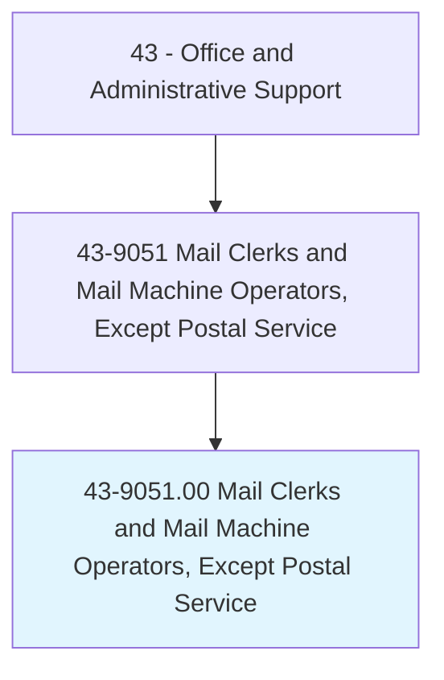
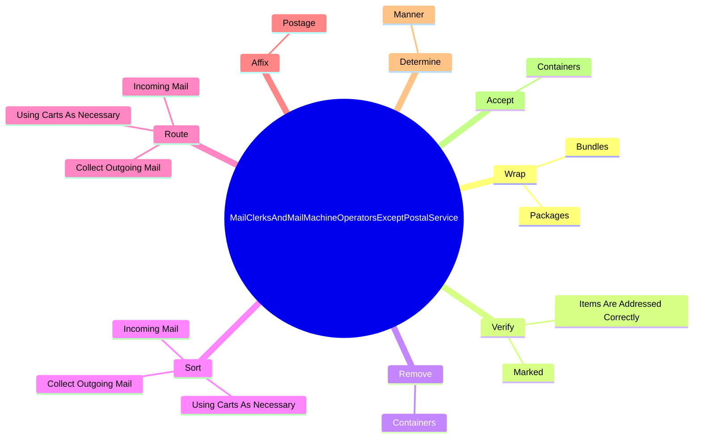
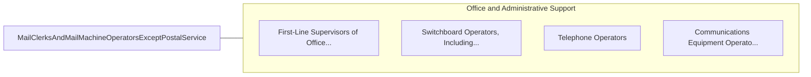

# Mail Clerks and Mail Machine Operators, Except Postal Service

> Prepare incoming and outgoing mail for distribution. Time-stamp, open, read, sort, and route incoming mail; and address, seal, stamp, fold, stuff, and affix postage to outgoing mail or packages. Duties may also include keeping necessary records and completed forms.

## Overview

Mail Clerks and Mail Machine Operators, Except Postal Service is an occupation within the Office and Administrative Support category. Prepare incoming and outgoing mail for distribution. Time-stamp, open, read, sort, and route incoming mail; and address, seal, stamp, fold, stuff, and affix postage to outgoing mail or packages.

## Classification Hierarchy

## Key Statistics

| Metric | Value |
|--------|-------|
| SOC Code | 43-9051.00 |
| Category | [Office and Administrative Support](/occupations/Administrative/index) |
| Task Count | 100 |
| Source | O*NET |

## Core Tasks

### wrap.Packages

Mail Clerks and Mail Machine Operators, Except Postal Service wrap packages as part of their core responsibilities.

**Actions:**
- `wrap.Packages.by.Hand`
- `wrap.Packages.by.ByUsingTyingMachines`
- `wrap.Bundles.by.Hand`
- `wrap.Bundles.by.ByUsingTyingMachines`

### verify.ItemsAreAddressedCorrectly

Mail Clerks and Mail Machine Operators, Except Postal Service verify items are addressed correctly as part of their core responsibilities.

**Actions:**
- `verify.ItemsAreAddressedCorrectly.with.ProperPostage`
- `verify.ItemsAreAddressedCorrectly.with.InSuitableConditionF`
- `verify.ItemsAreAddressedCorrectly.with.Processing`
- `verify.Marked.with.ProperPostage`

### remove.Containers

Mail Clerks and Mail Machine Operators, Except Postal Service remove containers as part of their core responsibilities.

**Actions:**
- `remove.Containers.of.SortedMailTransferThem.to.designated.AreasAccordingToEstablishedProcedures`
- `remove.Containers.of.ParcelsTransferThem.to.designated.AreasAccordingToEstablishedProcedures`

## Skills & Competencies

### Technical Skills
- **Office Management** - Advanced
- **Data Entry** - Advanced
- **Records Management** - Advanced

### Soft Skills
- **Communication** - Essential
- **Problem Solving** - Essential
- **Critical Thinking** - Important
- **Teamwork** - Important
- **Adaptability** - Important

## Related Occupations

## Industries

This occupation is found across multiple industries. See [Industries](/industries) for sector-specific employment data.

## Career Progression

---

*Source: O*NET 43-9051.00 - ONETOccupation*
