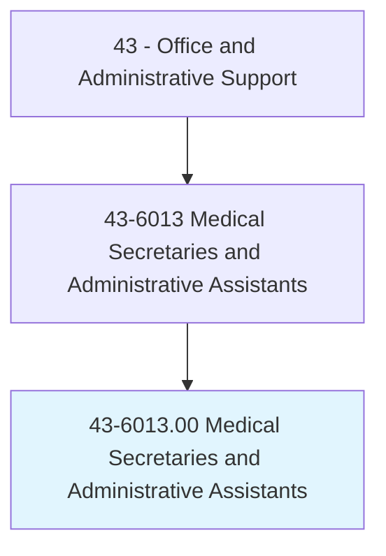
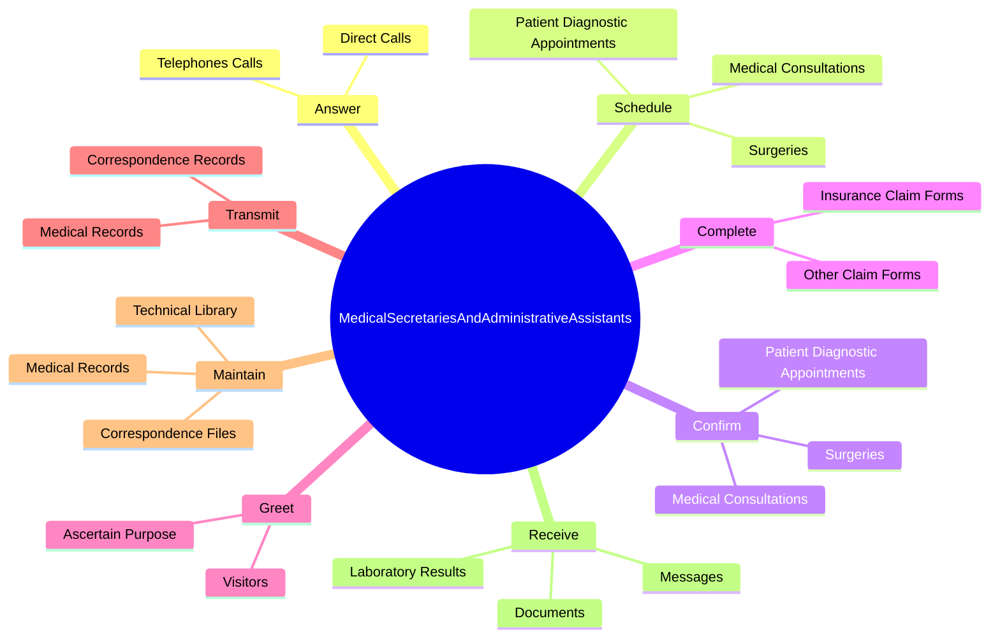
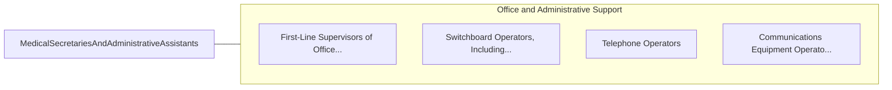

# Medical Secretaries and Administrative Assistants

> Perform secretarial duties using specific knowledge of medical terminology and hospital, clinic, or laboratory procedures. Duties may include scheduling appointments, billing patients, and compiling and recording medical charts, reports, and correspondence.

## Overview

Medical Secretaries and Administrative Assistants is an occupation within the Office and Administrative Support category. Perform secretarial duties using specific knowledge of medical terminology and hospital, clinic, or laboratory procedures. 

## Classification Hierarchy

## Key Statistics

| Metric | Value |
|--------|-------|
| SOC Code | 43-6013.00 |
| Category | [Office and Administrative Support](/occupations/Administrative/index) |
| Task Count | 103 |
| Source | O*NET |

## Core Tasks

### answer.TelephonesCalls

Medical Secretaries and Administrative Assistants answer telephones calls as part of their core responsibilities.

**Actions:**
- `answer.TelephonesCalls.to.appropriate.Staff`
- `answer.DirectCalls.to.appropriate.Staff`

### schedule.PatientDiagnosticAppointments

Medical Secretaries and Administrative Assistants schedule patient diagnostic appointments as part of their core responsibilities.

**Actions:**
- `schedule.PatientDiagnosticAppointments`
- `schedule.Surgeries`
- `schedule.MedicalConsultations`

### confirm.PatientDiagnosticAppointments

Medical Secretaries and Administrative Assistants confirm patient diagnostic appointments as part of their core responsibilities.

**Actions:**
- `confirm.PatientDiagnosticAppointments`
- `confirm.Surgeries`
- `confirm.MedicalConsultations`

## Skills & Competencies

### Technical Skills
- **Office Management** - Advanced
- **Data Entry** - Advanced
- **Records Management** - Advanced

### Soft Skills
- **Communication** - Essential
- **Problem Solving** - Essential
- **Critical Thinking** - Important
- **Teamwork** - Important
- **Adaptability** - Important

## Related Occupations

## Industries

This occupation is found across multiple industries. See [Industries](/industries) for sector-specific employment data.

## Career Progression

---

*Source: O*NET 43-6013.00 - ONETOccupation*
