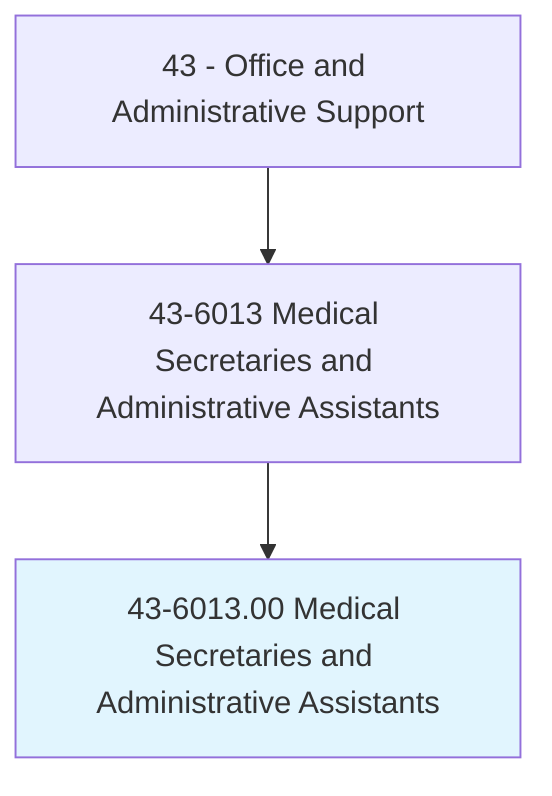
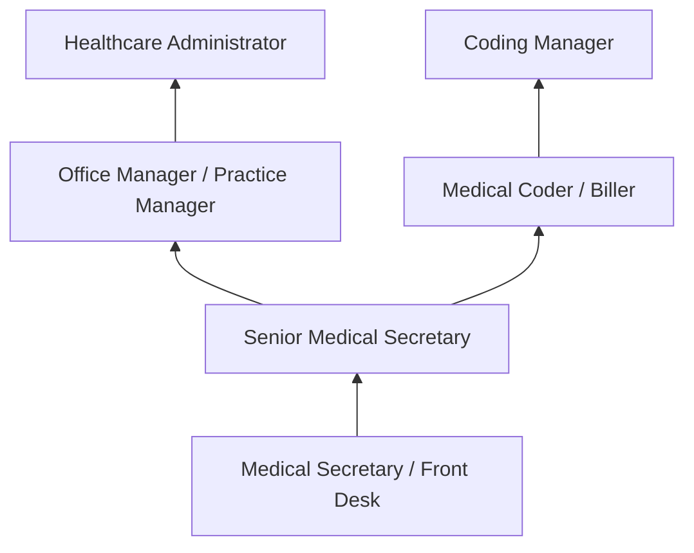
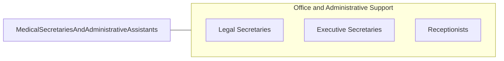

# Medical Secretaries and Administrative Assistants

> Perform secretarial duties using specific knowledge of medical terminology and hospital, clinic, or laboratory procedures. Duties may include scheduling appointments, billing patients, and compiling and recording medical charts, reports, and correspondence.

## Overview

Medical Secretaries and Administrative Assistants provide specialized administrative support in healthcare settings, combining general office skills with knowledge of medical terminology, coding systems, insurance procedures, and healthcare regulations. They manage patient scheduling, handle medical records, process insurance claims, coordinate referrals, and maintain the administrative workflow that keeps clinical operations running efficiently.

Working in physician offices, hospitals, clinics, outpatient facilities, and specialty practices, these professionals serve as the administrative bridge between patients, providers, and payers. They verify insurance eligibility, obtain prior authorizations, transcribe clinical notes, prepare patient charts, and manage correspondence with laboratories, pharmacies, and referring providers.

The role requires understanding of HIPAA privacy regulations, electronic health record (EHR) systems, medical billing and coding basics, and the complex workflows of healthcare delivery. As healthcare has digitized, medical secretaries increasingly manage patient portals, telehealth scheduling, and electronic prescription coordination.

## Classification Hierarchy

## Key Statistics

| Metric | Value |
|--------|-------|
| SOC Code | 43-6013.00 |
| Job Zone | 3 (Medium Preparation) |
| Category | [Office and Administrative Support](/occupations/Administrative/index) |
| Median Annual Salary | $39,000 |
| Employment | ~580,000 |
| Projected Growth | 7% (faster than average) |
| Core Tasks | 45 |
| Source | O*NET |

## Core Tasks

Core task data with GraphDL semantic actions for this occupation is maintained in the data pipeline. See [O*NET 43-6013.00](https://www.onetonline.org/link/summary/43-6013.00) for detailed task information.

## Skills & Competencies

### Technical Skills
- **EHR Systems (Epic, Cerner, athenahealth)** - Advanced
- **Medical Terminology** - Advanced
- **Insurance Verification and Prior Authorization** - Advanced
- **Medical Billing and Coding Basics** - Intermediate
- **HIPAA Compliance** - Advanced
- **Patient Scheduling Systems** - Advanced

### Soft Skills
- **Attention to Detail** - Critical
- **Empathy and Compassion** - Critical
- **Confidentiality** - Critical
- **Communication** - Essential
- **Multitasking** - Essential
- **Composure Under Stress** - Essential

## Education & Certifications

| Requirement | Details |
|-------------|---------|
| Typical Education | High school diploma; certificate or associate's preferred |
| CMAA (Certified Medical Administrative Assistant) | NHA credential |
| CEHRS (Certified Electronic Health Records Specialist) | NHA credential |
| HIPAA Training | Required annually |
| CPR/BLS | Often required in clinical settings |

## Career Progression

## Industry Variations

| Setting | Focus | Unique Aspects |
|---------|-------|----------------|
| Physician Offices | Scheduling, billing, records | Small team; broad responsibilities; patient relationships |
| Hospitals | Departmental support | Specialized departments; high volume; shift work possible |
| Specialty Practices | Referral coordination | Prior authorizations; specialized procedures; insurance navigation |
| Outpatient Clinics | Patient flow management | Walk-ins; community health; diverse populations |

## Technology & Tools

- **EHR** - Epic, Cerner, athenahealth, eClinicalWorks
- **Practice Management** - Kareo, AdvancedMD, NextGen
- **Scheduling** - Appointment management, patient portals
- **Communication** - Phone systems, patient messaging, fax servers

## Related Occupations

## Departments

This occupation typically works in:
- Front Office - Patient reception and scheduling
- Medical Records - Health information management
- Billing - Insurance and patient billing
- Administration - Practice operations

---

*Source: O*NET 43-6013.00 - ONETOccupation*
