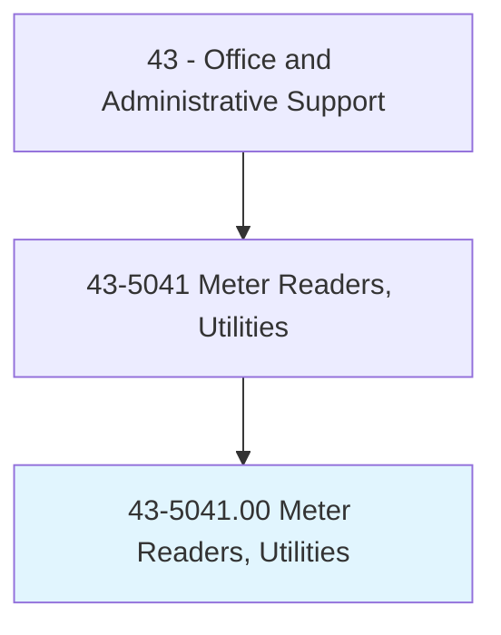
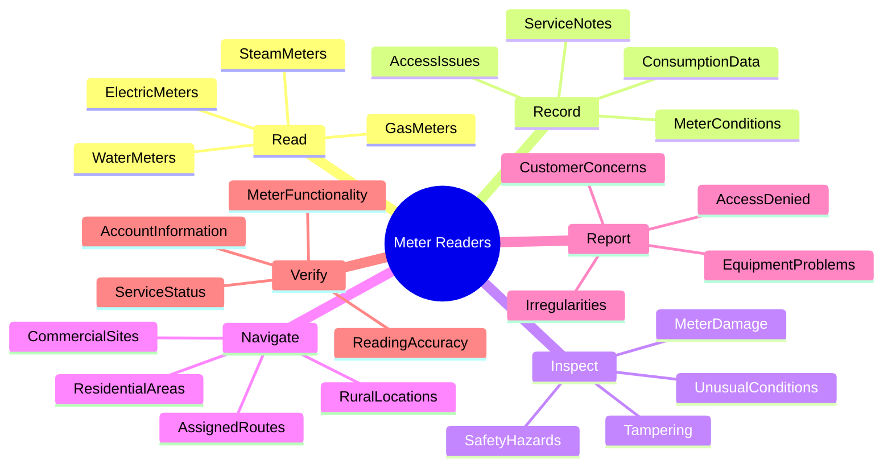
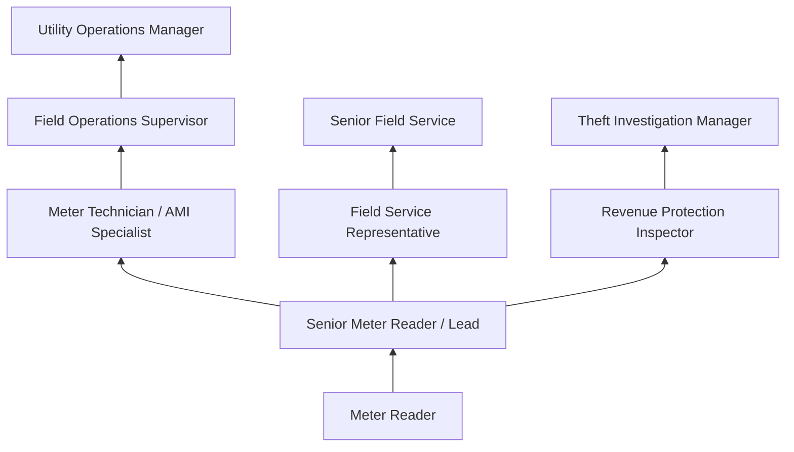
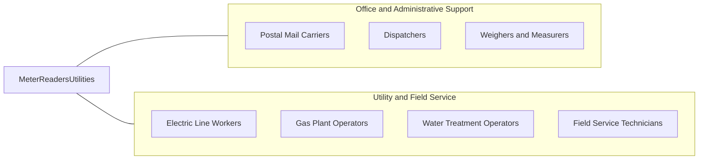

# Meter Readers, Utilities

> Read utility meters and record data. Walk or drive established routes to take readings of electric, gas, water, or steam consumption meters. May also record other service data.

## Overview

Meter Readers travel established routes to read electric, gas, water, and steam consumption meters, recording usage data for billing purposes. They walk or drive through residential and commercial areas, visually inspecting meters, entering readings into handheld devices, and reporting irregularities such as meter damage, tampering, or unusual consumption patterns.

Working primarily outdoors in all weather conditions, meter readers cover assigned territories on foot or by vehicle. They access meter locations that may be in basements, yards, utility rooms, or remote areas, sometimes requiring navigation around obstacles, animals, or difficult terrain. The role demands physical endurance and the ability to work independently throughout the day.

The occupation has declined significantly as utilities deploy automated meter reading (AMR) and advanced metering infrastructure (AMI) smart meter technology. However, positions remain for manual reads of legacy meters, meter audits, disconnect/reconnect services, and field verification of automated readings. Many utilities have evolved the meter reader role into broader field service positions combining reading, service, and customer interaction duties.

## Classification Hierarchy

## Key Statistics

| Metric | Value |
|--------|-------|
| SOC Code | 43-5041.00 |
| Job Zone | 2 (Some Preparation) |
| Category | [Office and Administrative Support](/occupations/Administrative/index) |
| Median Annual Salary | $42,400 |
| Salary Range | $30,000 - $60,000 |
| 10th Percentile | $30,500 |
| 90th Percentile | $59,800 |
| Employment | ~25,000 |
| Projected Growth | -15% (rapidly declining) |
| Core Tasks | 20 |
| Source | O*NET |

## Core Tasks

### read.ConsumptionMeters

Meter Readers visually inspect meters and record usage data for billing.

**Actions:**
- `read.ElectricMeters.for.kWhConsumption` - Record kilowatt-hour readings from electric meters
- `read.GasMeters.for.ThermConsumption` - Record natural gas usage in therms or CCF
- `read.WaterMeters.for.GallonUsage` - Record water consumption in gallons or cubic feet
- `read.DemandMeters.for.PeakUsage` - Record demand readings for commercial accounts
- `read.Time-of-UseMeters.for.RateCalculation` - Capture readings for tiered billing periods
- `verify.ReadingAccuracy.against.History` - Check readings for reasonableness

### record.MeterData

Meter Readers document readings and observations using handheld devices.

**Actions:**
- `enter.Readings.into.HandheldDevices` - Input consumption data electronically
- `record.MeterConditions.for.Maintenance` - Document equipment status and issues
- `note.AccessIssues.for.Follow-up` - Document locations with access problems
- `capture.PhotoDocumentation.of.Issues` - Photograph meter conditions when needed
- `record.CustomerInformation.changes` - Note address or account updates
- `upload.RouteData.to.BillingSystems` - Transfer readings for invoice generation

### inspect.MeterConditions

Meter Readers examine meters and surrounding areas for problems.

**Actions:**
- `inspect.Meters.for.Damage` - Check for broken seals, glass, or components
- `detect.Tampering.or.Theft` - Identify signs of meter manipulation or bypass
- `identify.SafetyHazards.at.MeterLocations` - Report dangerous conditions
- `check.MeterAccessibility.for.FutureReads` - Note vegetation, obstructions, locked gates
- `verify.MeterNumbers.match.AccountRecords` - Confirm meter-to-account assignments
- `report.Leak.Indicators.for.GasAndWater` - Note signs of utility leaks

### navigate.ServiceTerritories

Meter Readers travel assigned routes efficiently to complete daily readings.

**Actions:**
- `follow.OptimizedRoutes.for.Efficiency` - Complete routes in logical sequence
- `access.ResidentialMeters.in.Yards` - Navigate private property safely
- `locate.CommercialMeters.in.Buildings` - Find meters in commercial and industrial sites
- `reach.RuralMeters.in.RemoteAreas` - Access meters in agricultural and outlying areas
- `manage.Route.Timing.for.Completion` - Pace work to finish assigned areas
- `adapt.Routes.for.Weather.and.Conditions` - Adjust for weather, road closures, or obstacles

### report.FieldObservations

Meter Readers communicate findings to operations and customer service.

**Actions:**
- `report.HighUsage.for.LeakInvestigation` - Flag unusual consumption patterns
- `report.Tampering.to.RevenueProtection` - Escalate suspected theft situations
- `report.DamagedEquipment.to.Maintenance` - Request meter repairs or replacement
- `report.SafetyHazards.for.Remediation` - Alert management to dangerous conditions
- `report.CustomerComplaints.for.Resolution` - Relay concerns encountered in field
- `report.AccessProblems.for.CustomerContact` - Initiate follow-up for inaccessible meters

## Skills & Competencies

### Technical Skills
- **Meter Reading Devices** - Advanced (handheld data collectors, tablets, smartphones)
- **Route Navigation** - Advanced (maps, GPS, route optimization)
- **Meter Identification and Types** - Advanced (analog, digital, AMR, AMI meters)
- **Data Recording Systems** - Intermediate (mobile data entry, upload procedures)
- **Tamper and Theft Detection** - Intermediate (recognizing meter manipulation)
- **Utility Service Knowledge** - Intermediate (billing cycles, rate structures, service types)
- **Safety Procedures** - Advanced (personal safety, hazard recognition, animal awareness)
- **Vehicle Operation** - Intermediate (company vehicles, driving skills)

### Soft Skills
- **Attention to Detail** - Critical (accurate readings, spotting irregularities)
- **Self-Direction** - Critical (working independently throughout day)
- **Physical Stamina** - Critical (walking miles daily, all weather conditions)
- **Reliability** - Critical (completing routes on schedule)
- **Safety Awareness** - Essential (personal protection, hazard avoidance)
- **Customer Interaction** - Important (brief, professional encounters)
- **Navigation Skills** - Important (finding meters in unfamiliar areas)
- **Time Management** - Essential (completing daily route requirements)

## Education & Certifications

| Requirement | Details |
|-------------|---------|
| Typical Education | High school diploma |
| Valid Driver's License | Required for most positions |
| Utility-Specific Training | On-the-job (2-4 weeks typical) |
| Safety Training | Confined spaces, hazardous materials awareness, animal safety |
| Handheld Device Training | Electronic data collection equipment |
| Gas Safety Certification | Natural gas odor recognition and emergency response |
| DOT Medical Card | Required if operating commercial vehicles |

## Career Progression

### Career Pathway Details

| Level | Title | Years Experience | Key Responsibilities |
|-------|-------|------------------|----------------------|
| Entry | Meter Reader | 0-2 years | Route reading, basic reporting, training |
| Mid | Senior Meter Reader / Lead | 2-5 years | Difficult routes, training, problem resolution |
| Specialist | Meter Technician | 3-7 years | Installations, testing, AMI systems |
| Supervisory | Field Operations Supervisor | 7-12 years | Team management, scheduling, performance |
| Management | Operations Manager | 12+ years | Department leadership, planning, budgets |

### Alternative Career Paths

| Path | Description | Requirements |
|------|-------------|--------------|
| Meter Technician | Install and maintain meters | Technical training, testing skills |
| Field Service Rep | Customer service and field work | Customer service skills, broader duties |
| Revenue Protection | Investigate theft and tampering | Investigative skills, attention to detail |
| AMI/Smart Grid | Smart meter technology | Technical training, IT familiarity |

## Industry Variations

| Setting | Focus | Unique Aspects |
|---------|-------|----------------|
| Electric Utilities | kWh consumption | High-voltage awareness; demand readings; time-of-use meters; solar net metering |
| Gas Utilities | Therms/CCF readings | Gas leak detection; confined space entry; safety protocols; odor awareness |
| Water Utilities | Gallons/cubic feet | Underground meters; pit access; irrigation meters; leak detection |
| Municipal Utilities | Multi-service reading | Combined utility reads; customer contact; code enforcement referrals |
| Rural Cooperatives | Sparse territories | Long distances; diverse terrain; member relationships |
| District Energy | Steam/chilled water | Commercial focus; building access; BTU calculations |

### Electric Utility Meter Reading

Electric meter readers serve residential and commercial customers, reading watt-hour meters for billing. Modern electric meters include digital displays, demand registers for commercial accounts, and time-of-use tracking for tiered rates. Readers must understand basic electrical safety and recognize signs of meter tampering or diversion. Many electric utilities have transitioned to AMI smart meters that communicate wirelessly, reducing manual reading requirements.

### Gas Utility Meter Reading

Natural gas meter readers must be trained in gas safety, including odor recognition, leak response procedures, and confined space protocols. Gas meters may be located indoors, requiring building access and customer interaction. Readers report suspected gas leaks immediately and know emergency procedures. Many gas utilities use drive-by AMR technology that allows reading without leaving the vehicle.

### Water Utility Meter Reading

Water meter readers access meters often located underground in meter pits, requiring removal of lids and potential confined space entry. They look for signs of water leaks, tampering, and meter malfunctions. Water meters may serve irrigation as well as domestic use, with separate meters or sub-meters to track. Many water systems still rely on manual reads due to the challenges of underground meter communication.

### Combination Utility Service

Municipal utilities serving multiple services (electric, gas, water) may have readers responsible for all utility types, increasing efficiency but requiring broader training. Combination readers develop comprehensive knowledge of utility systems and often handle customer inquiries about all services during their routes.

## Technology & Tools

### Reading Equipment
- **Handheld Devices** - Electronic meter reading devices, tablets, smartphones
- **AMR Receivers** - Drive-by/walk-by data collection equipment
- **GPS Units** - Navigation and route tracking
- **Cameras** - Documentation of meter conditions and issues

### Metering Technology
- **Analog Meters** - Traditional dial-face consumption meters
- **Digital Meters** - Electronic display meters
- **AMR Meters** - Automatic meter reading (radio frequency)
- **AMI/Smart Meters** - Advanced metering infrastructure with two-way communication
- **Demand Meters** - Commercial peak demand measurement

### Vehicle and Route Tools
- **Company Vehicles** - Trucks, vans, or compact vehicles
- **Route Software** - Optimization and tracking applications
- **Mobile Data Terminal** - In-vehicle computing for route management
- **Safety Equipment** - Reflective vests, flashlights, first aid

### Safety Equipment
- **Personal Protective Equipment** - Steel-toe boots, gloves, eye protection
- **Weather Gear** - Rain gear, cold weather clothing, sun protection
- **Animal Deterrents** - Dog repellent spray, noise devices
- **Gas Detectors** - For gas utility readers

## Work Environment

### Physical Setting
- Outdoor work in all weather conditions
- Walking through residential neighborhoods and commercial areas
- Accessing basements, yards, utility rooms, and remote locations
- Vehicle travel between and within route areas
- Varied terrain including stairs, hills, and rough ground

### Work Schedule
- Full-time employment with early start times
- Monthly reading cycles with deadline requirements
- Year-round outdoor work regardless of weather
- Overtime during catch-up periods or emergencies
- Some weekend or holiday work for service needs

### Physical Requirements
- Walking 8-15 miles daily on established routes
- Climbing stairs, ladders, and accessing elevated areas
- Bending and kneeling to read ground-level meters
- Lifting meter pit lids (up to 50 lbs)
- Working in confined spaces (training required)
- Exposure to weather extremes, dogs, insects

### Safety Considerations
- Dog encounters and other animals
- Slip, trip, and fall hazards
- Weather exposure (heat, cold, rain, snow)
- Traffic safety while walking routes
- Suspicious activity and personal security
- Utility-specific hazards (gas leaks, electrical)

## Related Occupations

### Related Occupation Comparison

| Occupation | Similarity | Key Difference |
|------------|------------|----------------|
| Postal Mail Carriers | High | Daily routes, outdoor work, different purpose |
| Field Service Technicians | Medium | Service work vs reading focus |
| Line Workers | Medium | Technical electrical work vs reading |
| Dispatchers | Low | Office-based vs field work |

## Industries

- [Utilities](/industries/Utilities) - Primary Employment (electric, gas, water)
- [Government](/industries/PublicAdministration) - Municipal utilities
- [Cooperative Utilities](/industries/Utilities) - Rural electric and water

## Departments

This occupation typically works in:
- Field Operations - Meter reading routes
- Metering - Meter management and data collection
- Customer Service - Billing support and issue resolution
- Revenue Protection - Theft detection and investigation
- [Operations](/departments/Operations) - General utility operations

## Performance Metrics

| Metric | Description | Typical Target |
|--------|-------------|----------------|
| Route Completion | Percentage of scheduled reads completed | >98% daily |
| Read Accuracy | Error rate in recorded readings | <0.5% |
| Estimated Reads | Percentage requiring estimation | <5% |
| Productivity | Reads per hour | Route-dependent |
| Safety | Incidents and near-misses | Zero target |

## Compensation and Benefits

### Pay Structure
- Hourly pay with progression based on tenure
- Overtime for extended routes or emergency work
- Shift differential for early morning starts
- Mileage reimbursement or vehicle provided
- Performance bonuses in some utilities

### Utility Employment Benefits
- Health insurance (medical, dental, vision)
- Pension or 401(k) with employer match
- Paid time off and holidays
- Union representation at many utilities
- Career advancement opportunities
- Training and development programs

---

*Source: O*NET 43-5041.00 - ONETOccupation*
