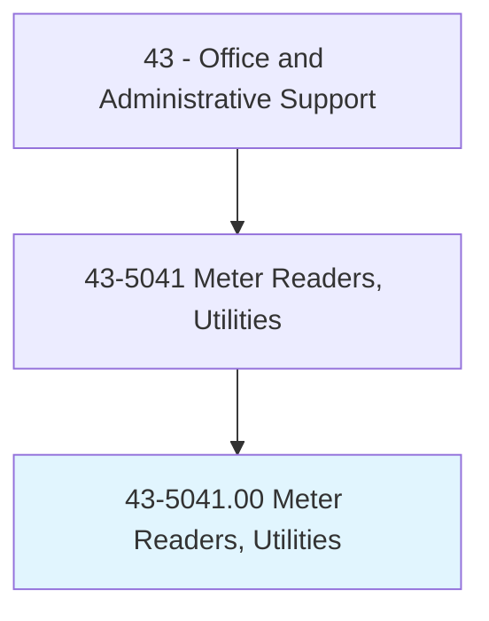
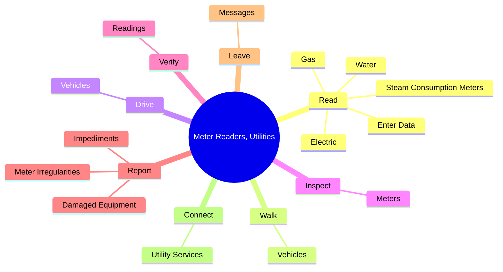
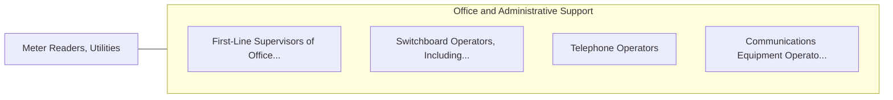

# Meter Readers, Utilities

> Read meter and record consumption of electricity, gas, water, or steam.

## Overview

Meter Readers, Utilities is classified under Office and Administrative Support (SOC 43). Read meter and record consumption of electricity, gas, water, or steam.

## Classification Hierarchy

## Key Statistics

| Metric | Value |
|--------|-------|
| SOC Code | 43-5041.00 |
| Category | [Office and Administrative Support](/occupations/Administrative/index) |
| Task Count | 37 |
| Source | O*NET |

## Core Tasks

### read.Electric

Meter Readers, Utilities read electric as part of their core responsibilities.

**Actions:**
- `read.Electric.in.RouteBooksComputers`
- `read.Electric.in.HandHeldComputers`
- `read.Gas.in.RouteBooksComputers`
- `read.Gas.in.HandHeldComputers`

### walk.Vehicles

Meter Readers, Utilities walk vehicles as part of their core responsibilities.

**Actions:**
- `walk.Vehicles.along.EstablishedRoutes.to.take.ReadingsOfMeterDials`

### drive.Vehicles

Meter Readers, Utilities drive vehicles as part of their core responsibilities.

**Actions:**
- `drive.Vehicles.along.EstablishedRoutes.to.take.ReadingsOfMeterDials`

## Skills & Competencies

### Technical Skills
- **Office Management** - Advanced
- **Data Entry** - Advanced
- **Records Management** - Advanced

### Soft Skills
- **Communication** - Essential
- **Problem Solving** - Essential
- **Critical Thinking** - Important
- **Teamwork** - Important
- **Adaptability** - Important

## Related Occupations

## Industries

This occupation is found across multiple industries. See [Industries](/industries) for sector-specific employment data.

## Career Progression

---

*Source: O*NET 43-5041.00 - ONETOccupation*
