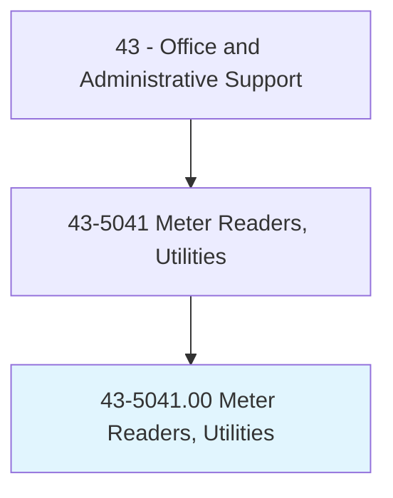
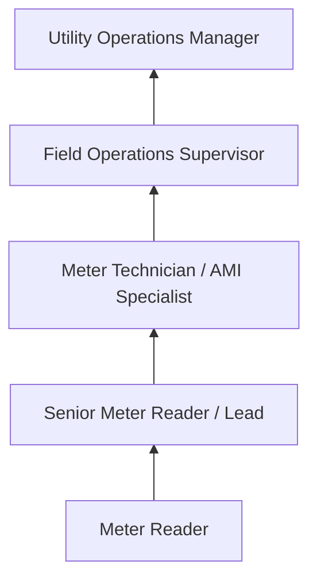
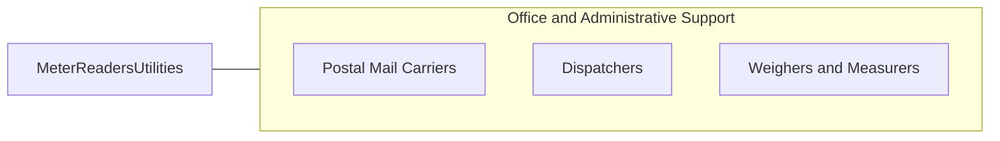

# Meter Readers, Utilities

> Read utility meters and record data. Walk or drive established routes to take readings of electric, gas, water, or steam consumption meters. May also record other service data.

## Overview

Meter Readers travel established routes to read electric, gas, water, and steam consumption meters, recording usage data for billing purposes. They walk or drive through residential and commercial areas, visually inspecting meters, entering readings into handheld devices, and reporting irregularities such as meter damage, tampering, or unusual consumption patterns.

Working primarily outdoors in all weather conditions, meter readers cover assigned territories on foot or by vehicle. They access meter locations that may be in basements, yards, utility rooms, or remote areas, sometimes requiring navigation around obstacles, animals, or difficult terrain. The role demands physical endurance and the ability to work independently throughout the day.

The occupation has declined significantly as utilities deploy automated meter reading (AMR) and advanced metering infrastructure (AMI) smart meter technology. However, positions remain for manual reads of legacy meters, meter audits, disconnect/reconnect services, and field verification of automated readings.

## Classification Hierarchy

## Key Statistics

| Metric | Value |
|--------|-------|
| SOC Code | 43-5041.00 |
| Job Zone | 2 (Some Preparation) |
| Category | [Office and Administrative Support](/occupations/Administrative/index) |
| Median Annual Salary | $42,400 |
| Employment | ~25,000 |
| Projected Growth | -15% (rapidly declining) |
| Core Tasks | 20 |
| Source | O*NET |

## Core Tasks

Core task data with GraphDL semantic actions for this occupation is maintained in the data pipeline. See [O*NET 43-5041.00](https://www.onetonline.org/link/summary/43-5041.00) for detailed task information.

## Skills & Competencies

### Technical Skills
- **Meter Reading Devices** - Advanced
- **Route Navigation** - Advanced
- **Meter Identification and Types** - Advanced
- **Data Recording Systems** - Intermediate
- **Tamper and Theft Detection** - Intermediate

### Soft Skills
- **Attention to Detail** - Critical
- **Self-Direction** - Critical
- **Physical Stamina** - Critical
- **Reliability** - Critical
- **Safety Awareness** - Essential

## Education & Certifications

| Requirement | Details |
|-------------|---------|
| Typical Education | High school diploma |
| Valid Driver's License | Required |
| Utility-Specific Training | On-the-job; meter types and systems |
| Safety Training | Confined spaces, hazardous materials awareness |

## Career Progression

## Industry Variations

| Setting | Focus | Unique Aspects |
|---------|-------|----------------|
| Electric Utilities | kWh consumption | High-voltage awareness; demand readings; time-of-use meters |
| Gas Utilities | Therms/CCF readings | Gas leak detection; confined space entry; safety protocols |
| Water Utilities | Gallons/cubic feet | Underground meters; pit access; irrigation meters |
| Municipal Utilities | Multi-service reading | Combined utility reads; customer contact; code enforcement |

## Technology & Tools

- **Handheld Devices** - Electronic meter reading devices, tablets
- **AMR/AMI** - Drive-by and smart meter systems
- **GPS/Routing** - Route optimization software
- **Vehicles** - Company trucks/vans

## Related Occupations

## Departments

This occupation typically works in:
- [Field Operations](/departments/FieldOps) - Meter reading routes
- [Metering](/departments/Metering) - Meter management
- [Customer Service](/departments/CustomerService) - Billing support
- [Revenue Protection](/departments/RevenueProtection) - Theft detection

---

*Source: O*NET 43-5041.00 - ONETOccupation*
