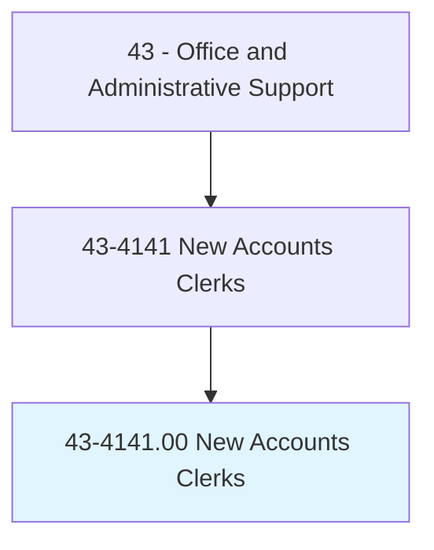
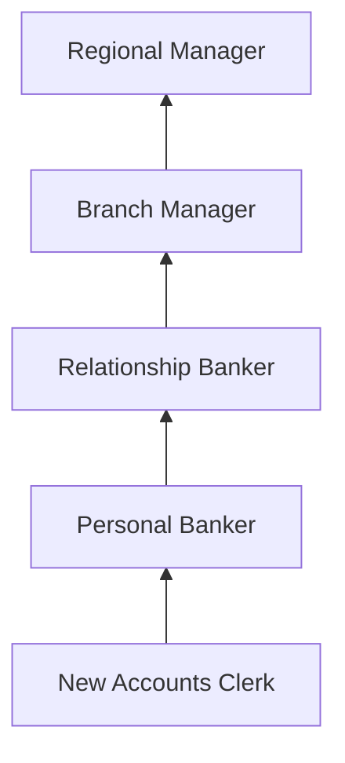
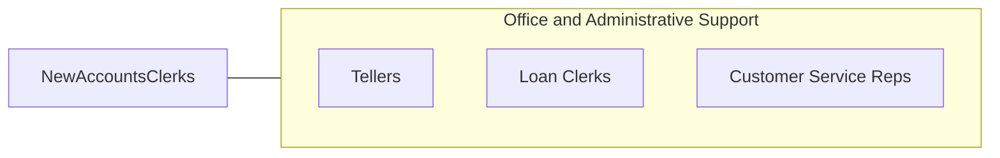

# New Accounts Clerks

> Interview persons desiring to open accounts in financial institutions. Explain available services such as savings and checking accounts, individual retirement accounts, and certificates of deposit.

## Overview

New Accounts Clerks work in banks, credit unions, and other financial institutions to open and set up customer accounts. They interview prospective clients to determine their financial needs, explain available products and services, complete account applications, verify identification and documentation, and ensure compliance with banking regulations including BSA/AML and CIP requirements.

These professionals serve as the initial point of contact for customers establishing banking relationships, guiding them through the account opening process for checking, savings, money market, certificate of deposit, and individual retirement accounts. They cross-sell additional products, set up online banking access, order debit cards, and ensure customers understand account terms, fees, and features.

The role requires knowledge of financial products, regulatory compliance (particularly Know Your Customer and anti-money laundering rules), and strong interpersonal skills to build customer relationships. As digital account opening has grown, the role increasingly focuses on complex accounts, relationship building, and in-branch advisory services.

## Classification Hierarchy

## Key Statistics

| Metric | Value |
|--------|-------|
| SOC Code | 43-4141.00 |
| Job Zone | 2 (Some Preparation) |
| Category | [Office and Administrative Support](/occupations/Administrative/index) |
| Median Annual Salary | $38,800 |
| Employment | ~42,000 |
| Projected Growth | -10% (declining) |
| Core Tasks | 30 |
| Source | O*NET |

## Core Tasks

Core task data with GraphDL semantic actions for this occupation is maintained in the data pipeline. See [O*NET 43-4141.00](https://www.onetonline.org/link/summary/43-4141.00) for detailed task information.

## Skills & Competencies

### Technical Skills
- **Banking Products and Services** - Advanced
- **Account Opening Systems** - Advanced
- **BSA/AML/KYC Compliance** - Advanced
- **Core Banking Software** - Advanced
- **Identity Verification** - Advanced

### Soft Skills
- **Customer Service** - Critical
- **Attention to Detail** - Critical
- **Communication** - Critical
- **Sales Aptitude** - Essential
- **Trustworthiness** - Critical

## Education & Certifications

| Requirement | Details |
|-------------|---------|
| Typical Education | High school diploma; some college preferred |
| ABA Banking Fundamentals | American Bankers Association |
| BSA/AML Training | Required annually |
| NMLS Registration | Required if offering certain products |

## Career Progression

## Industry Variations

| Setting | Focus | Unique Aspects |
|---------|-------|----------------|
| Commercial Banks | Full-service accounts | Broad product line; cross-selling; digital integration |
| Credit Unions | Member services | Member-owned; community focus; lower fees |
| Savings Institutions | Deposit accounts | CD laddering; savings programs; mortgage referrals |
| Online Banks | Digital onboarding | Remote verification; video banking; digital-first processes |

## Technology & Tools

- **Core Banking** - FIS, Fiserv, Jack Henry
- **Account Opening** - Digital onboarding platforms
- **Compliance** - ID verification, OFAC screening
- **CRM** - Salesforce Financial Services Cloud

## Related Occupations

## Departments

This occupation typically works in:
- Retail Banking - Branch account services
- Customer Service - Account support
- Compliance - KYC/AML adherence
- [Sales](/departments/Sales) - Product cross-selling

---

*Source: O*NET 43-4141.00 - ONETOccupation*
