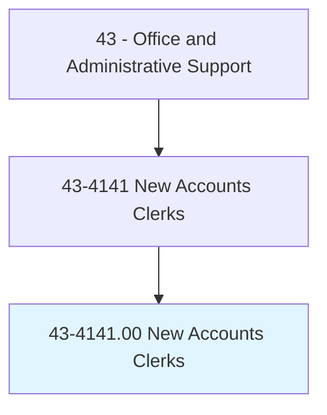
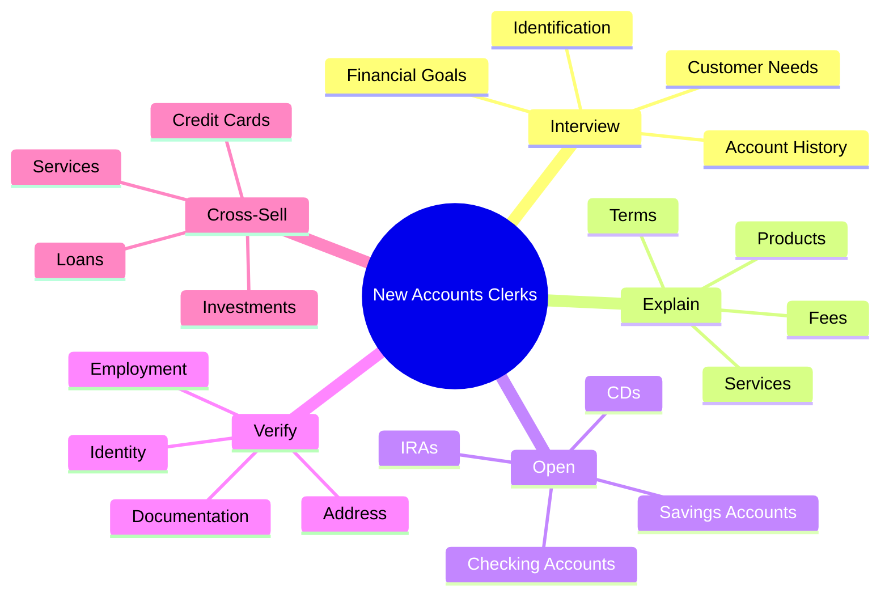
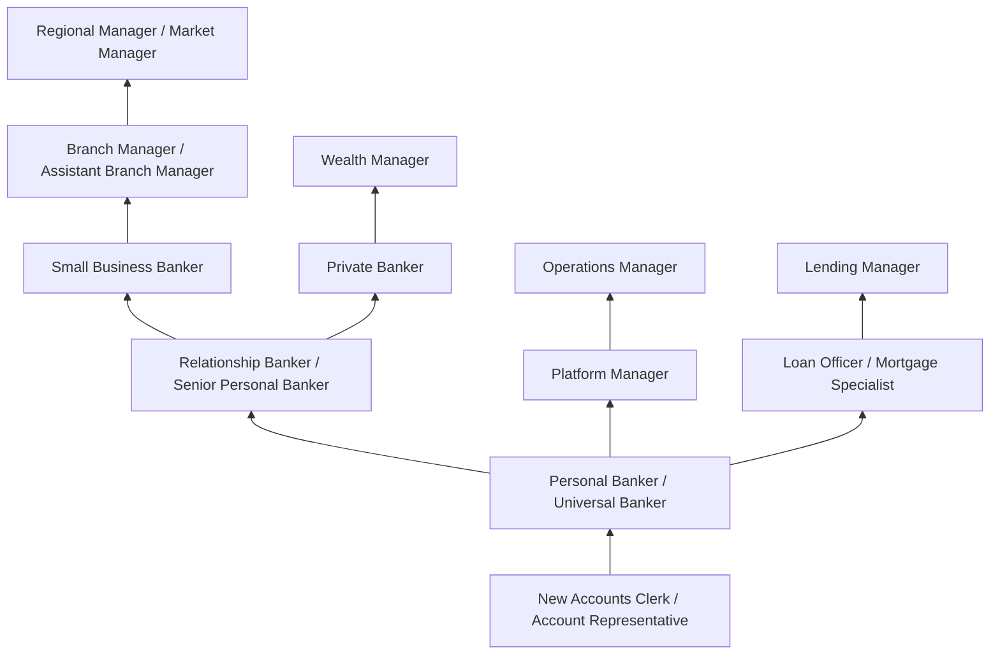
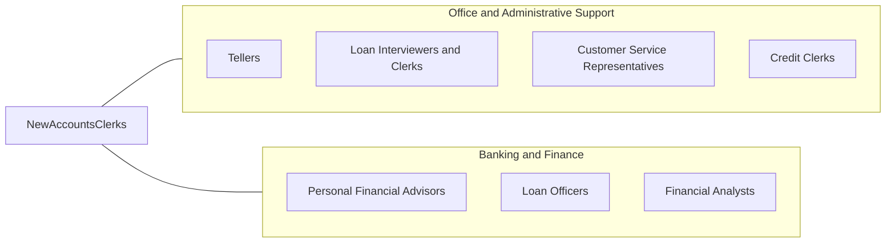

# New Accounts Clerks

> Interview persons desiring to open accounts in financial institutions. Explain available services such as savings and checking accounts, individual retirement accounts, and certificates of deposit.

## Overview

New Accounts Clerks work in banks, credit unions, and other financial institutions to open and set up customer accounts, serving as the gateway through which individuals and businesses establish banking relationships. They interview prospective clients to determine their financial needs and goals, explain available products and services, complete account applications, verify identification and documentation, ensure compliance with banking regulations, and guide customers through the account opening process for checking, savings, money market, certificate of deposit, and retirement accounts.

These professionals serve as relationship builders, creating the crucial first impression that shapes long-term customer loyalty. Beyond basic account opening, they cross-sell additional products (credit cards, loans, investment services), set up online and mobile banking access, order debit cards and checks, explain account terms, fees, and features, and ensure customers understand how to use their new accounts effectively. They must balance sales objectives with genuine customer service, recommending products that truly meet customer needs.

The role requires comprehensive knowledge of financial products, strong interpersonal skills, and thorough understanding of regulatory compliance including Know Your Customer (KYC), Bank Secrecy Act/Anti-Money Laundering (BSA/AML), Customer Identification Program (CIP), and OFAC requirements. As digital account opening has grown significantly, the role increasingly focuses on complex accounts requiring personal attention, relationship building with high-value customers, and advisory services that digital channels cannot provide. Many institutions have evolved the title to "Personal Banker" or "Universal Banker" to reflect expanded responsibilities.

## Classification Hierarchy



## Key Statistics

| Metric | Value |
|--------|-------|
| SOC Code | 43-4141.00 |
| Job Zone | 2 (Some Preparation) |
| Category | [Office and Administrative Support](/occupations/Administrative/index) |
| Median Annual Salary | $38,800 |
| Salary Range | $28,000 - $54,000 |
| 10th Percentile | $28,500 |
| 90th Percentile | $53,800 |
| Employment | ~42,000 |
| Projected Growth | -10% (declining) |
| Annual Openings | ~5,000 |
| Core Tasks | 30 |
| Source | O*NET |

## Core Tasks



### interview.ProspectiveCustomers

New Accounts Clerks interview customers to assess their banking needs.

**Actions:**
- `interview.Customers.about.FinancialNeeds`
- `assess.Requirements.for.AccountTypes`
- `recommend.Products.based.on.Needs`
- `explain.Features.of.Accounts`

### open.CustomerAccounts

New Accounts Clerks open and set up new accounts.

**Actions:**
- `open.Accounts.for.Customers`
- `verify.Identity.per.CIPRequirements`
- `process.Documentation.for.Compliance`
- `activate.Services.for.Accounts`

## Skills & Competencies

### Technical Skills
- **Banking Products and Services** - Expert (full product knowledge)
- **Account Opening Systems** - Expert (core banking platforms)
- **BSA/AML/KYC Compliance** - Expert (regulatory requirements)
- **Customer Identification Program (CIP)** - Expert (ID verification, documentation)
- **Core Banking Software** - Expert (FIS, Fiserv, Jack Henry)
- **Cross-Selling Techniques** - Advanced (needs-based selling)
- **OFAC Screening** - Advanced (sanctions compliance)
- **Online/Mobile Banking Setup** - Advanced (digital services)

### Soft Skills
- **Customer Service Excellence** - Critical (building relationships)
- **Attention to Detail** - Critical (compliance documentation)
- **Communication** - Critical (explaining complex products clearly)
- **Sales Aptitude** - Essential (meeting referral goals)
- **Trustworthiness** - Critical (handling sensitive financial information)
- **Patience** - Essential (working with confused customers)
- **Problem Solving** - Important (resolving account issues)
- **Confidentiality** - Critical (protecting customer information)

## Education & Certifications

| Requirement | Details |
|-------------|---------|
| Typical Education | High school diploma; some college preferred |
| Preferred Education | Associate's or bachelor's in business or finance |
| ABA Banking Fundamentals | American Bankers Association foundation |
| BSA/AML Certification | Required annual training |
| NMLS Registration | Required if recommending certain products |
| Product Knowledge Training | Bank-specific certification |
| Customer Service Certification | Professional development |
| Background Check | Comprehensive financial and criminal check |

## Career Progression



### Career Pathway Details

| Level | Title | Years Experience | Key Responsibilities |
|-------|-------|------------------|----------------------|
| Entry | New Accounts Clerk | 0-1 years | Basic account opening, product explanation |
| Mid | Personal Banker / Universal Banker | 1-3 years | Full-service banking, cross-selling, transactions |
| Senior | Relationship Banker | 3-5 years | High-value customers, complex needs, portfolio management |
| Specialist | Small Business Banker | 4-7 years | Business accounts, commercial products, lending referrals |
| Management | Branch Manager | 7-12 years | Branch operations, staff management, sales leadership |
| Regional | Market Manager | 12+ years | Multi-branch oversight, regional strategy |

### Specialization Paths

| Path | Focus | Additional Requirements |
|------|-------|-------------------------|
| Small Business Banking | Business accounts | Commercial lending knowledge |
| Private Banking | High-net-worth clients | Investment knowledge, relationship skills |
| Mortgage Lending | Home loans | NMLS licensing, underwriting knowledge |
| Investment Services | Brokerage accounts | Securities licensing (Series 6/7) |

## Industry Variations

| Setting | Focus | Unique Aspects |
|---------|-------|----------------|
| Commercial Banks | Full-service accounts | Broad product line; cross-selling goals; digital integration; brand standards |
| Credit Unions | Member services | Member-owned; community focus; personalized service; lower fees |
| Savings Institutions | Deposit accounts | CD laddering; savings programs; mortgage referrals; conservative approach |
| Online/Digital Banks | Digital onboarding | Remote verification; video banking; digital-first processes; tech support |
| Community Banks | Local relationships | Personal connections; local decision-making; small business focus |
| Private Banks | Wealth clients | High minimums; investment integration; concierge service |

### Commercial Bank New Accounts

Large commercial banks emphasize sales metrics, cross-selling, and digital adoption alongside traditional account opening. New accounts clerks work within brand standards, follow structured sales processes, and are measured on referral goals, new accounts opened, and product penetration rates. Career paths are well-defined within large organizational structures.

### Credit Union Member Services

Credit union member service representatives focus on member relationships rather than sales quotas. The member-owned structure creates different dynamics, with emphasis on member education, competitive rates, and community involvement. Account opening includes membership eligibility verification and share account requirements.

### Digital/Online Banking

Online banks handle most account opening digitally, but maintain phone and video support for complex situations, compliance requirements, and customers who prefer personal assistance. Staff help customers complete digital applications, troubleshoot verification issues, and explain products through virtual channels.

### Community Banking

Community banks emphasize local relationships and personalized service. New accounts staff often know customers personally, have authority to make certain decisions locally, and can provide more flexible service than large institutions. Small business accounts and local commercial relationships are important.

## Technology & Tools

### Core Banking Platforms
- **FIS** - Integrated Financial Solutions
- **Fiserv** - DNA, Signature, Premier
- **Jack Henry** - SilverLake, CIF 20/20
- **Temenos** - T24, Transact
- **nCino** - Cloud banking platform

### Account Opening and CRM
- **Digital Account Opening Platforms** - Online application systems
- **Salesforce Financial Services Cloud** - Customer relationship management
- **Microsoft Dynamics** - Banking CRM
- **ID Verification Systems** - Jumio, Mitek, Onfido
- **E-signature** - DocuSign, Adobe Sign

### Compliance Tools
- **OFAC Screening** - Sanctions list checking
- **CIP Documentation** - Identity verification records
- **BSA/AML Monitoring** - Transaction monitoring
- **HMDA Reporting** - Fair lending data collection
- **Audit Trail Systems** - Compliance documentation

### Customer Service
- **Appointment Scheduling** - Customer booking systems
- **Queue Management** - Branch traffic flow
- **Communication Tools** - Secure messaging, phone systems
- **Product Comparison Tools** - Customer education materials

## Related Occupations



### Related Occupation Comparison

| Occupation | Similarity | Key Difference |
|------------|------------|----------------|
| Tellers | High | Transactions vs account opening |
| Loan Interviewers | High | Lending vs deposit accounts |
| Personal Bankers | High | Often same role with different title |
| Customer Service Reps | Medium | General service vs banking specialty |

## Industries

- [Commercial Banking](/industries/Finance/Banking) - High Employment
- [Credit Unions](/industries/Finance/CreditUnions) - High Employment
- [Savings Institutions](/industries/Finance/SavingsInstitutions) - Moderate Employment
- [Investment Firms (Brokerage Accounts)](/industries/Finance/SecuritiesBrokers) - Low Employment

## Departments

This occupation typically works in:
- Retail Banking - Branch account services
- Customer Service - Account support and inquiries
- Compliance - KYC/AML adherence
- [Sales](/departments/Sales) - Product cross-selling and referrals
- Operations - Account maintenance and processing

## Work Environment

### Physical Setting
- Bank branch office with customer seating area
- Desk or platform workstation
- Private or semi-private for confidential conversations
- Professional banking environment
- Access to secure areas for documents

### Work Schedule
- Bank operating hours (typically 9am-5pm or 9am-6pm)
- Some Saturday hours required
- Extended hours at select branches
- Holiday schedule follows bank holidays
- Some part-time positions available

### Work Characteristics
- Face-to-face customer interaction throughout day
- Sales goals and metrics tracking
- Compliance documentation requirements
- Multi-tasking between customers
- Team environment with other banking staff

### Unique Considerations
- Handling sensitive financial information
- Background check required for employment
- Fiduciary responsibility to customers
- Sales pressure balanced with customer needs
- Regulatory compliance is mandatory

## Performance Metrics

### Key Performance Indicators

| Metric | Description | Typical Target |
|--------|-------------|----------------|
| Accounts Opened | New accounts per month | Varies by branch |
| Products per Account | Cross-sell ratio | 2-3+ products |
| Referrals | Loan/investment referrals | Monthly goals |
| Customer Satisfaction | Survey scores | >90% |
| Compliance Accuracy | Error-free documentation | 100% |
| Digital Adoption | Online/mobile enrollment | >80% |

### Compliance Requirements
- 100% CIP documentation completion
- Proper OFAC screening on all accounts
- Accurate customer information recording
- Timely CTR filing when required
- Complete signature cards and agreements

## Regulatory Compliance

### Key Banking Regulations

| Regulation | Purpose | Clerk Responsibility |
|------------|---------|---------------------|
| Bank Secrecy Act (BSA) | Anti-money laundering | Suspicious activity awareness |
| USA PATRIOT Act (CIP) | Customer identification | ID verification and documentation |
| OFAC | Sanctions compliance | Name screening |
| Regulation E | Electronic fund transfers | Disclosure and consent |
| Regulation DD | Truth in Savings | Fee and rate disclosures |
| FCRA | Credit reporting | Privacy notices |

### Documentation Requirements
- Government-issued photo ID
- Social Security Number verification
- Address verification (utility bill, lease)
- Beneficial ownership for business accounts
- Tax identification for businesses

## GraphDL Semantic Structure

```graphdl
New Accounts Clerks perform:
- interview.Customers.about.BankingNeeds
- explain.Products.to.Prospects
- open.Accounts.for.Customers
- verify.Identity.per.Regulations
- cross-sell.Services.to.Customers
- process.Applications.through.Systems
- ensure.Compliance.with.BankingLaws
- build.Relationships.for.Retention
```

---

*Source: O*NET 43-4141.00 - ONETOccupation*
