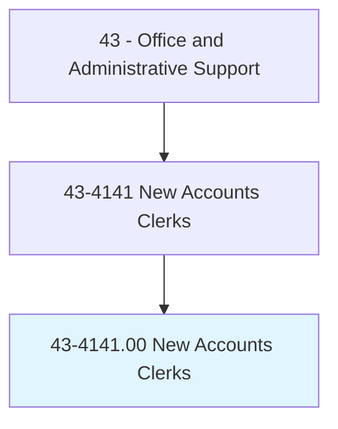
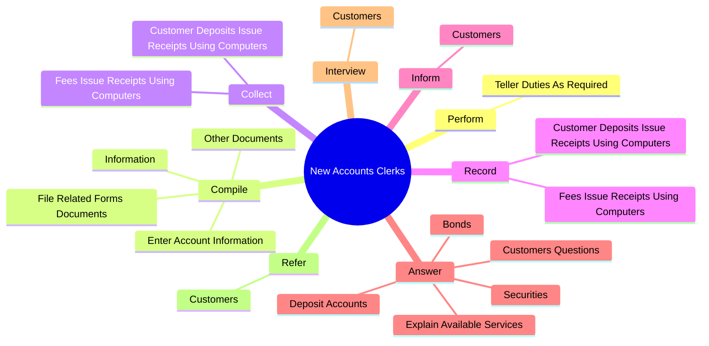
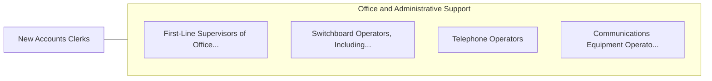

# New Accounts Clerks

> Interview persons desiring to open accounts in financial institutions. Explain account services available to prospective customers and assist them in preparing applications.

## Overview

New Accounts Clerks is an occupation within the Office and Administrative Support category. Interview persons desiring to open accounts in financial institutions. 

## Classification Hierarchy

## Key Statistics

| Metric | Value |
|--------|-------|
| SOC Code | 43-4141.00 |
| Category | [Office and Administrative Support](/occupations/Administrative/index) |
| Task Count | 39 |
| Source | O*NET |

## Core Tasks

### perform.TellerDutiesAsRequired

New Accounts Clerks perform teller duties as required as part of their core responsibilities.

**Actions:**
- `perform.TellerDutiesAsRequired`

### compile.Information

New Accounts Clerks compile information as part of their core responsibilities.

**Actions:**
- `compile.Information.about.NewAccounts`
- `compile.EnterAccountInformation.into.Computers`
- `compile.FileRelatedFormsDocuments`
- `compile.OtherDocuments`

### collect.CustomerDepositsIssueReceiptsUsingComputers

New Accounts Clerks collect customer deposits issue receipts using computers as part of their core responsibilities.

**Actions:**
- `collect.CustomerDepositsIssueReceiptsUsingComputers`
- `collect.FeesIssueReceiptsUsingComputers`

## Skills & Competencies

### Technical Skills
- **Office Management** - Advanced
- **Data Entry** - Advanced
- **Records Management** - Advanced

### Soft Skills
- **Communication** - Essential
- **Problem Solving** - Essential
- **Critical Thinking** - Important
- **Teamwork** - Important
- **Adaptability** - Important

## Related Occupations

## Industries

This occupation is found across multiple industries. See [Industries](/industries) for sector-specific employment data.

## Career Progression

---

*Source: O*NET 43-4141.00 - ONETOccupation*
