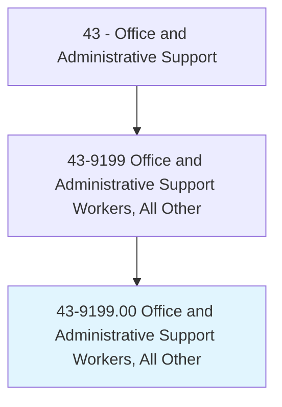
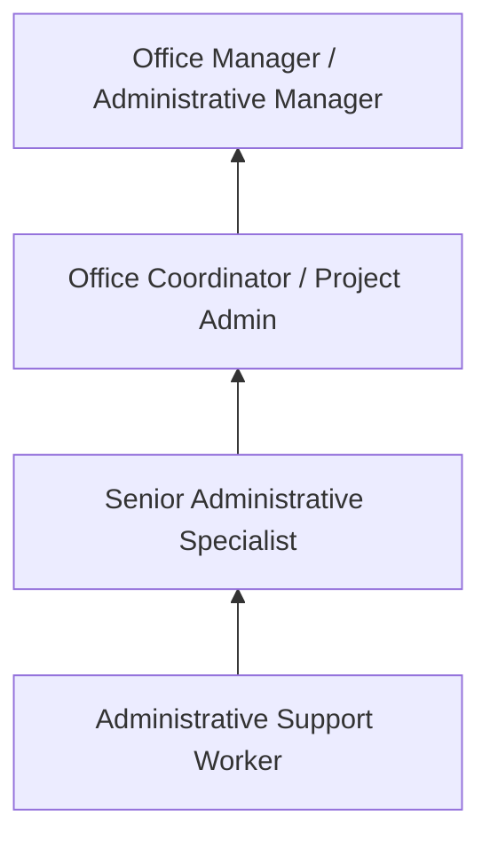
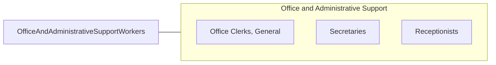

# Office and Administrative Support Workers, All Other

> All office and administrative support workers not listed separately.

## Overview

Office and Administrative Support Workers, All Other encompasses specialized office support roles not classified elsewhere in the SOC system. This includes positions such as document controllers, contract administrators, scheduling coordinators, records analysts, executive office assistants in specialized environments, and emerging administrative roles created by technological change and organizational evolution.

These professionals perform a diverse range of administrative and clerical functions that support organizational operations. Their duties may combine elements of several classified occupations or focus on niche administrative functions specific to their industry or employer. Common responsibilities include document management, scheduling, data compilation, regulatory filing, and interdepartmental coordination.

The residual nature of this category reflects the breadth of office support roles across the economy, capturing positions that require administrative skills applied to specialized contexts, from legislative offices to research laboratories to military installations.

## Classification Hierarchy

## Key Statistics

| Metric | Value |
|--------|-------|
| SOC Code | 43-9199.00 |
| Job Zone | 2 (Some Preparation) |
| Category | [Office and Administrative Support](/occupations/Administrative/index) |
| Median Annual Salary | $38,500 |
| Employment | ~200,000 |
| Projected Growth | -1% (little or no change) |
| Core Tasks | Varies |
| Source | O*NET |

## Core Tasks

Core task data with GraphDL semantic actions for this occupation is maintained in the data pipeline. See [O*NET 43-9199.00](https://www.onetonline.org/link/summary/43-9199.00) for detailed task information.

## Skills & Competencies

### Technical Skills
- **Office Software (Microsoft 365, Google Workspace)** - Advanced
- **Document Management Systems** - Advanced
- **Data Entry and Reporting** - Advanced
- **Scheduling and Coordination** - Advanced
- **Database Management** - Intermediate

### Soft Skills
- **Organizational Skills** - Critical
- **Adaptability** - Critical
- **Communication** - Essential
- **Attention to Detail** - Essential
- **Initiative** - Important

## Education & Certifications

| Requirement | Details |
|-------------|---------|
| Typical Education | High school diploma; associate's helpful |
| Microsoft Office Specialist | Software proficiency credential |
| Administrative Professional Certificate | Community college programs |
| Industry-Specific Training | Domain-dependent |

## Career Progression

## Industry Variations

| Setting | Focus | Unique Aspects |
|---------|-------|----------------|
| Government | Regulatory administration | Civil service; procedural compliance; public records |
| Corporate | Operational support | Cross-departmental; project-based; varied responsibilities |
| Healthcare | Clinical administration | HIPAA; specialized systems; patient-facing elements |
| Nonprofits | Program administration | Grant tracking; donor records; event coordination |

## Technology & Tools

- **Office** - Microsoft 365, Google Workspace
- **Collaboration** - Slack, Teams, Zoom
- **Document Management** - SharePoint, Box, Dropbox
- **Scheduling** - Outlook, Calendly, scheduling platforms

## Related Occupations

## Departments

This occupation typically works in:
- Administration - General office operations
- [Operations](/departments/Operations) - Operational support
- [Human Resources](/departments/HR) - Administrative functions
- [Executive Office](/departments/Executive) - Specialized support

---

*Source: O*NET 43-9199.00 - ONETOccupation*
