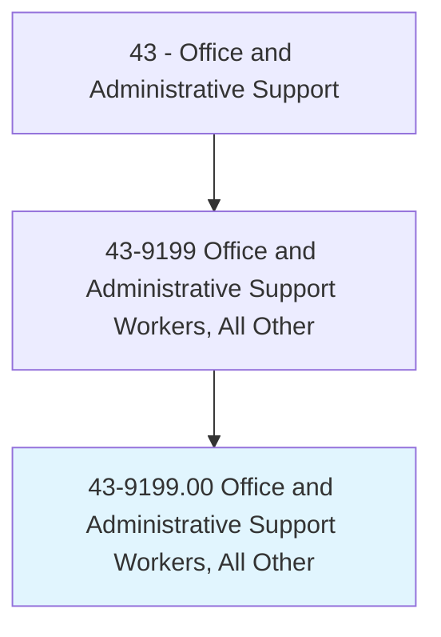
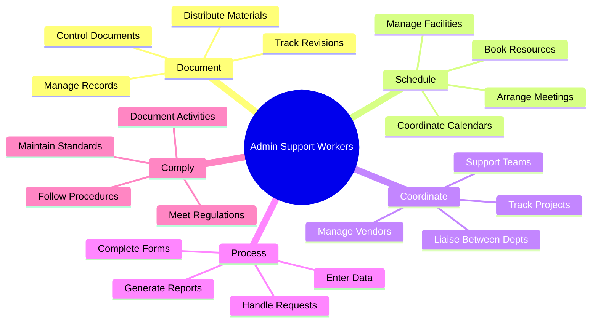
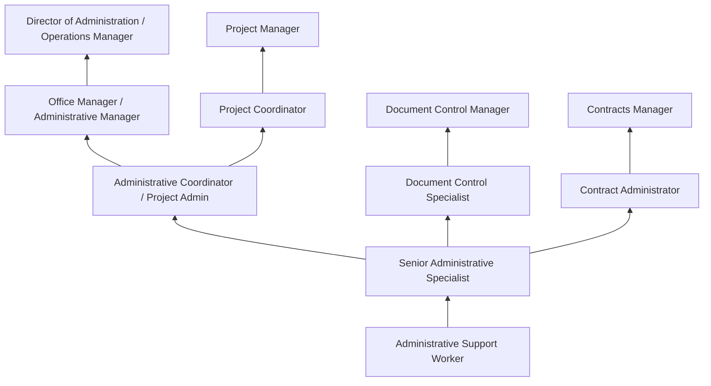
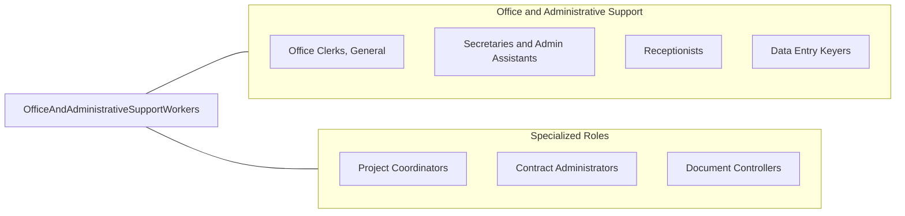

# Office and Administrative Support Workers, All Other

> All office and administrative support workers not listed separately.

## Overview

Office and Administrative Support Workers, All Other encompasses specialized office support roles not classified elsewhere in the Standard Occupational Classification system. This residual category includes diverse positions such as document controllers who manage engineering drawings and technical specifications, contract administrators who track agreement terms and compliance, scheduling coordinators who manage complex calendaring for departments or facilities, records analysts who evaluate information management practices, executive office assistants in specialized environments like research labs or military installations, and emerging administrative roles created by technological change and organizational evolution.

These professionals perform a wide range of administrative and clerical functions that support organizational operations across virtually every industry sector. Their duties may combine elements of several classified occupations or focus on niche administrative functions specific to their industry, employer, or organizational context. Common responsibilities include specialized document management, complex scheduling, data compilation and analysis, regulatory filing, interdepartmental coordination, project administration, and supporting technical or professional staff with administrative tasks that require domain knowledge.

The residual nature of this category reflects the breadth and constant evolution of office support roles across the economy, capturing positions that require administrative competencies applied to specialized contexts that don't fit neatly into existing classifications. From document control specialists managing engineering change orders in manufacturing to administrative specialists handling classified materials in defense settings, these workers fill essential organizational needs that combine general office skills with specialized domain expertise.

## Classification Hierarchy



## Key Statistics

| Metric | Value |
|--------|-------|
| SOC Code | 43-9199.00 |
| Job Zone | 2 (Some Preparation) |
| Category | [Office and Administrative Support](/occupations/Administrative/index) |
| Median Annual Salary | $38,500 |
| Salary Range | $27,000 - $56,000 |
| 10th Percentile | $27,500 |
| 90th Percentile | $55,800 |
| Employment | ~200,000 |
| Projected Growth | -1% (little or no change) |
| Annual Openings | ~25,000 |
| Core Tasks | Varies by position |
| Source | O*NET |

## Core Tasks



### manage.SpecializedDocumentation

Administrative support workers handle specialized document control.

**Actions:**
- `control.Documents.per.ConfigurationManagement`
- `track.Revisions.through.ApprovalWorkflows`
- `distribute.Materials.to.AuthorizedRecipients`
- `maintain.Archives.for.RegulatoryCompliance`

### coordinate.DepartmentOperations

Administrative support workers facilitate organizational functions.

**Actions:**
- `schedule.Resources.for.DepartmentNeeds`
- `coordinate.Activities.across.Functions`
- `track.Projects.through.Milestones`
- `support.Teams.with.AdministrativeTasks`

## Skills & Competencies

### Technical Skills
- **Office Software (Microsoft 365, Google Workspace)** - Advanced (Word, Excel, PowerPoint, Outlook)
- **Document Management Systems** - Advanced (SharePoint, specialized DMS platforms)
- **Data Entry and Reporting** - Advanced (accuracy, databases, analytics)
- **Scheduling and Coordination** - Advanced (calendar management, resource booking)
- **Database Management** - Intermediate (queries, data maintenance)
- **Specialized Software** - Intermediate to Advanced (industry-specific applications)
- **Project Tracking Tools** - Intermediate (Asana, Monday.com, MS Project basics)
- **Enterprise Systems** - Intermediate (ERP, CRM components)

### Soft Skills
- **Organizational Skills** - Critical (managing multiple priorities and functions)
- **Adaptability** - Critical (handling varied and changing responsibilities)
- **Communication** - Essential (written and verbal, multiple stakeholders)
- **Attention to Detail** - Essential (accuracy in documentation and data)
- **Initiative** - Important (anticipating needs, proactive problem-solving)
- **Discretion** - Important (handling confidential information)
- **Collaboration** - Important (working across departments)
- **Problem Solving** - Important (resolving administrative issues)

## Education & Certifications

| Requirement | Details |
|-------------|---------|
| Typical Education | High school diploma; associate's helpful |
| Preferred Education | Associate's or bachelor's in business administration |
| Microsoft Office Specialist | Software proficiency credential |
| Administrative Professional Certificate | Community college or professional programs |
| CAP (Certified Administrative Professional) | IAAP professional certification |
| Industry-Specific Training | Domain-dependent (engineering, healthcare, legal, etc.) |
| Security Clearance | Required for government/defense positions |
| Project Management Basics | Helpful for coordination roles |

## Career Progression



### Career Pathway Details

| Level | Title | Years Experience | Key Responsibilities |
|-------|-------|------------------|----------------------|
| Entry | Administrative Support Worker | 0-2 years | Basic tasks, data entry, filing, scheduling |
| Mid | Senior Administrative Specialist | 2-4 years | Complex coordination, training, specialized tasks |
| Coordinator | Administrative Coordinator | 4-6 years | Department coordination, project support, process improvement |
| Management | Office Manager / Admin Manager | 6-10 years | Staff supervision, operations, vendor management |
| Director | Director of Administration | 10+ years | Strategic planning, multi-department oversight |

### Specialization Paths

| Specialization | Focus Area | Additional Skills |
|----------------|------------|-------------------|
| Document Control | Engineering/technical documents | Configuration management, revision control |
| Contract Administration | Agreement tracking, compliance | Legal terminology, contract terms |
| Scheduling/Resource Coordination | Complex calendaring, facilities | Resource management, conflict resolution |
| Project Administration | Project support, tracking | PM methodology, reporting, stakeholder management |

## Industry Variations

| Setting | Focus | Unique Aspects |
|---------|-------|----------------|
| Government | Regulatory administration | Civil service; procedural compliance; public records; security |
| Corporate | Operational support | Cross-departmental; project-based; varied responsibilities |
| Engineering/Construction | Document control | Drawing management; specifications; configuration control |
| Healthcare | Clinical administration | HIPAA; specialized systems; patient-adjacent support |
| Nonprofits | Program administration | Grant tracking; donor records; event coordination |
| Defense/Aerospace | Classified support | Security clearances; strict protocols; technical documentation |

### Government Administrative Support

Government administrative support workers operate within civil service systems with specific procedures, documentation requirements, and public accountability. They handle constituent correspondence, process official documents, maintain public records, support policy implementation, and ensure compliance with government regulations. Positions offer job security and benefits but require adherence to bureaucratic procedures.

### Engineering and Construction Document Control

Document controllers in engineering, construction, and manufacturing environments manage technical drawings, specifications, change orders, and project documentation. They maintain revision histories, distribute current documents, collect superseded materials, and ensure that project teams work from authorized documentation. Knowledge of engineering practices and configuration management is essential.

### Defense and Aerospace Support

Administrative specialists in defense and aerospace environments handle classified materials, maintain security protocols, support technical programs, and work within highly regulated environments. Security clearances are required, and workers must follow strict procedures for document handling, communications, and visitor control.

### Healthcare Administrative Support

Healthcare administrative support workers in clinical settings support medical staff with scheduling, documentation, and coordination while maintaining HIPAA compliance. They may handle patient-adjacent tasks without direct clinical responsibility, coordinate between departments, and support quality and compliance programs.

## Technology & Tools

### Office Productivity
- **Microsoft 365** - Word, Excel, PowerPoint, Outlook, Teams
- **Google Workspace** - Docs, Sheets, Slides, Gmail, Meet
- **Adobe Acrobat** - PDF creation and management
- **Office Equipment** - Copiers, scanners, fax, phones

### Document Management
- **SharePoint** - Enterprise document storage and collaboration
- **Box / Dropbox / OneDrive** - Cloud file management
- **Specialized DMS** - Documentum, OpenText, ProjectWise
- **Drawing Management** - Autodesk Vault, Bluebeam

### Collaboration and Communication
- **Microsoft Teams** - Chat, meetings, collaboration
- **Slack** - Team messaging and channels
- **Zoom** - Video conferencing
- **Project Tools** - Asana, Monday.com, Trello

### Scheduling and Coordination
- **Microsoft Outlook** - Calendar and scheduling
- **Calendly / Doodle** - Appointment booking
- **Resource Booking** - Meeting room and resource management
- **Facilities Systems** - Space and equipment scheduling

## Related Occupations



### Related Occupation Comparison

| Occupation | Similarity | Key Difference |
|------------|------------|----------------|
| Office Clerks, General | High | General vs specialized functions |
| Secretaries and Admin Assistants | High | Individual support vs specialized tasks |
| Project Coordinators | Medium | Specific focus vs varied duties |
| Document Controllers | Medium | Specific function vs varied administrative |

## Industries

- [Professional Services](/industries/ProfessionalServices) - High Employment
- [Government](/industries/PublicAdministration) - High Employment
- [Healthcare](/industries/Healthcare/index) - Moderate Employment
- [Manufacturing](/industries/Manufacturing/index) - Moderate Employment
- [Construction](/industries/Construction) - Moderate Employment
- [Defense/Aerospace](/industries/Manufacturing/Aerospace) - Moderate Employment

## Departments

This occupation typically works in:
- Administration - General office operations
- [Operations](/departments/Operations) - Operational support functions
- [Human Resources](/departments/HR) - Administrative support
- [Executive Office](/departments/Executive) - Specialized support
- Engineering - Document control and technical admin
- Project Management - Project administration

## Work Environment

### Physical Setting
- Office environment (cubicle, desk, open plan)
- Computer workstation with standard equipment
- Access to filing, storage, conference rooms
- Professional or business casual dress
- Increasingly hybrid or remote work options

### Work Schedule
- Standard Monday-Friday business hours
- Some positions require overtime during busy periods
- Predictable schedule for most positions
- Project-driven work may have deadline intensity
- Full-time and part-time positions available

### Work Characteristics
- Multi-tasking across varied responsibilities
- Frequent interruptions and changing priorities
- Service orientation supporting others
- Computer-intensive work
- Regular communication with stakeholders

### Physical Demands
- Primarily sedentary desk work
- Light lifting of supplies and materials
- Extended computer and phone use
- Walking to meetings and other offices
- Ergonomic considerations important

## Performance Metrics

### Key Performance Indicators

| Metric | Description | Typical Target |
|--------|-------------|----------------|
| Task Completion | On-time delivery of assignments | >95% |
| Accuracy | Error-free work product | >98% |
| Response Time | Turnaround on requests | Within expectations |
| Customer Satisfaction | Stakeholder feedback | >90% positive |
| Compliance | Following procedures and regulations | 100% |
| Efficiency | Productivity measures | Continuous improvement |

### Quality Standards
- Accurate and complete documentation
- Timely response to requests
- Professional communication
- Proactive problem identification
- Adherence to procedures and standards

## Specialized Role Examples

### Document Controller
- Manages technical drawings and specifications
- Maintains revision histories and distribution lists
- Ensures teams use current, authorized documents
- Supports engineering change processes
- Works with configuration management systems

### Contract Administrator
- Tracks contract terms and milestones
- Monitors compliance and deliverables
- Maintains contract files and documentation
- Coordinates with legal and procurement
- Supports vendor relationship management

### Scheduling Coordinator
- Manages complex calendars for groups or facilities
- Books resources and coordinates logistics
- Resolves scheduling conflicts
- Supports event planning and coordination
- Maintains scheduling systems and tools

## GraphDL Semantic Structure

```graphdl
Office and Administrative Support Workers perform:
- manage.Documents.per.OrganizationalStandards
- coordinate.Activities.across.Departments
- schedule.Resources.for.Operations
- process.Requests.from.Stakeholders
- track.Projects.through.Milestones
- maintain.Records.for.Compliance
- support.Teams.with.AdministrativeTasks
- communicate.Information.to.Stakeholders
```

---

*Source: O*NET 43-9199.00 - ONETOccupation*
