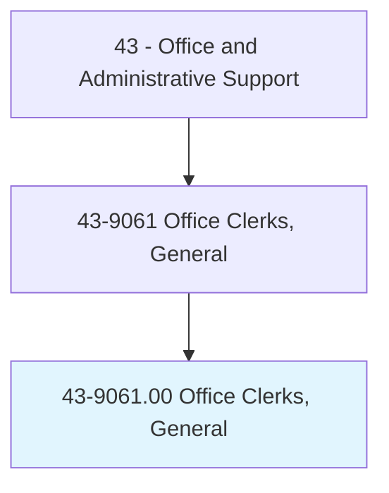
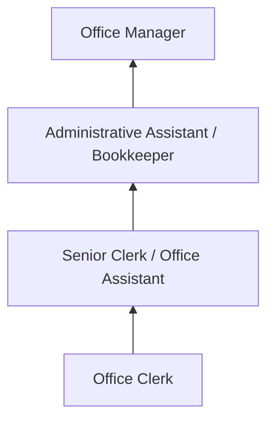

# Office Clerks, General

> Perform duties too varied and diverse to be classified in any specific office clerical occupation, requiring knowledge of office systems and procedures. Clerical duties may be assigned in accordance with the office procedures of individual establishments and may include a combination of answering telephones, bookkeeping, typing or word processing, office machine operation, and filing.

## Overview

Office Clerks, General perform a broad mix of clerical tasks that span multiple office functions rather than specializing in a single area. They may answer phones, file documents, process mail, enter data, maintain records, operate office equipment, greet visitors, manage supplies, and support various departments as needed. Their versatility makes them essential to small offices and organizations where staff handle multiple responsibilities.

This is one of the largest clerical occupations, with workers employed in virtually every industry and organization type. In small businesses, a general office clerk may be the only administrative employee, handling everything from bookkeeping to customer communication. In larger organizations, they provide flexible support across departments, filling gaps and handling overflow work.

The role serves as a common entry point into office careers, providing exposure to multiple administrative functions and developing transferable skills. While some routine tasks have been automated, the generalist nature of the position creates ongoing demand for adaptable workers who can handle diverse assignments.

## Classification Hierarchy

## Key Statistics

| Metric | Value |
|--------|-------|
| SOC Code | 43-9061.00 |
| Job Zone | 2 (Some Preparation) |
| Category | [Office and Administrative Support](/occupations/Administrative/index) |
| Median Annual Salary | $36,600 |
| Employment | ~2,700,000 |
| Projected Growth | -6% (declining) |
| Core Tasks | 35 |
| Source | O*NET |

## Core Tasks

Core task data with GraphDL semantic actions for this occupation is maintained in the data pipeline. See [O*NET 43-9061.00](https://www.onetonline.org/link/summary/43-9061.00) for detailed task information.

## Skills & Competencies

### Technical Skills
- **Office Software** - Advanced
- **Filing Systems** - Advanced
- **Data Entry** - Advanced
- **Office Equipment Operation** - Advanced
- **Basic Bookkeeping** - Intermediate

### Soft Skills
- **Versatility** - Critical
- **Organizational Skills** - Critical
- **Communication** - Essential
- **Reliability** - Critical
- **Customer Service** - Essential

## Education & Certifications

| Requirement | Details |
|-------------|---------|
| Typical Education | High school diploma |
| Office Technology Training | Vocational programs |
| Microsoft Office Certification | MOS credential |
| Bookkeeping Basics | Helpful for advancement |

## Career Progression

## Industry Variations

| Setting | Focus | Unique Aspects |
|---------|-------|----------------|
| Small Business | All-purpose admin | Solo admin role; broad responsibilities; direct management contact |
| Healthcare | Clinical support | Medical terminology; HIPAA; appointment scheduling |
| Education | School office support | Student records; parent communication; academic calendars |
| Government | Public service support | Forms processing; regulatory procedures; public inquiries |

## Technology & Tools

- **Office Software** - Microsoft Office, Google Workspace
- **Equipment** - Copiers, scanners, fax, phone systems
- **Filing** - Physical and electronic filing systems
- **Communication** - Email, phone, messaging

## Related Occupations

## Departments

This occupation typically works in:
- [Administration](/departments/Administration) - General office support
- [Operations](/departments/Operations) - Operational tasks
- [Finance](/departments/Finance) - Bookkeeping support
- [Customer Service](/departments/CustomerService) - Front desk and phones

---

*Source: O*NET 43-9061.00 - ONETOccupation*
