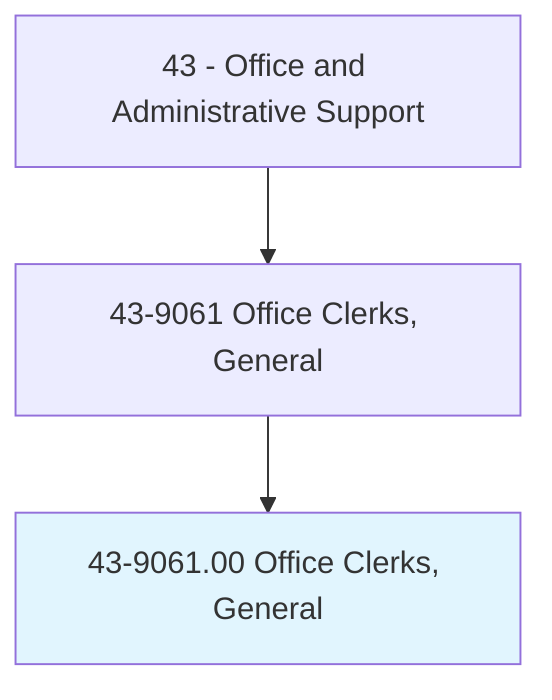
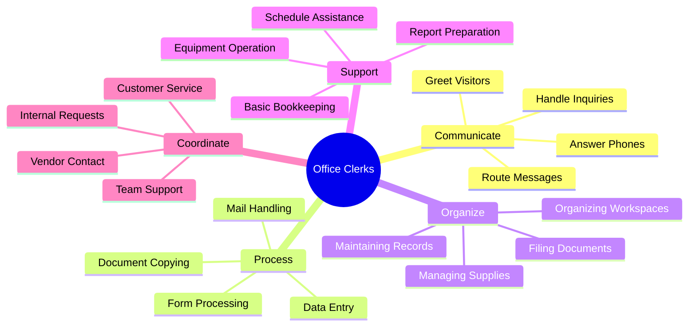
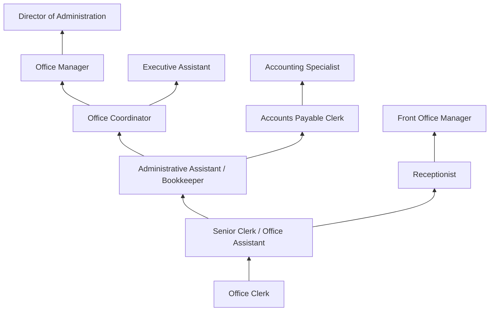
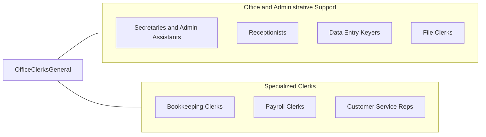

# Office Clerks, General

> Perform duties too varied and diverse to be classified in any specific office clerical occupation, requiring knowledge of office systems and procedures. Clerical duties may be assigned in accordance with the office procedures of individual establishments and may include a combination of answering telephones, bookkeeping, typing or word processing, office machine operation, and filing.

## Overview

Office Clerks, General perform a broad mix of clerical tasks that span multiple office functions rather than specializing in a single area. They answer phones, file documents, process mail, enter data, maintain records, operate office equipment, greet visitors, manage supplies, and provide general administrative support across departments. Their versatility makes them essential to organizations where staff handle multiple responsibilities rather than narrowly defined roles.

This is one of the largest clerical occupations in the economy, with workers employed in virtually every industry sector and organization type. In small businesses, a general office clerk may be the only administrative employee, handling everything from bookkeeping and payroll to customer communication and inventory tracking. In larger organizations, they provide flexible support across departments, filling gaps, handling overflow work, and supporting specialized staff with routine tasks that free professionals to focus on higher-level responsibilities.

The role serves as one of the most common entry points into office careers, providing exposure to multiple administrative functions and developing transferable skills that prepare workers for advancement into specialized positions. While technology has automated some routine tasks, the generalist nature of the position creates ongoing demand for adaptable workers who can handle diverse assignments, learn new systems quickly, and provide reliable support across changing organizational needs.

## Classification Hierarchy



## Key Statistics

| Metric | Value |
|--------|-------|
| SOC Code | 43-9061.00 |
| Job Zone | 2 (Some Preparation) |
| Category | [Office and Administrative Support](/occupations/Administrative/index) |
| Median Annual Salary | $36,600 |
| Salary Range | $25,000 - $52,000 |
| 10th Percentile | $25,500 |
| 90th Percentile | $51,800 |
| Employment | ~2,700,000 |
| Projected Growth | -6% (declining) |
| Annual Openings | ~340,000 |
| Core Tasks | 35 |
| Source | O*NET |

## Core Tasks



### handle.OfficeCommunications

Office Clerks manage incoming and outgoing communications.

**Actions:**
- `answer.Phones.and.RouteMessages`
- `greet.Visitors.and.DirectTraffic`
- `process.Mail.incoming.and.Outgoing`
- `respond.To.Inquiries.professionally`

### maintain.OfficeOperations

Office Clerks keep office systems running smoothly.

**Actions:**
- `file.Documents.in.OrganizedSystems`
- `enter.Data.into.DatabasesAndRecords`
- `operate.Equipment.for.OfficeNeeds`
- `manage.Supplies.for.OfficeInventory`

## Skills & Competencies

### Technical Skills
- **Office Software (Microsoft Office)** - Advanced (Word, Excel, Outlook)
- **Filing Systems** - Advanced (physical and electronic organization)
- **Data Entry** - Advanced (accuracy, speed, database use)
- **Office Equipment Operation** - Advanced (copiers, scanners, fax, phones)
- **Basic Bookkeeping** - Intermediate (invoices, receipts, ledgers)
- **Database/CRM Systems** - Intermediate (data retrieval, entry)
- **Telephone Systems** - Advanced (multi-line, voicemail, routing)
- **Mail Processing** - Intermediate (sorting, metering, shipping)

### Soft Skills
- **Versatility** - Critical (handling varied and changing tasks)
- **Organizational Skills** - Critical (managing multiple responsibilities)
- **Communication** - Essential (clear, professional interaction)
- **Reliability** - Critical (consistent, dependable performance)
- **Customer Service** - Essential (positive stakeholder interactions)
- **Adaptability** - Important (learning new tasks and systems)
- **Initiative** - Important (anticipating needs, taking action)
- **Attention to Detail** - Essential (accurate work product)

## Education & Certifications

| Requirement | Details |
|-------------|---------|
| Typical Education | High school diploma |
| Preferred Education | Some college or vocational training |
| Office Technology Training | Vocational programs in office skills |
| Microsoft Office Certification | MOS credential demonstrating proficiency |
| Bookkeeping Basics | Helpful for advancement |
| Data Entry Certification | Speed and accuracy credentials |
| Customer Service Training | Professional development |
| Industry-Specific Training | Sector knowledge as needed |

## Career Progression



### Career Pathway Details

| Level | Title | Years Experience | Key Responsibilities |
|-------|-------|------------------|----------------------|
| Entry | Office Clerk | 0-1 years | Basic clerical, filing, phones, data entry |
| Mid | Senior Clerk / Office Assistant | 1-3 years | Complex tasks, training, reliability |
| Specialist | Administrative Assistant / Bookkeeper | 3-5 years | Specialized functions, department support |
| Coordinator | Office Coordinator | 5-7 years | Operations coordination, vendor management |
| Management | Office Manager | 7-12 years | Staff supervision, budgets, operations |
| Director | Director of Administration | 12+ years | Strategic oversight, multiple functions |

### Specialization Paths

| Specialization | Focus Area | Additional Skills |
|----------------|------------|-------------------|
| Administrative Assistant | Executive/department support | Advanced scheduling, correspondence |
| Bookkeeper | Financial records | Accounting software, reconciliation |
| Receptionist | Front desk operations | Customer service, appearance |
| Data Entry Specialist | High-volume data processing | Speed, accuracy, databases |
| Payroll Clerk | Employee compensation | Payroll systems, tax knowledge |

## Industry Variations

| Setting | Focus | Unique Aspects |
|---------|-------|----------------|
| Small Business | All-purpose admin | Solo admin role; broad responsibilities; direct owner contact; varied duties |
| Healthcare | Clinical support | Medical terminology; HIPAA; appointment scheduling; patient interaction |
| Education | School office support | Student records; parent communication; academic calendars; enrollment |
| Government | Public service support | Forms processing; regulatory procedures; public inquiries; civil service |
| Legal | Law office support | Legal terminology; filing systems; court deadlines; client confidentiality |
| Manufacturing | Production office | Shop floor coordination; safety documentation; shift scheduling |

### Small Business Office Clerk

Small business office clerks often serve as the sole administrative employee, handling every office function from answering phones and greeting customers to managing accounts payable/receivable, processing payroll, maintaining inventory, and supporting the owner with scheduling and correspondence. The role requires extreme versatility and the ability to switch between tasks constantly throughout the day.

### Healthcare Office Clerk

Healthcare office clerks work in medical offices, clinics, and hospitals supporting clinical operations with appointment scheduling, patient check-in, medical record filing, insurance verification, and basic billing tasks. HIPAA compliance governs all patient information handling, and clerks must learn medical terminology and healthcare-specific software systems.

### School Office Clerk

School office clerks handle student enrollment, attendance tracking, parent communications, supply ordering, teacher support, and the constant stream of visitors, deliveries, and inquiries that flow through school offices. They work within academic calendars and must understand student privacy requirements under FERPA.

### Government Office Clerk

Government office clerks process forms, maintain records, respond to public inquiries, and support agency functions within civil service systems. They follow established procedures for document handling, often work with legacy systems, and serve as the public-facing representatives of government offices.

## Technology & Tools

### Office Software
- **Microsoft Office** - Word, Excel, Outlook, PowerPoint
- **Google Workspace** - Docs, Sheets, Gmail, Calendar
- **Adobe Acrobat** - PDF creation and editing
- **QuickBooks/Sage** - Basic accounting software

### Office Equipment
- **Multi-Function Copiers** - Copying, scanning, faxing
- **Phone Systems** - Multi-line, voicemail, conferencing
- **Postage Meters** - Mail processing equipment
- **Scanners** - Document digitization
- **Shredders** - Confidential document destruction

### Communication Tools
- **Email Platforms** - Outlook, Gmail, web mail
- **Instant Messaging** - Teams, Slack
- **Video Conferencing** - Zoom, Teams, WebEx (support role)
- **Customer Portals** - Web-based inquiry systems

### Filing and Records
- **Physical Filing Systems** - Alphabetical, numerical, color-coded
- **Electronic File Management** - SharePoint, OneDrive, network drives
- **Database Systems** - Access, CRM platforms
- **Records Retention** - Archive and destruction schedules

## Related Occupations



### Related Occupation Comparison

| Occupation | Similarity | Key Difference |
|------------|------------|----------------|
| Secretaries and Admin Assistants | High | Dedicated support vs general duties |
| Receptionists | Medium | Front desk focus vs varied tasks |
| Data Entry Keyers | Medium | Specialized data vs multiple functions |
| Bookkeeping Clerks | Medium | Financial specialty vs general support |

## Industries

- [Professional Services](/industries/ProfessionalServices) - High Employment
- [Healthcare](/industries/Healthcare/index) - High Employment
- [Government](/industries/PublicAdministration) - High Employment
- [Education](/industries/Education) - Moderate Employment
- [Manufacturing](/industries/Manufacturing/index) - Moderate Employment
- [Retail](/industries/Retail) - Moderate Employment
- [Nonprofit](/industries/ProfessionalServices) - Moderate Employment

## Departments

This occupation typically works in:
- Administration - General office support
- [Operations](/departments/Operations) - Operational support
- [Finance](/departments/Finance) - Bookkeeping support
- Customer Service - Front desk and phones
- [Human Resources](/departments/HR) - Administrative support
- Various Departments - As assigned throughout organization

## Work Environment

### Physical Setting
- Office environment (desk, computer, phone)
- Front desk or reception area (some positions)
- Shared office space or cubicle
- Access to copiers, filing, supplies
- Business casual to professional dress

### Work Schedule
- Standard Monday-Friday business hours
- Full-time and part-time positions widely available
- Some overtime during busy periods
- Predictable schedule in most settings
- Entry-level positions may have flexible hours

### Work Characteristics
- Multi-tasking throughout the day
- Frequent interruptions and shifting priorities
- Regular interaction with coworkers and visitors
- Computer-based work with phone duties
- Service orientation supporting others

### Physical Demands
- Primarily sedentary desk work
- Light lifting of supplies and files (up to 25 lbs)
- Extended computer and phone use
- Walking to deliver items and attend meetings
- Standing at copiers and filing cabinets

## Performance Metrics

### Key Performance Indicators

| Metric | Description | Typical Target |
|--------|-------------|----------------|
| Task Completion | On-time completion of assignments | >95% |
| Accuracy | Error-free work product | >98% |
| Phone Response | Answer within specified rings | <3 rings |
| Filing Backlog | Unfiled documents | Minimal |
| Customer Satisfaction | Stakeholder feedback | >90% positive |
| Attendance | Reliable presence | Per policy |

### Quality Standards
- Accurate and complete work
- Professional phone demeanor
- Organized filing and records
- Timely response to requests
- Pleasant customer interactions

## Entry-Level Opportunity

### Why Office Clerk is a Good Starting Point

- **Low Barriers**: High school diploma typically sufficient
- **Skill Development**: Exposure to multiple office functions
- **Career Foundation**: Transferable skills for advancement
- **Industry Exposure**: Available in virtually every sector
- **Advancement Paths**: Clear progression to specialized roles
- **Stable Demand**: Consistent need despite automation

### Skills Developed
- Computer and software proficiency
- Communication and customer service
- Organization and time management
- Basic business understanding
- Professional workplace behavior
- Problem-solving and adaptability

## GraphDL Semantic Structure

```graphdl
Office Clerks, General perform:
- answer.Phones.for.Organization
- greet.Visitors.at.FrontDesk
- file.Documents.in.RecordsSystems
- enter.Data.into.Databases
- process.Mail.incoming.and.Outgoing
- operate.Equipment.for.OfficeNeeds
- manage.Supplies.for.OfficeInventory
- support.Staff.with.ClericalTasks
```

---

*Source: O*NET 43-9061.00 - ONETOccupation*
