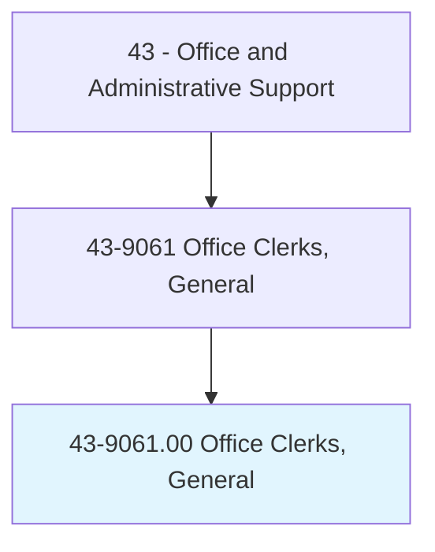
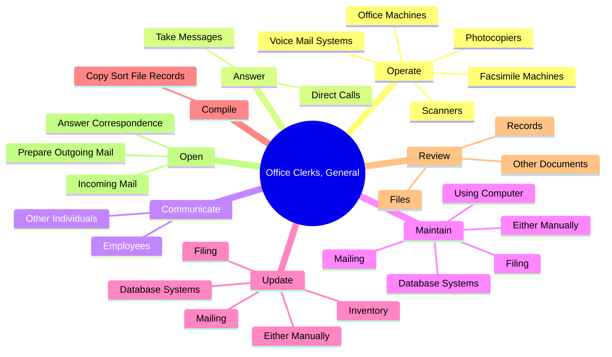
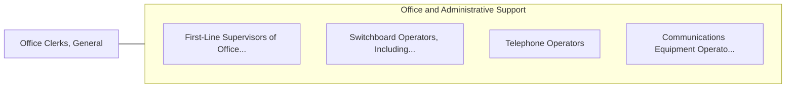

# Office Clerks, General

> Perform duties too varied and diverse to be classified in any specific office clerical occupation, requiring knowledge of office systems and procedures. Clerical duties may be assigned in accordance with the office procedures of individual establishments and may include a combination of answering telephones, bookkeeping, typing or word processing, office machine operation, and filing.

## Overview

Office Clerks, General is an occupation within the Office and Administrative Support category. Perform duties too varied and diverse to be classified in any specific office clerical occupation, requiring knowledge of office systems and procedures. 

## Classification Hierarchy

## Key Statistics

| Metric | Value |
|--------|-------|
| SOC Code | 43-9061.00 |
| Category | [Office and Administrative Support](/occupations/Administrative/index) |
| Task Count | 117 |
| Source | O*NET |

## Core Tasks

### operate.OfficeMachines

Office Clerks, General operate office machines as part of their core responsibilities.

**Actions:**
- `operate.OfficeMachines`
- `operate.Photocopiers`
- `operate.Scanners`
- `operate.FacsimileMachines`

### answer.DirectCalls

Office Clerks, General answer direct calls as part of their core responsibilities.

**Actions:**
- `answer.DirectCalls`
- `answer.TakeMessages`

### communicate.Employees

Office Clerks, General communicate employees as part of their core responsibilities.

**Actions:**
- `communicate.Employees.to.answer.Questions`
- `communicate.Employees.to.disseminate`
- `communicate.Employees.to.explain.Information`
- `communicate.Employees.to.take.Orders`

## Skills & Competencies

### Technical Skills
- **Office Management** - Advanced
- **Data Entry** - Advanced
- **Records Management** - Advanced

### Soft Skills
- **Communication** - Essential
- **Problem Solving** - Essential
- **Critical Thinking** - Important
- **Teamwork** - Important
- **Adaptability** - Important

## Related Occupations

## Industries

This occupation is found across multiple industries. See [Industries](/industries) for sector-specific employment data.

## Career Progression

---

*Source: O*NET 43-9061.00 - ONETOccupation*
