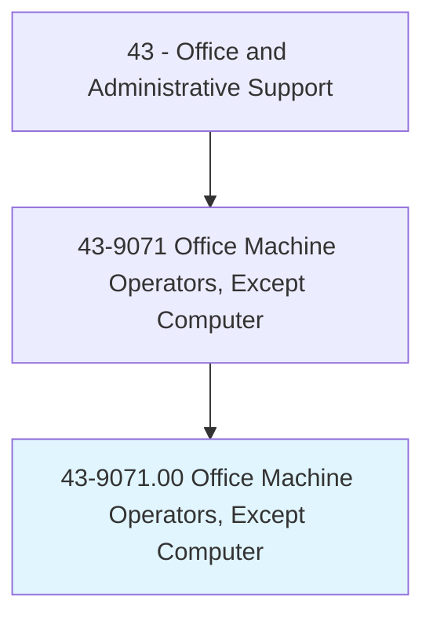
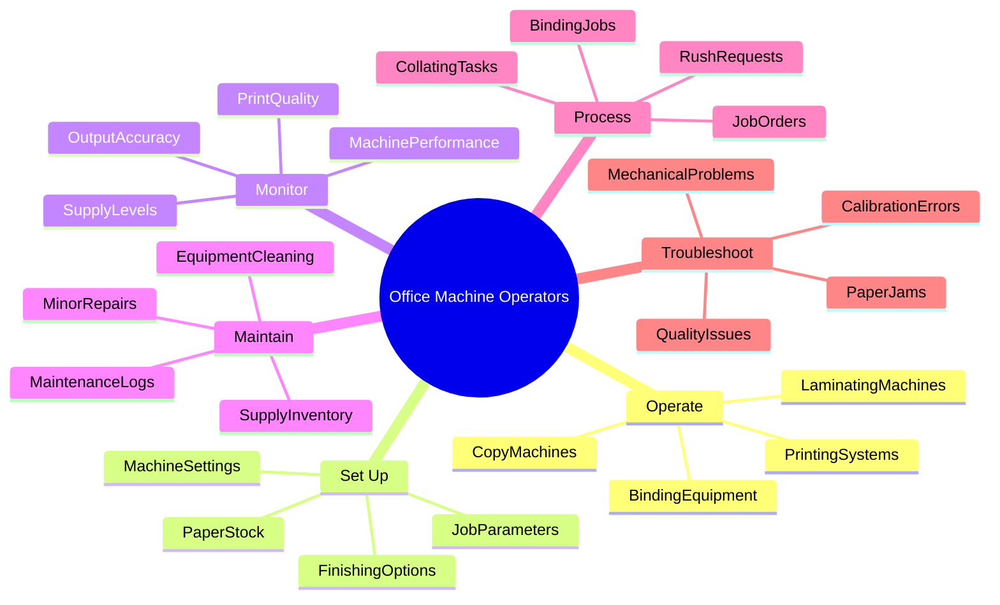
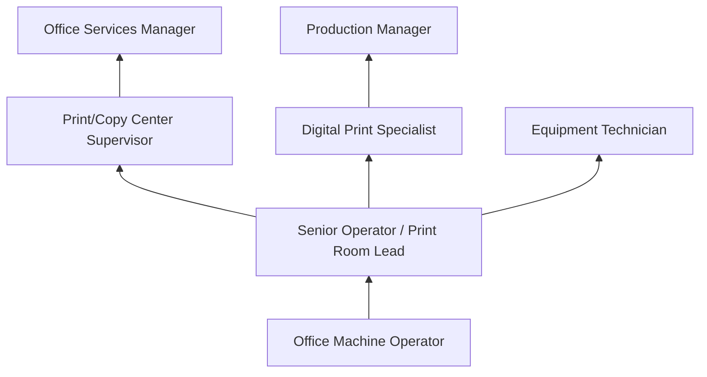
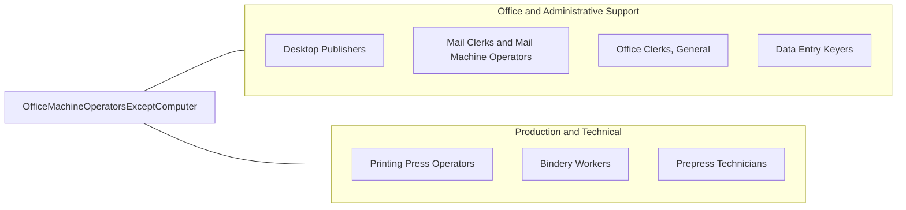

# Office Machine Operators, Except Computer

> Operate one or more of a variety of office machines, such as photocopying, photographic, and duplicating machines, or other office machines.

## Overview

Office Machine Operators run specialized office equipment including high-volume copiers, duplicating machines, binding equipment, laminating machines, microfilm processors, and print production systems. They set up machines for production runs, load paper and supplies, adjust settings for quality output, perform routine maintenance, and troubleshoot equipment malfunctions.

Working in corporate offices, government agencies, print shops, and service bureaus, these operators handle large-scale reproduction jobs that exceed the capacity of standard desktop equipment. They manage job queues, prioritize rush requests, collate and bind finished products, and maintain inventory of supplies including paper, toner, and binding materials.

The occupation has declined substantially as digital distribution has replaced physical copying and as multifunction devices have made basic copying a self-service function. Remaining positions focus on high-volume production printing, specialized finishing operations, and document management services. Organizations with significant print volumes, legal document requirements, or specialized finishing needs continue to employ dedicated machine operators who bring expertise in production efficiency and quality control.

## Classification Hierarchy

## Key Statistics

| Metric | Value |
|--------|-------|
| SOC Code | 43-9071.00 |
| Job Zone | 1 (Little or No Preparation) |
| Category | [Office and Administrative Support](/occupations/Administrative/index) |
| Median Annual Salary | $33,500 |
| Employment | ~45,000 |
| Projected Growth | -14% (rapidly declining) |
| Core Tasks | 20 |
| Source | O*NET |

## Core Tasks

### operate.ProductionEquipment

Office Machine Operators run various types of office and production equipment to reproduce documents and materials.

**Actions:**
- `operate.CopyMachines.for.DocumentReproduction` - Run high-volume copiers for large print jobs
- `operate.DigitalPrinters.to.produce.PrintMaterials` - Manage digital production printing systems
- `operate.BindingEquipment.for.FinishedDocuments` - Use binding, stapling, and fastening equipment
- `operate.LaminatingMachines.to.protect.Materials` - Apply lamination for durability and protection
- `operate.FoldingMachines.for.MailingPreparation` - Process documents for mailing or distribution
- `operate.CuttingEquipment.to.trim.Documents` - Cut materials to specified dimensions

### setUp.MachineParameters

Office Machine Operators configure equipment settings for each job's specific requirements.

**Actions:**
- `setUp.CopySettings.according.to.JobSpecifications` - Configure resolution, color, paper size settings
- `load.PaperStock.into.MachineTrays` - Fill paper trays with appropriate stock
- `configure.FinishingOptions.for.FinalOutput` - Set stapling, hole punching, collating options
- `adjust.ImageQuality.to.meet.Standards` - Calibrate for optimal reproduction quality
- `program.JobQueues.for.EfficientProcessing` - Sequence multiple jobs for workflow efficiency

### monitor.ProductionQuality

Office Machine Operators continuously check output to ensure quality standards are met.

**Actions:**
- `inspect.PrintOutput.for.QualityDefects` - Check copies for clarity, alignment, and accuracy
- `monitor.MachinePerformance.during.ProductionRuns` - Watch for equipment issues during operation
- `verify.Collation.for.CorrectPageOrder` - Ensure multi-page documents are properly assembled
- `check.ColorAccuracy.against.OriginalDocuments` - Compare color reproduction to originals
- `track.SupplyLevels.to.prevent.Interruptions` - Monitor toner, paper, and staples inventory

### maintain.Equipment

Office Machine Operators perform routine maintenance to keep equipment operational.

**Actions:**
- `clean.MachineSurfaces.and.Components` - Remove dust, toner residue, and debris
- `replace.ConsumableSupplies.as.Needed` - Change toner cartridges, paper rolls, staples
- `perform.MinorRepairs.for.SimpleIssues` - Fix basic mechanical problems
- `log.MaintenanceActivities.in.Records` - Document service performed and issues found
- `schedule.ServiceCalls.for.MajorRepairs` - Arrange technician visits for complex problems
- `calibrate.Equipment.for.OptimalPerformance` - Run calibration routines to maintain quality

### troubleshoot.EquipmentIssues

Office Machine Operators diagnose and resolve equipment malfunctions.

**Actions:**
- `clear.PaperJams.from.Equipment` - Remove stuck paper and resume operations
- `diagnose.QualityProblems.by.testing.Settings` - Identify causes of poor output quality
- `reset.MachineErrors.to.restore.Operation` - Clear error codes and restart equipment
- `consult.TechnicalManuals.for.Solutions` - Reference documentation for troubleshooting
- `report.RecurringIssues.to.Maintenance` - Escalate persistent problems to technicians

## Skills & Competencies

### Technical Skills
- **High-Volume Copier Operation** - Expert (Xerox, Canon, Ricoh production systems)
- **Binding and Finishing Equipment** - Advanced (perfect binding, coil, saddle stitch)
- **Print Production** - Advanced (variable data, large format, specialty substrates)
- **Equipment Maintenance** - Intermediate (preventive care, cleaning, minor repairs)
- **Digital File Processing** - Intermediate (PDF handling, file conversion, RIP software)
- **Color Management** - Intermediate (calibration, color matching, proofing)
- **Job Ticketing Systems** - Advanced (print management software, workflow automation)
- **Inventory Management** - Intermediate (supplies tracking, reorder points)

### Soft Skills
- **Attention to Detail** - Critical (quality inspection, accurate settings)
- **Time Management** - Essential (meeting deadlines, prioritizing rush jobs)
- **Mechanical Aptitude** - Essential (understanding equipment operation and troubleshooting)
- **Reliability** - Critical (consistent attendance, dependable output)
- **Quality Focus** - Essential (commitment to producing accurate work)
- **Physical Stamina** - Important (standing, lifting paper boxes, repetitive tasks)
- **Problem Solving** - Important (diagnosing equipment issues, finding workarounds)

## Education & Certifications

| Requirement | Details |
|-------------|---------|
| Typical Education | High school diploma or less |
| Equipment Training | Manufacturer-specific (Xerox, Canon, Ricoh, Konica Minolta) |
| Print Production Basics | On-the-job training (4-8 weeks typical) |
| Safety Training | Equipment operation safety, lifting techniques |
| Color Management | Vendor certifications for color-critical work |
| Digital Workflow | Training on RIP software and job ticketing |

## Career Progression

### Career Pathway Details

| Level | Title | Years Experience | Key Responsibilities |
|-------|-------|------------------|----------------------|
| Entry | Office Machine Operator | 0-2 years | Basic copying, simple finishing, supply management |
| Mid | Senior Operator / Lead | 2-5 years | Complex jobs, training, quality oversight, scheduling |
| Supervisory | Print Center Supervisor | 5-8 years | Staff management, budgeting, vendor relations |
| Management | Office Services Manager | 8+ years | Department operations, strategic planning, technology decisions |

## Industry Variations

| Setting | Focus | Unique Aspects |
|---------|-------|----------------|
| Corporate | Internal reproduction | Executive presentations; board materials; confidential documents; brand standards |
| Government | Public records | High volume; archival standards; accessibility requirements; security clearances |
| Legal | Court documents | Exact copies; exhibit production; discovery printing; certified copies; chain of custody |
| Print Services | Commercial production | Variable data; finishing options; customer orders; competitive turnaround |
| Education | Academic materials | Course packets; exam production; seasonal peaks; copyright compliance |
| Healthcare | Medical records | HIPAA compliance; patient materials; forms production; archival requirements |

### Corporate Print Centers

Corporate print center operators handle internal document needs including training materials, marketing collateral, financial reports, and executive presentations. They work with brand guidelines, maintain confidentiality for sensitive documents, and coordinate with multiple departments. Many corporate centers have evolved into comprehensive office services operations handling mail, shipping, and facilities support.

### Legal Document Production

Legal print operations require extreme precision for court filings, exhibits, and discovery documents. Operators must understand bates numbering, tab creation, exhibit formatting, and binding specifications required by courts. Chain of custody documentation may be required for evidence materials, and deadlines are often court-imposed with no flexibility.

### Government and Public Sector

Government print operations handle high volumes of public documents, forms, and correspondence while meeting accessibility requirements and archival standards. Security clearances may be required for handling classified or sensitive materials. Operations must comply with procurement regulations and often work within tight budget constraints.

## Technology & Tools

### Production Equipment
- **High-Volume Copiers** - Xerox Versant, Canon imagePRESS, Ricoh Pro series
- **Production Printers** - Digital production presses for commercial-quality output
- **Wide Format** - Large format printers for posters, banners, signage
- **Finishing Equipment** - Booklet makers, perfect binders, coil inserters, laminators

### Software and Systems
- **Print Management** - EFI Fiery, Creo, RISO ComColor controllers
- **Job Ticketing** - PrintSmith, EFI Pace, RSA QDirect
- **File Handling** - Adobe Acrobat, PDF preflight tools
- **Inventory** - Supply tracking systems, automated reorder

### Support Equipment
- **Scanners** - High-speed production scanners for digitization
- **Paper Handling** - Joggers, paper drills, corner rounders
- **Quality Control** - Densitometers, spectrophotometers for color verification

## Work Environment

### Physical Setting
- Print production rooms with climate control for equipment
- Standing workstations near equipment
- Paper storage and supply areas
- Finishing and assembly workstations
- Moderate noise levels from operating equipment

### Work Schedule
- Standard business hours in most corporate settings
- Shift work in 24-hour production facilities
- Overtime during peak periods or rush projects
- Deadline-driven schedule flexibility

### Physical Requirements
- Standing for extended periods
- Lifting paper boxes (up to 50 lbs)
- Repetitive motions for collating and finishing
- Fine motor skills for equipment adjustment

## Related Occupations

### Related Occupation Comparison

| Occupation | Similarity | Key Difference |
|------------|------------|----------------|
| Desktop Publishers | Medium | Design focus vs production focus |
| Printing Press Operators | High | Commercial presses vs office equipment |
| Bindery Workers | High | Finishing specialization vs full production |
| Mail Clerks | Medium | Mail focus vs document reproduction |

## Industries

- Administrative and Support Services - High Employment
- [Government](/industries/PublicAdministration) - High Employment
- [Legal Services](/industries/ProfessionalServices) - Moderate Employment
- [Education](/industries/Education) - Moderate Employment
- [Finance and Insurance](/industries/Finance) - Moderate Employment
- [Healthcare](/industries/Healthcare) - Moderate Employment

## Departments

This occupation typically works in:
- Print/Copy Center - Document reproduction and finishing
- Office Services - Comprehensive administrative support
- Records Management - Document processing and archival
- Administration - General support services
- [Facilities](/departments/Operations) - Building operations support

## Performance Metrics

| Metric | Description | Typical Target |
|--------|-------------|----------------|
| Jobs Completed | Number of jobs processed per day/week | Varies by volume |
| Quality Rate | Percentage of jobs without defects | >98% |
| Turnaround Time | Average time from request to completion | Per SLA |
| Equipment Uptime | Percentage of time machines operational | >95% |
| Supply Costs | Cost per impression or finished piece | Budget targets |

---

*Source: O*NET 43-9071.00 - ONETOccupation*
