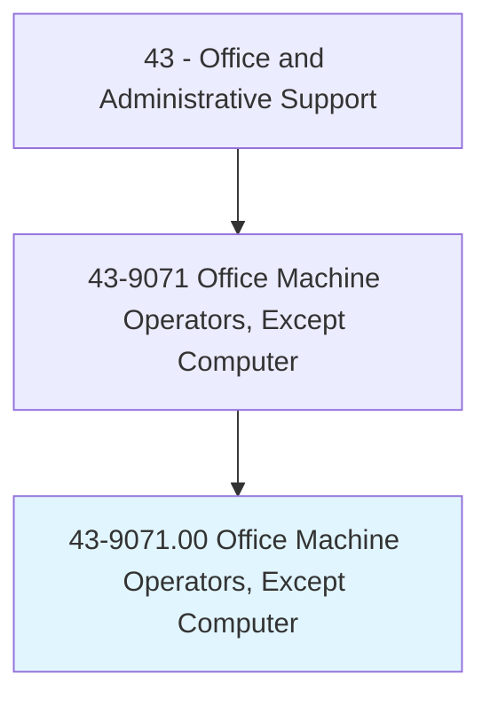
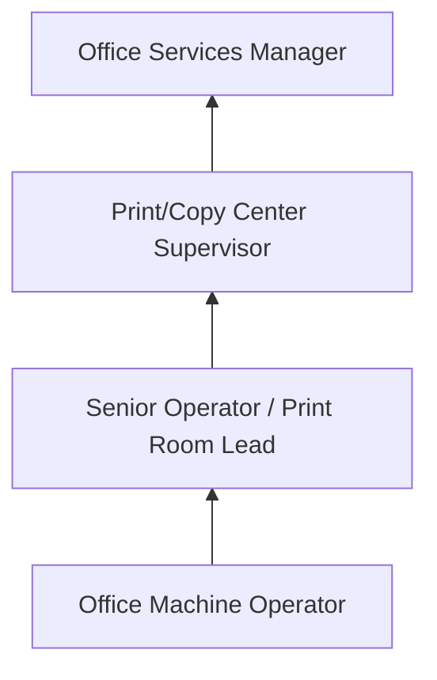
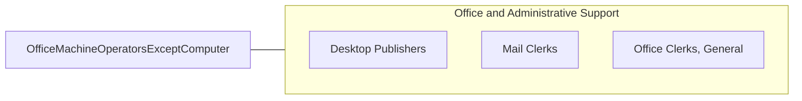

# Office Machine Operators, Except Computer

> Operate one or more of a variety of office machines, such as photocopying, photographic, and duplicating machines, or other office machines.

## Overview

Office Machine Operators run specialized office equipment including high-volume copiers, duplicating machines, binding equipment, laminating machines, microfilm processors, and print production systems. They set up machines for production runs, load paper and supplies, adjust settings for quality output, perform routine maintenance, and troubleshoot equipment malfunctions.

Working in corporate offices, government agencies, print shops, and service bureaus, these operators handle large-scale reproduction jobs that exceed the capacity of standard desktop equipment. They manage job queues, prioritize rush requests, collate and bind finished products, and maintain inventory of supplies including paper, toner, and binding materials.

The occupation has declined substantially as digital distribution has replaced physical copying and as multifunction devices have made basic copying a self-service function. Remaining positions focus on high-volume production printing, specialized finishing operations, and document management services.

## Classification Hierarchy

## Key Statistics

| Metric | Value |
|--------|-------|
| SOC Code | 43-9071.00 |
| Job Zone | 1 (Little or No Preparation) |
| Category | [Office and Administrative Support](/occupations/Administrative/index) |
| Median Annual Salary | $33,500 |
| Employment | ~45,000 |
| Projected Growth | -14% (rapidly declining) |
| Core Tasks | 20 |
| Source | O*NET |

## Core Tasks

Core task data with GraphDL semantic actions for this occupation is maintained in the data pipeline. See [O*NET 43-9071.00](https://www.onetonline.org/link/summary/43-9071.00) for detailed task information.

## Skills & Competencies

### Technical Skills
- **High-Volume Copier Operation** - Advanced
- **Binding and Finishing Equipment** - Advanced
- **Print Production** - Advanced
- **Equipment Maintenance** - Intermediate
- **Digital File Processing** - Intermediate

### Soft Skills
- **Attention to Detail** - Critical
- **Time Management** - Essential
- **Mechanical Aptitude** - Essential
- **Reliability** - Critical
- **Quality Focus** - Essential

## Education & Certifications

| Requirement | Details |
|-------------|---------|
| Typical Education | High school diploma or less |
| Equipment Training | Manufacturer-specific (Xerox, Canon, Ricoh) |
| Print Production Basics | On-the-job training |
| Safety Training | Equipment operation safety |

## Career Progression

## Industry Variations

| Setting | Focus | Unique Aspects |
|---------|-------|----------------|
| Corporate | Internal reproduction | Executive presentations; board materials; confidential documents |
| Government | Public records | High volume; archival standards; accessibility requirements |
| Legal | Court documents | Exact copies; exhibit production; discovery printing |
| Print Services | Commercial production | Variable data; finishing options; customer orders |

## Technology & Tools

- **Production Printers** - Xerox, Canon, Ricoh high-volume systems
- **Finishing** - Binding, laminating, folding, cutting equipment
- **Software** - Print management, job ticketing
- **Scanning** - High-speed document scanners, OCR

## Related Occupations

## Departments

This occupation typically works in:
- [Print/Copy Center](/departments/PrintCenter) - Document reproduction
- [Office Services](/departments/OfficeServices) - Support services
- [Records Management](/departments/Records) - Document processing
- [Administration](/departments/Administration) - General support

---

*Source: O*NET 43-9071.00 - ONETOccupation*
