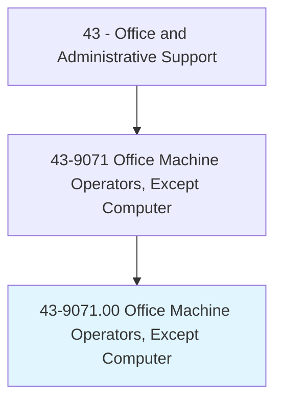
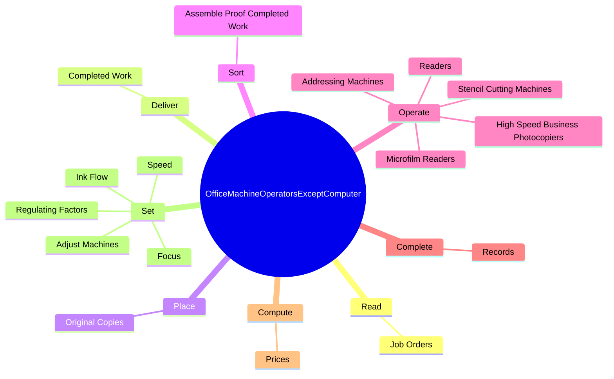
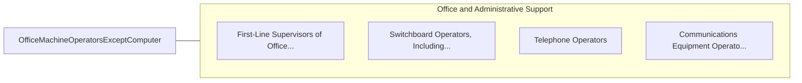

# Office Machine Operators, Except Computer

> Operate one or more of a variety of office machines, such as photocopying, photographic, and duplicating machines, or other office machines.

## Overview

Office Machine Operators, Except Computer is classified under Office and Administrative Support (SOC 43). Operate one or more of a variety of office machines, such as photocopying, photographic, and duplicating machines, or other office machines.

## Classification Hierarchy

## Key Statistics

| Metric | Value |
|--------|-------|
| SOC Code | 43-9071.00 |
| Category | [Office and Administrative Support](/occupations/Administrative) |
| Task Count | 71 |
| Source | O*NET |

## Core Tasks

### read.JobOrders

Office Machine Operators, Except Computer read job orders as part of their core responsibilities.

**Actions:**
- `read.JobOrders.to.determine.TypeOfWorkToBeDone`
- `read.JobOrders.to.QuantitiesToBeProduced`
- `read.JobOrders.to.MaterialsNeeded`

### deliver.CompletedWork

Office Machine Operators, Except Computer deliver completed work as part of their core responsibilities.

**Actions:**
- `deliver.CompletedWork`

### place.OriginalCopies

Office Machine Operators, Except Computer place original copies as part of their core responsibilities.

**Actions:**
- `place.OriginalCopies.in.FeedTrays`
- `place.OriginalCopies.in.FeedOriginalsIntoFeedRolls`
- `place.OriginalCopies.in.PositionOriginals.on.TablesBeneathCameraLenses`

## Skills & Competencies

### Technical Skills
- **Office Management** - Advanced
- **Data Entry** - Advanced
- **Records Management** - Advanced

### Soft Skills
- **Communication** - Essential
- **Problem Solving** - Essential
- **Critical Thinking** - Important
- **Teamwork** - Important
- **Adaptability** - Important

## Related Occupations

## Industries

This occupation is found across multiple industries. See [Industries](/industries) for sector-specific employment data.

## Career Progression

---

*Source: O*NET 43-9071.00 - ONETOccupation*
