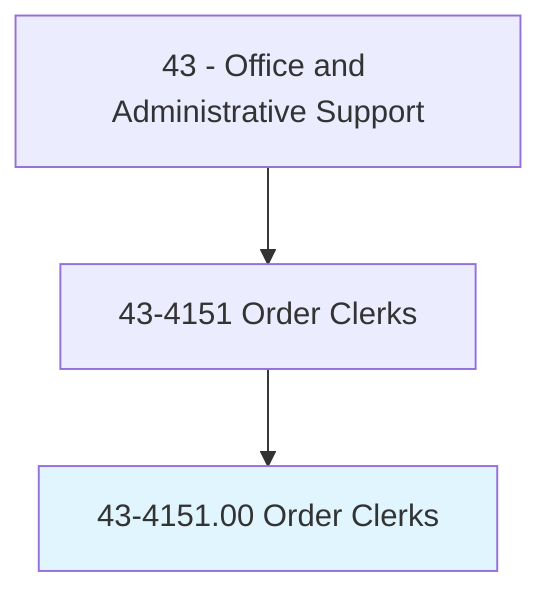
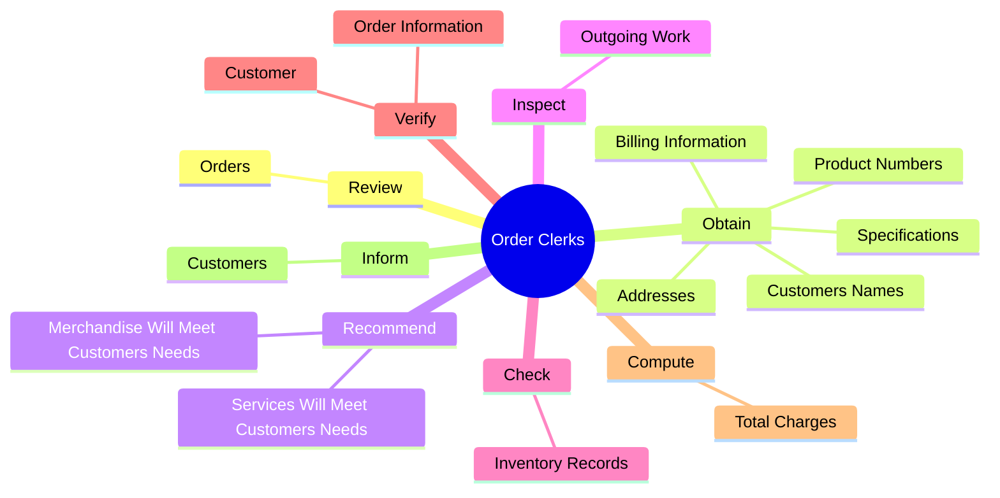
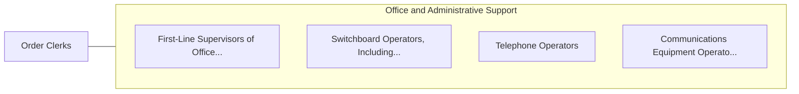

# Order Clerks

> Receive and process incoming orders for materials, merchandise, classified ads, or services such as repairs, installations, or rental of facilities. Generally receives orders via mail, phone, fax, or other electronic means. Duties include informing customers of receipt, prices, shipping dates, and delays; preparing contracts; and handling complaints.

## Overview

Order Clerks is an occupation within the Office and Administrative Support category. Receive and process incoming orders for materials, merchandise, classified ads, or services such as repairs, installations, or rental of facilities. Generally receives orders via mail, phone, fax, or other electronic means.

## Classification Hierarchy

## Key Statistics

| Metric | Value |
|--------|-------|
| SOC Code | 43-4151.00 |
| Category | [Office and Administrative Support](/occupations/Administrative) |
| Task Count | 58 |
| Source | O*NET |

## Core Tasks

### review.Orders

Order Clerks review orders as part of their core responsibilities.

**Actions:**
- `review.Orders.for.CompletenessAccordingToReportingProcedures`
- `review.Orders.for.ForwardIncompleteOrders.for.FurtherProcessing`

### obtain.CustomersNames

Order Clerks obtain customers names as part of their core responsibilities.

**Actions:**
- `obtain.CustomersNames.of.ItemsToBePurchased`
- `obtain.CustomersNames.of.EnterInformation.on.OrderForms`
- `obtain.Addresses.of.ItemsToBePurchased`
- `obtain.Addresses.of.EnterInformation.on.OrderForms`

### recommend.MerchandiseWillMeetCustomersNeeds

Order Clerks recommend merchandise will meet customers needs as part of their core responsibilities.

**Actions:**
- `recommend.MerchandiseWillMeetCustomersNeeds`
- `recommend.ServicesWillMeetCustomersNeeds`

## Skills & Competencies

### Technical Skills
- **Office Management** - Advanced
- **Data Entry** - Advanced
- **Records Management** - Advanced

### Soft Skills
- **Communication** - Essential
- **Problem Solving** - Essential
- **Critical Thinking** - Important
- **Teamwork** - Important
- **Adaptability** - Important

## Related Occupations

## Industries

This occupation is found across multiple industries. See [Industries](/industries) for sector-specific employment data.

## Career Progression

---

*Source: O*NET 43-4151.00 - ONETOccupation*
