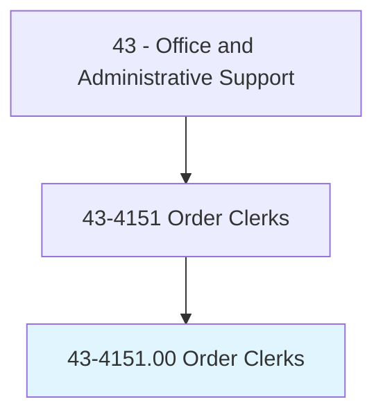
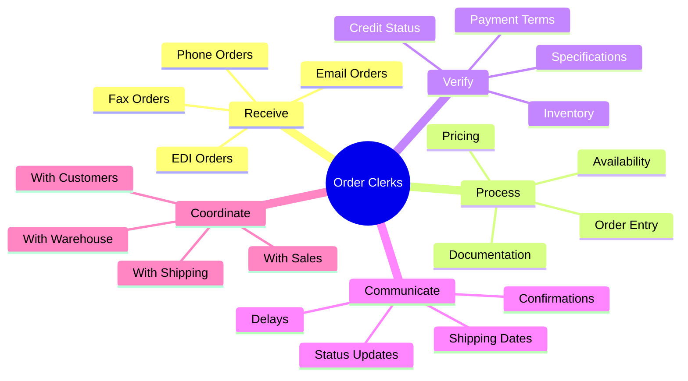
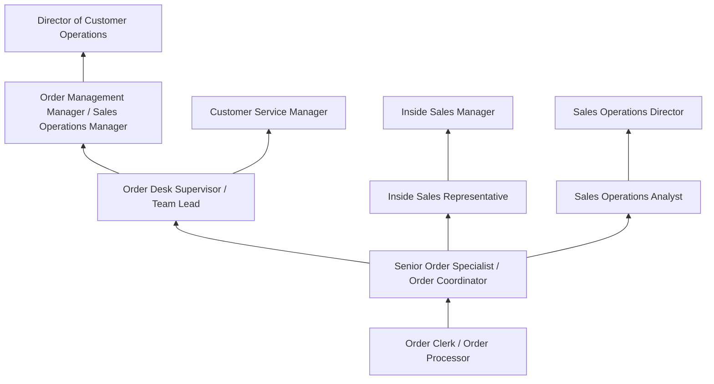
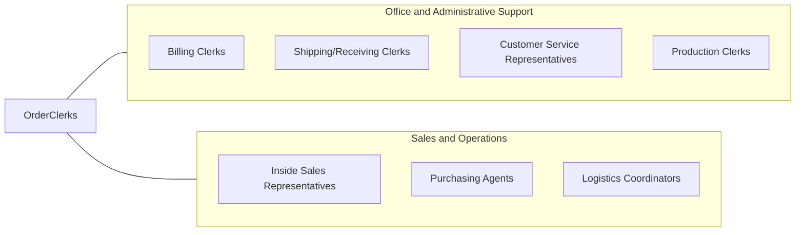

# Order Clerks

> Receive and process incoming orders for materials, merchandise, classified ads, or services such as repairs, installations, or rental of facilities. Generally receive orders via mail, phone, fax, or other electronic means. Duties include informing customers of receipt, prices, shipping dates, and delays; and preparing contracts or order forms.

## Overview

Order Clerks receive, process, and track orders for goods and services from customers, sales representatives, and internal departments, serving as the administrative backbone of the order-to-cash cycle. They enter order details into processing systems, verify pricing and availability, coordinate with warehouses and suppliers, confirm shipping dates, communicate order status to customers, and ensure that every transaction is accurately documented and fulfilled according to customer specifications.

Working in wholesale distribution, manufacturing, retail, e-commerce, media, and service organizations, order clerks manage the critical interface between customer requests and fulfillment operations. They review incoming orders for completeness and accuracy, verify customer credit status and payment terms, apply appropriate discounts and special pricing, process change orders and cancellations, resolve discrepancies with customers and internal teams, and escalate complex issues requiring management attention. Many order clerks develop deep product knowledge and customer relationships, becoming trusted points of contact for repeat buyers.

As e-commerce platforms and automated ordering systems have expanded, the role has evolved from high-volume manual order entry toward exception handling, complex order management, customer communication, and situations requiring human judgment and problem-solving skills. Order clerks increasingly manage orders that cross multiple channels, require customization, involve complex shipping requirements, or present credit and payment issues that automated systems cannot resolve. The role remains essential for B2B commerce, custom manufacturing, and any business where personalized order handling creates competitive advantage.

## Classification Hierarchy



## Key Statistics

| Metric | Value |
|--------|-------|
| SOC Code | 43-4151.00 |
| Job Zone | 2 (Some Preparation) |
| Category | [Office and Administrative Support](/occupations/Administrative/index) |
| Median Annual Salary | $37,100 |
| Salary Range | $27,000 - $52,000 |
| 10th Percentile | $27,500 |
| 90th Percentile | $51,800 |
| Employment | ~55,000 |
| Projected Growth | -10% (declining) |
| Annual Openings | ~7,000 |
| Core Tasks | 30 |
| Source | O*NET |

## Core Tasks



### receive.CustomerOrders

Order Clerks receive and capture customer order information.

**Actions:**
- `receive.Orders.from.Customers`
- `enter.OrderDetails.into.Systems`
- `verify.Pricing.against.Catalogs`
- `confirm.Receipt.to.Customers`

### process.OrderFulfillment

Order Clerks process orders through fulfillment workflows.

**Actions:**
- `process.Orders.through.ERP`
- `coordinate.Shipments.with.Warehouse`
- `track.Deliveries.for.Customers`
- `resolve.Issues.with.Orders`

## Skills & Competencies

### Technical Skills
- **Order Management Systems (OMS)** - Expert (order entry, tracking, reporting)
- **ERP Systems (SAP, Oracle, NetSuite)** - Advanced (order processing modules)
- **Inventory Lookup and Availability** - Advanced (real-time stock checking)
- **Pricing and Discount Structures** - Advanced (price books, contract pricing)
- **Data Entry** - Expert (speed and accuracy)
- **EDI Processing** - Advanced (electronic data interchange)
- **Microsoft Excel** - Advanced (order tracking, reporting)
- **CRM Systems** - Intermediate (customer history, notes)

### Soft Skills
- **Accuracy** - Critical (zero tolerance for order errors)
- **Customer Service** - Essential (professional communication)
- **Communication** - Essential (clear verbal and written)
- **Problem Solving** - Essential (resolving order issues)
- **Organizational Skills** - Critical (managing multiple orders)
- **Attention to Detail** - Critical (specifications, quantities)
- **Patience** - Important (handling difficult situations)
- **Time Management** - Essential (meeting order deadlines)

## Education & Certifications

| Requirement | Details |
|-------------|---------|
| Typical Education | High school diploma |
| Preferred Education | Associate's degree in business or supply chain |
| ERP System Training | SAP, Oracle, NetSuite, Microsoft Dynamics |
| Customer Service Training | Company-specific programs |
| Industry Knowledge | Product-specific familiarity |
| APICS Fundamentals | Supply chain basics |
| EDI Certification | B2B electronic commerce |
| Continuing Education | Product updates, system training |

## Career Progression



### Career Pathway Details

| Level | Title | Years Experience | Key Responsibilities |
|-------|-------|------------------|----------------------|
| Entry | Order Clerk / Order Processor | 0-1 years | Basic order entry, confirmations, standard procedures |
| Mid | Senior Order Specialist | 1-3 years | Complex orders, customer relationships, exception handling |
| Lead | Order Desk Supervisor | 3-5 years | Team coordination, quality review, escalation handling |
| Management | Order Management Manager | 5-10 years | Department leadership, process improvement, system optimization |
| Director | Director of Customer Operations | 10+ years | Strategic planning, technology decisions, cross-functional leadership |

### Transition Paths

| Path | Skills Applied | Additional Requirements |
|------|---------------|-------------------------|
| Inside Sales | Customer relationships, product knowledge | Sales training, quota management |
| Sales Operations | Systems, data, processes | Analytics skills, reporting |
| Customer Service Management | Communication, problem-solving | Leadership, team management |
| Supply Chain Coordinator | Logistics, coordination | Supply chain knowledge |

## Industry Variations

| Setting | Focus | Unique Aspects |
|---------|-------|----------------|
| Wholesale Distribution | B2B ordering | Volume discounts; credit terms; delivery scheduling; route planning |
| Manufacturing | Production orders | Lead times; custom specifications; blanket orders; BOM verification |
| Retail / E-Commerce | Consumer orders | Returns processing; real-time inventory; shipping options; omnichannel |
| Media / Publishing | Classified ads, subscriptions | Publication deadlines; ad specifications; renewal processing; insertion orders |
| Industrial Supply | MRO and technical products | Technical specifications; safety data sheets; vendor coordination |
| Food Service | Restaurant and institutional | Temperature requirements; delivery windows; perishable handling |

### Wholesale Distribution Order Processing

Wholesale order clerks handle B2B transactions with established customers, managing credit terms, volume discounts, minimum order requirements, and delivery scheduling. They work with sales representatives to process quotes and convert them to orders, coordinate with transportation for delivery routing, and manage back-orders and partial shipments. Product knowledge is essential for suggesting alternatives when items are unavailable.

### Manufacturing Order Processing

Manufacturing order clerks process both customer orders and internal production orders, coordinating custom specifications, lead times, and engineering requirements. They work with production planning to schedule manufacturing, manage blanket purchase orders with scheduled releases, and track orders through production to shipment. Understanding of bills of materials and manufacturing processes is valuable.

### E-Commerce Order Management

E-commerce order clerks handle high volumes of consumer orders across multiple channels, processing returns and exchanges, managing inventory across fulfillment centers, and resolving shipping issues. They work with automated systems that handle routine orders while focusing on exceptions, customer escalations, and orders requiring special handling.

### Media and Publishing Order Processing

Media order clerks process classified advertising, subscription orders, and insertion orders for print and digital publications. They work with publication deadlines, ad specifications, and complex pricing including frequency discounts and package deals. Renewal processing and subscriber retention add ongoing relationship management responsibilities.

## Technology & Tools

### Order Management Systems
- **SAP SD (Sales and Distribution)** - Enterprise order management
- **Oracle Order Management** - Cloud-based OMS
- **NetSuite** - Mid-market ERP and order management
- **Microsoft Dynamics 365** - Business applications
- **Salesforce Order Management** - CRM-integrated ordering

### E-Commerce Platforms
- **Shopify** - E-commerce order processing
- **Magento/Adobe Commerce** - Enterprise e-commerce
- **BigCommerce** - Multi-channel commerce
- **EDI Systems** - B2B electronic ordering
- **Customer Portals** - Self-service ordering

### Communication and Coordination
- **Email and Phone Systems** - Customer communication
- **CRM Systems** - Customer relationship management
- **Collaboration Tools** - Teams, Slack, internal messaging
- **Document Management** - Order documentation

### Inventory and Shipping
- **WMS Integration** - Warehouse availability
- **TMS Integration** - Shipping coordination
- **Carrier Systems** - FedEx, UPS, USPS
- **Tracking Systems** - Shipment visibility

## Related Occupations



### Related Occupation Comparison

| Occupation | Similarity | Key Difference |
|------------|------------|----------------|
| Customer Service Representatives | High | Broader service vs order focus |
| Billing Clerks | High | Invoicing vs order entry |
| Inside Sales Representatives | Medium | Revenue generation vs processing |
| Shipping Clerks | Medium | Fulfillment vs order capture |

## Industries

- [Wholesale Trade](/industries/Wholesale) - High Employment
- [Manufacturing](/industries/Manufacturing/index) - High Employment
- [Retail Trade](/industries/Retail) - High Employment
- [Information/Media](/industries/Information) - Moderate Employment
- [Professional Services](/industries/ProfessionalServices) - Moderate Employment
- [Transportation/Logistics](/industries/Transportation) - Moderate Employment

## Departments

This occupation typically works in:
- Order Management - Primary order processing
- Sales Operations - Sales support and coordination
- Customer Service - Order inquiries and support
- [Supply Chain](/departments/SupplyChain) - Fulfillment coordination
- [Finance](/departments/Finance) - Credit and billing support
- Inside Sales - Order-related sales activities

## Work Environment

### Physical Setting
- Office environment with computer workstation
- Phone and headset for customer communication
- Multi-monitor setup for system access
- Open floor plan or cubicle setting
- Some positions offer remote work

### Work Schedule
- Standard Monday-Friday business hours
- Extended hours during peak seasons
- Some positions require evening/weekend coverage
- Deadline pressure around shipping cutoffs
- Month-end and quarter-end volume spikes

### Work Characteristics
- High volume of transactions daily
- Constant phone and email communication
- Multi-tasking between orders and inquiries
- Deadline-driven with shipping cutoffs
- Team collaboration with sales and warehouse

### Performance Metrics

| Metric | Description | Typical Standard |
|--------|-------------|------------------|
| Order Accuracy | Error-free order entry | >99% |
| Processing Time | Order entry to release | Same day or next day |
| Customer Communication | Response to inquiries | Within 4 hours |
| Backorder Resolution | Open order follow-up | Weekly review |
| Customer Satisfaction | Survey scores | >90% positive |

## GraphDL Semantic Structure

```graphdl
Order Clerks perform:
- receive.Orders.from.Customers
- enter.OrderDetails.into.Systems
- verify.Pricing.against.Catalogs
- check.Availability.in.Inventory
- confirm.Orders.to.Customers
- coordinate.Shipments.with.Warehouse
- resolve.Issues.for.CustomerSatisfaction
- track.Deliveries.through.Completion
```

---

*Source: O*NET 43-4151.00 - ONETOccupation*
