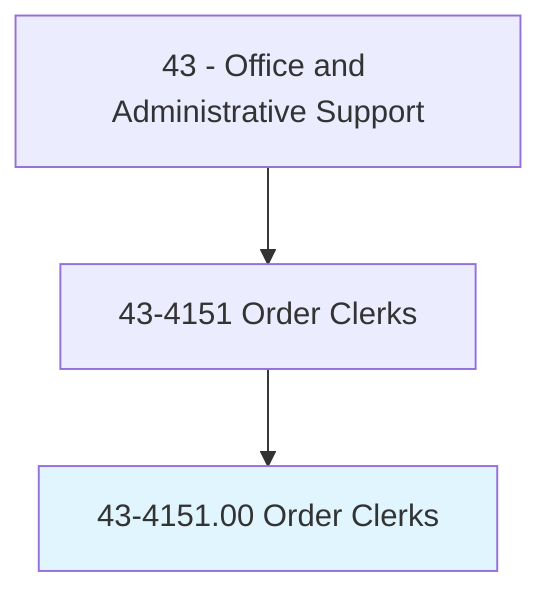
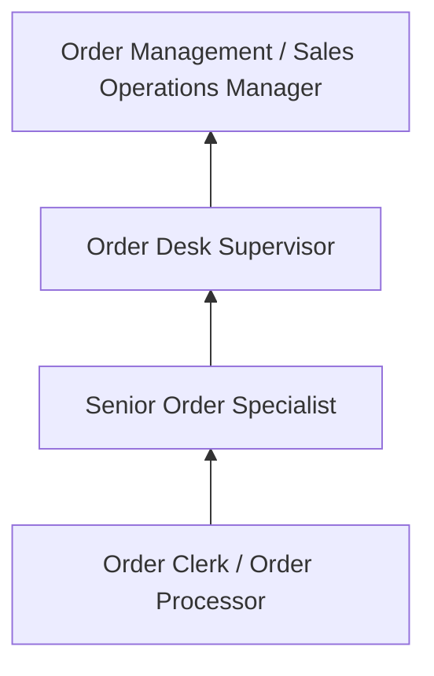
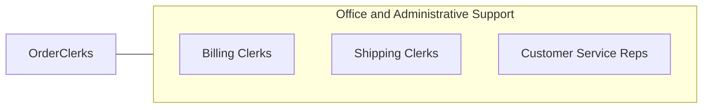

# Order Clerks

> Receive and process incoming orders for materials, merchandise, classified ads, or services such as repairs, installations, or rental of facilities. Generally receive orders via mail, phone, fax, or other electronic means. Duties include informing customers of receipt, prices, shipping dates, and delays; and preparing contracts or order forms.

## Overview

Order Clerks receive, process, and track orders for goods and services from customers, sales representatives, and internal departments. They enter order details into processing systems, verify pricing and availability, coordinate with warehouses and suppliers, confirm shipping dates, and communicate order status to customers. The role ensures accurate and timely fulfillment of customer purchases.

Working in wholesale distribution, manufacturing, retail, and service organizations, order clerks manage the administrative side of the order-to-cash cycle. They review incoming orders for completeness, check customer credit status, apply discounts or special pricing, process change orders and cancellations, and resolve order discrepancies with customers and fulfillment teams.

As e-commerce and automated ordering systems have expanded, the role has shifted from manual order entry toward exception handling, customer communication, and complex order management that requires human judgment and problem-solving skills.

## Classification Hierarchy

## Key Statistics

| Metric | Value |
|--------|-------|
| SOC Code | 43-4151.00 |
| Job Zone | 2 (Some Preparation) |
| Category | [Office and Administrative Support](/occupations/Administrative/index) |
| Median Annual Salary | $37,100 |
| Employment | ~55,000 |
| Projected Growth | -10% (declining) |
| Core Tasks | 30 |
| Source | O*NET |

## Core Tasks

Core task data with GraphDL semantic actions for this occupation is maintained in the data pipeline. See [O*NET 43-4151.00](https://www.onetonline.org/link/summary/43-4151.00) for detailed task information.

## Skills & Competencies

### Technical Skills
- **Order Management Systems** - Advanced
- **ERP Systems (SAP, Oracle)** - Intermediate
- **Inventory Lookup** - Advanced
- **Pricing and Discount Structures** - Advanced
- **Data Entry** - Advanced

### Soft Skills
- **Accuracy** - Critical
- **Customer Service** - Essential
- **Communication** - Essential
- **Problem Solving** - Essential
- **Organizational Skills** - Critical

## Education & Certifications

| Requirement | Details |
|-------------|---------|
| Typical Education | High school diploma |
| ERP System Training | SAP, Oracle, NetSuite |
| Customer Service Training | Company-specific |
| Industry Knowledge | Product-specific familiarity |

## Career Progression

## Industry Variations

| Setting | Focus | Unique Aspects |
|---------|-------|----------------|
| Wholesale Distribution | B2B ordering | Volume discounts; credit terms; delivery scheduling |
| Manufacturing | Production orders | Lead times; custom specifications; blanket orders |
| Retail / E-Commerce | Consumer orders | Returns processing; real-time inventory; shipping options |
| Media | Classified ads, subscriptions | Publication deadlines; ad specifications; renewal processing |

## Technology & Tools

- **ERP** - SAP, Oracle, NetSuite, Microsoft Dynamics
- **Order Management** - Shopify, Magento, EDI systems
- **Communication** - Phone, email, customer portals
- **Inventory** - WMS integration, availability lookups

## Related Occupations

## Departments

This occupation typically works in:
- Order Management - Order processing
- Sales Operations - Sales support
- Customer Service - Order inquiries
- [Supply Chain](/departments/SupplyChain) - Fulfillment coordination

---

*Source: O*NET 43-4151.00 - ONETOccupation*
