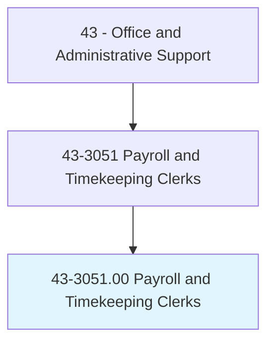
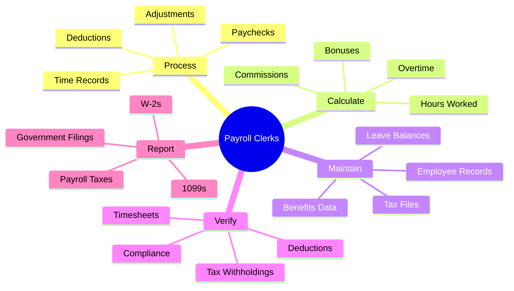
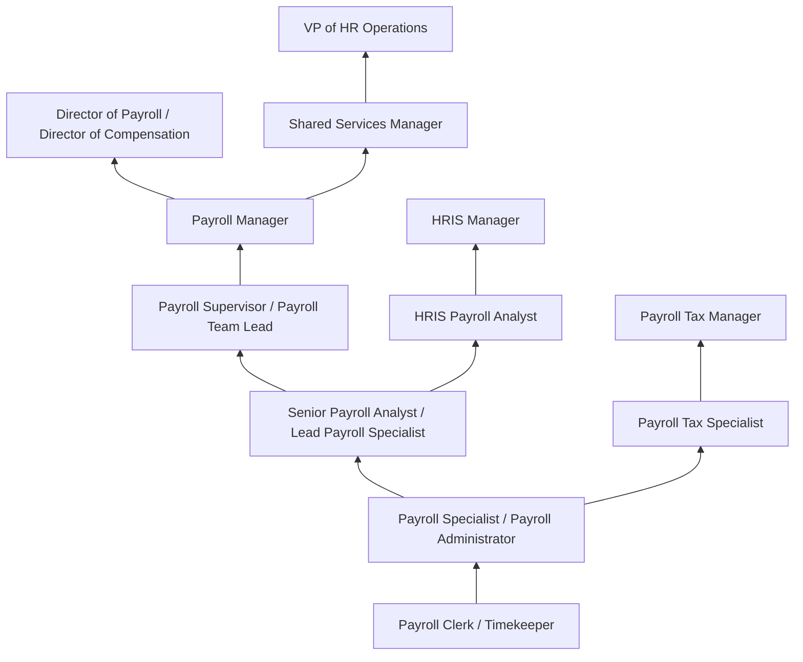
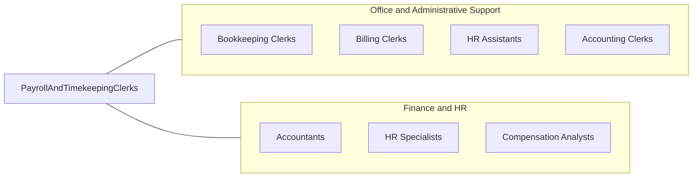

# Payroll and Timekeeping Clerks

> Compile and record employee time and payroll data. May compute employees' time worked, production, and commission. May compute and post wages and deductions, or prepare paychecks.

## Overview

Payroll and Timekeeping Clerks compile, verify, and process employee time records and payroll data, ensuring that every worker receives accurate compensation on schedule. They review timesheets, attendance records, and leave requests, calculate regular hours and overtime, process new hire paperwork, compute deductions for taxes, benefits, garnishments, and retirement contributions, and generate paychecks or initiate direct deposit transmissions. Their work directly impacts employee satisfaction and organizational compliance with complex federal, state, and local wage regulations.

Working in payroll departments, human resources offices, and accounting teams across all industries, these clerks manage the recurring cycle of payroll processing that ranges from weekly to monthly depending on the organization. They maintain employee payroll records throughout employment, respond to employee questions about pay calculations, deductions, and tax withholdings, prepare W-2s and other year-end tax documents, and ensure compliance with the Fair Labor Standards Act (FLSA), state wage and hour laws, and tax withholding requirements. Many also handle benefits deductions, garnishment orders, and union dues calculations.

The role requires thorough knowledge of payroll regulations, tax requirements, benefits administration, and payroll software systems. While automation has streamlined calculations and reduced manual errors, clerks remain essential for data verification, exception handling, system administration, regulatory compliance, employee support, and the human judgment needed to interpret complex pay scenarios. Multi-state employers require clerks who understand varying tax jurisdictions, while union environments add collective bargaining agreement complexity to compensation calculations.

## Classification Hierarchy



## Key Statistics

| Metric | Value |
|--------|-------|
| SOC Code | 43-3051.00 |
| Job Zone | 3 (Medium Preparation) |
| Category | [Office and Administrative Support](/occupations/Administrative/index) |
| Median Annual Salary | $49,000 |
| Salary Range | $35,000 - $70,000 |
| 10th Percentile | $35,500 |
| 90th Percentile | $69,800 |
| Employment | ~150,000 |
| Projected Growth | -7% (declining) |
| Annual Openings | ~18,000 |
| Core Tasks | 35 |
| Source | O*NET |

## Core Tasks



### process.PayrollData

Payroll Clerks process employee compensation data.

**Actions:**
- `process.Timesheets.for.PayCalculation`
- `compute.Wages.from.HoursWorked`
- `calculate.Deductions.for.Benefits`
- `generate.Paychecks.for.Distribution`

### maintain.PayrollRecords

Payroll Clerks maintain accurate payroll records.

**Actions:**
- `maintain.Records.for.Employees`
- `update.Files.with.StatusChanges`
- `archive.Documents.per.RetentionRequirements`
- `prepare.Reports.for.Management`

## Skills & Competencies

### Technical Skills
- **Payroll Software (ADP, Paychex, Workday)** - Expert (full-cycle processing, reporting)
- **Tax Withholding Calculations** - Expert (federal, state, local taxes)
- **Timekeeping Systems** - Expert (Kronos, TSheets, time clock management)
- **Benefits Deduction Processing** - Advanced (health, retirement, voluntary)
- **Wage and Hour Law** - Advanced (FLSA, state regulations)
- **Garnishment Processing** - Advanced (child support, tax levies, creditors)
- **Microsoft Excel** - Advanced (formulas, pivot tables, reporting)
- **HRIS Navigation** - Advanced (employee data, reporting)

### Soft Skills
- **Accuracy** - Critical (zero tolerance for pay errors)
- **Confidentiality** - Critical (protecting sensitive compensation data)
- **Attention to Detail** - Critical (calculations, compliance)
- **Deadline Management** - Critical (payroll cycles are non-negotiable)
- **Communication** - Essential (explaining pay to employees)
- **Problem Solving** - Essential (resolving discrepancies)
- **Organizational Skills** - Essential (managing multiple deadlines)
- **Integrity** - Critical (handling financial data ethically)

## Education & Certifications

| Requirement | Details |
|-------------|---------|
| Typical Education | High school diploma; associate's preferred |
| Preferred Education | Associate's or bachelor's in accounting or business |
| FPC (Fundamental Payroll Certification) | APA entry-level credential |
| CPP (Certified Payroll Professional) | APA advanced credential |
| Payroll Software Certification | ADP, Paychex, Workday, UKG certifications |
| Continuing Education | APA conferences, webinars, compliance updates |
| Background Check | Required due to financial data access |
| State-Specific Training | Multi-state payroll requirements |

## Career Progression



### Career Pathway Details

| Level | Title | Years Experience | Key Responsibilities |
|-------|-------|------------------|----------------------|
| Entry | Payroll Clerk / Timekeeper | 0-2 years | Time entry, basic processing, employee inquiries |
| Mid | Payroll Specialist | 2-4 years | Full-cycle payroll, tax filings, benefits processing |
| Senior | Senior Payroll Analyst | 4-7 years | Complex calculations, multi-state, system administration |
| Supervisory | Payroll Supervisor | 7-10 years | Team oversight, process improvement, compliance |
| Management | Payroll Manager | 10-15 years | Department leadership, vendor management, strategic planning |
| Director | Director of Payroll | 15+ years | Enterprise payroll strategy, M&A integration, executive reporting |

### Specialization Paths

| Specialization | Focus Area | Additional Skills Needed |
|----------------|------------|-----------------------------|
| Payroll Tax | Tax compliance and filing | Tax law expertise, multi-jurisdiction knowledge |
| HRIS/Payroll Systems | Technology and integration | Technical skills, project management |
| International Payroll | Global compensation | Country-specific regulations, currency management |
| Executive Compensation | Stock options, deferred comp | Securities knowledge, confidentiality |

## Industry Variations

| Setting | Focus | Unique Aspects |
|---------|-------|----------------|
| Large Corporations | Multi-state, global payroll | Complex tax jurisdictions; union payroll; international compliance; shared services |
| Small Business | Full-cycle responsibility | All-in-one duties; outsourcing coordination; owner relationships |
| Government | Public sector pay | Civil service pay scales; pension calculations; collective bargaining; transparency |
| Payroll Service Bureaus | Multi-client processing | Multiple clients; diverse industries; deadline intensity; service level focus |
| Healthcare | Complex shift differentials | 24/7 operations; overtime complexities; credential-based pay; union contracts |
| Manufacturing | Production-based pay | Piece rates; shift premiums; union contracts; overtime tracking |

### Large Corporation Payroll

Large corporations process payroll for thousands of employees across multiple states and countries. Payroll clerks specialize in areas like tax compliance, benefits processing, or specific business units. Multi-state taxation requires understanding of reciprocity agreements, resident vs. non-resident withholding, and local taxes in jurisdictions like New York City and Philadelphia.

### Small Business Payroll

Small business payroll clerks often handle entire payroll functions solo, from timesheet collection through check distribution. They may coordinate with external payroll providers (ADP, Paychex) while maintaining internal records. Close working relationships with owners and employees require excellent communication and problem-solving skills.

### Government Payroll

Government payroll involves civil service pay scales, step increases, longevity pay, and complex pension calculations. Union contracts specify pay rates, overtime rules, and premium pay. Public sector transparency requirements mean payroll data may be subject to public records requests.

### Payroll Service Bureaus

Payroll service provider employees manage payroll for multiple clients across diverse industries. They must quickly adapt to different pay rules, software configurations, and client requirements. Service level agreements create strict accuracy and timeliness standards.

## Technology & Tools

### Payroll Platforms
- **ADP Workforce Now** - Comprehensive payroll and HR
- **Paychex Flex** - Small to mid-market payroll
- **Workday Payroll** - Cloud enterprise HCM
- **UKG Pro (Kronos)** - Workforce and payroll management
- **Ceridian Dayforce** - Continuous payroll calculation

### Timekeeping Systems
- **UKG Dimensions** - Enterprise time and attendance
- **TSheets (QuickBooks Time)** - Mobile time tracking
- **ADP Time & Attendance** - Integrated timekeeping
- **Replicon** - Professional services time tracking
- **Physical Time Clocks** - Biometric, badge readers

### Tax and Compliance
- **ADP SmartCompliance** - Tax filing and payment
- **Symmetry Tax Engine** - Withholding calculations
- **State Tax Systems** - Individual state portals
- **IRS EFTPS** - Federal tax deposits
- **Year-End Processing** - W-2, 1099 generation

### Reporting and Analytics
- **Microsoft Excel** - Custom reporting, analysis
- **Power BI** - Payroll dashboards
- **HRIS Reporting** - Standard and ad hoc reports
- **Audit Tools** - Pre-transmission verification

## Related Occupations



### Related Occupation Comparison

| Occupation | Similarity | Key Difference |
|------------|------------|----------------|
| Bookkeeping Clerks | High | General ledger vs payroll specialty |
| HR Assistants | Medium | Broader HR vs payroll focus |
| Accountants | Medium | Professional-level vs clerical responsibilities |
| Compensation Analysts | Medium | Strategy/design vs processing focus |

## Industries

- [Professional Services](/industries/ProfessionalServices) - High Employment
- [Healthcare](/industries/Healthcare/index) - High Employment
- [Manufacturing](/industries/Manufacturing/index) - High Employment
- [Government](/industries/PublicAdministration) - High Employment
- [Financial Services](/industries/Finance) - Moderate Employment
- [Retail](/industries/Retail) - Moderate Employment
- [Education](/industries/Education) - Moderate Employment

## Departments

This occupation typically works in:
- Payroll - Primary payroll processing department
- [Human Resources](/departments/HR) - Employee administration and support
- [Finance/Accounting](/departments/Finance) - Tax compliance and reporting
- Shared Services - Centralized corporate services
- Administration - General office operations

## Work Environment

### Physical Setting
- Office environment within HR, payroll, or finance department
- Desk-based work with computer and phone
- Secure access for confidential records
- Some positions offer remote work
- Shared services centers for large organizations

### Work Schedule
- Standard Monday-Friday business hours
- Critical deadlines around pay dates (non-negotiable)
- Extended hours during pay periods and year-end
- Quarterly tax filing deadlines
- Year-end W-2 and 1099 processing (January-February crunch)

### Work Characteristics
- Cyclical workload following pay schedules
- High accuracy requirements with financial impact
- Deadline-driven with no flexibility on pay dates
- Confidential data handling throughout
- Employee interaction for pay questions and issues

### Compliance Requirements
- FLSA minimum wage and overtime
- Federal, state, and local tax withholding
- New hire reporting requirements
- Garnishment and levy processing
- Year-end tax document preparation

## Regulatory Framework

### Key Payroll Laws

| Law/Regulation | Focus | Clerk Responsibility |
|----------------|-------|---------------------|
| Fair Labor Standards Act (FLSA) | Minimum wage, overtime | Correct classification, overtime calculation |
| Federal Insurance Contributions Act (FICA) | Social Security/Medicare | Accurate withholding, employer match |
| Federal Unemployment Tax Act (FUTA) | Unemployment insurance | Quarterly filings, annual reconciliation |
| State Unemployment Insurance (SUI) | State unemployment | Multi-state compliance, rate management |
| Garnishment Laws | Wage attachments | Priority ordering, limit calculations |

### Tax Filing Calendar

| Period | Filing | Deadline |
|--------|--------|----------|
| Per Payroll | Federal Tax Deposit | Within 1-3 business days |
| Quarterly | Form 941 | End of month following quarter |
| Quarterly | State Unemployment | State-specific deadlines |
| Annual | W-2 Distribution | January 31 |
| Annual | W-2 Filing | January 31 (electronic) |

## GraphDL Semantic Structure

```graphdl
Payroll and Timekeeping Clerks perform:
- process.Payroll.for.Employees
- calculate.Wages.from.TimeRecords
- compute.Deductions.for.TaxesAndBenefits
- verify.Timesheets.for.Accuracy
- maintain.Records.per.Regulations
- prepare.TaxFilings.for.Government
- respond.To.EmployeeInquiries
- ensure.Compliance.with.WageLaws
```

---

*Source: O*NET 43-3051.00 - ONETOccupation*
