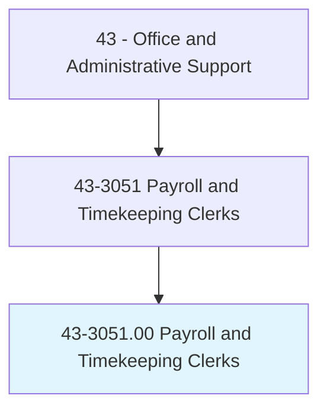
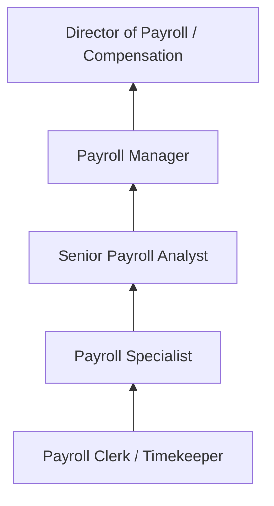
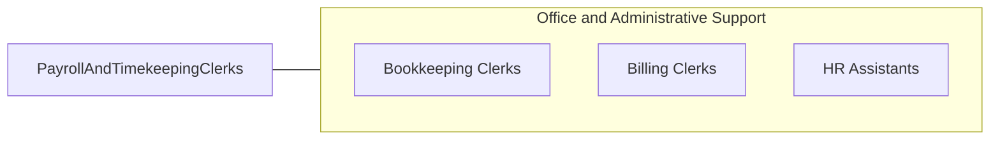

# Payroll and Timekeeping Clerks

> Compile and record employee time and payroll data. May compute employees' time worked, production, and commission. May compute and post wages and deductions, or prepare paychecks.

## Overview

Payroll and Timekeeping Clerks compile, verify, and process employee time records and payroll data. They review timesheets and attendance records, calculate hours worked including overtime, process new hire paperwork, compute deductions for taxes, benefits, garnishments, and retirement contributions, and generate paychecks or direct deposit transmissions. Accuracy is critical since errors directly affect employee compensation and regulatory compliance.

Working in payroll departments, HR offices, and accounting teams across all industries, these clerks manage the recurring cycle of payroll processing. They maintain employee payroll records, respond to employee questions about pay, deductions, and tax withholdings, prepare W-2s and other tax documents, and ensure compliance with federal, state, and local wage and hour laws.

The role requires knowledge of payroll regulations, tax requirements, benefits administration, and payroll software systems. While automation has streamlined calculations, clerks remain essential for data verification, exception handling, regulatory compliance, and employee support.

## Classification Hierarchy

## Key Statistics

| Metric | Value |
|--------|-------|
| SOC Code | 43-3051.00 |
| Job Zone | 3 (Medium Preparation) |
| Category | [Office and Administrative Support](/occupations/Administrative/index) |
| Median Annual Salary | $49,000 |
| Employment | ~150,000 |
| Projected Growth | -7% (declining) |
| Core Tasks | 35 |
| Source | O*NET |

## Core Tasks

Core task data with GraphDL semantic actions for this occupation is maintained in the data pipeline. See [O*NET 43-3051.00](https://www.onetonline.org/link/summary/43-3051.00) for detailed task information.

## Skills & Competencies

### Technical Skills
- **Payroll Software (ADP, Paychex, Workday)** - Advanced
- **Tax Withholding Calculations** - Advanced
- **Timekeeping Systems** - Advanced
- **Benefits Deduction Processing** - Advanced
- **Wage and Hour Law** - Intermediate

### Soft Skills
- **Accuracy** - Critical
- **Confidentiality** - Critical
- **Attention to Detail** - Critical
- **Deadline Management** - Critical
- **Communication** - Essential

## Education & Certifications

| Requirement | Details |
|-------------|---------|
| Typical Education | High school diploma; associate's preferred |
| FPC (Fundamental Payroll Certification) | APA credential |
| CPP (Certified Payroll Professional) | APA advanced credential |
| Payroll Software Certification | ADP, Paychex, Workday |

## Career Progression

## Industry Variations

| Setting | Focus | Unique Aspects |
|---------|-------|----------------|
| Large Corporations | Multi-state payroll | Complex tax jurisdictions; union payroll; international payroll |
| Small Business | Full-cycle payroll | All-in-one responsibility; outsourcing coordination |
| Government | Public sector pay | Civil service pay scales; pension calculations; collective bargaining |
| Payroll Service Bureaus | Client payroll | Multiple clients; diverse industries; deadline intensity |

## Technology & Tools

- **Payroll** - ADP, Paychex, Workday, UKG, Ceridian
- **Timekeeping** - Kronos, TSheets, time clocks
- **HRIS** - Integrated HR and payroll platforms
- **Tax Filing** - Electronic tax deposit and filing systems

## Related Occupations

## Departments

This occupation typically works in:
- [Payroll](/departments/Payroll) - Payroll processing
- [Human Resources](/departments/HR) - Employee administration
- [Finance](/departments/Finance) - Accounting and tax compliance
- [Administration](/departments/Administration) - Office operations

---

*Source: O*NET 43-3051.00 - ONETOccupation*
