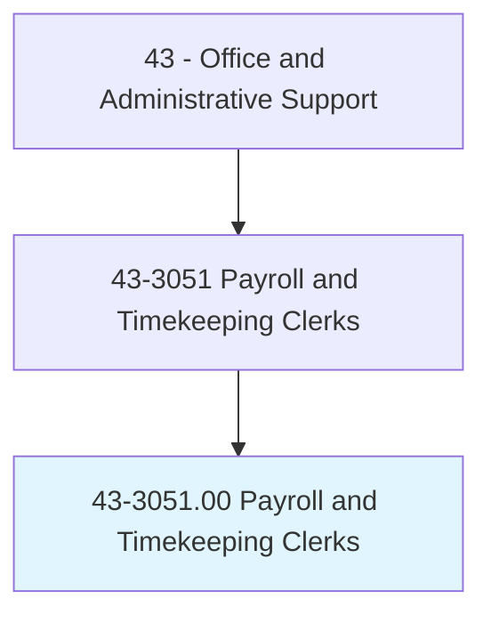
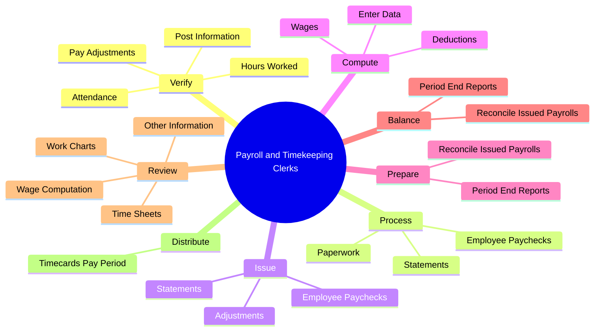
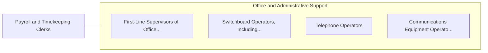

# Payroll and Timekeeping Clerks

> Compile and record employee time and payroll data. May compute employees' time worked, production, and commission. May compute and post wages and deductions, or prepare paychecks.

## Overview

Payroll and Timekeeping Clerks is an occupation within the Office and Administrative Support category. Compile and record employee time and payroll data. May compute employees' time worked, production, and commission.

## Classification Hierarchy

## Key Statistics

| Metric | Value |
|--------|-------|
| SOC Code | 43-3051.00 |
| Category | [Office and Administrative Support](/occupations/Administrative) |
| Task Count | 82 |
| Source | O*NET |

## Core Tasks

### verify.Attendance

Payroll and Timekeeping Clerks verify attendance as part of their core responsibilities.

**Actions:**
- `verify.Attendance`
- `verify.HoursWorked`
- `verify.PayAdjustments`
- `verify.PostInformation.onto.DesignatedRecords`

### process.EmployeePaychecks

Payroll and Timekeeping Clerks process employee paychecks as part of their core responsibilities.

**Actions:**
- `process.EmployeePaychecks.of.Earnings`
- `process.EmployeePaychecks.of.Deductions`
- `process.Statements.of.Earnings`
- `process.Statements.of.Deductions`

### issue.EmployeePaychecks

Payroll and Timekeeping Clerks issue employee paychecks as part of their core responsibilities.

**Actions:**
- `issue.EmployeePaychecks.of.Earnings`
- `issue.EmployeePaychecks.of.Deductions`
- `issue.Statements.of.Earnings`
- `issue.Statements.of.Deductions`

## Skills & Competencies

### Technical Skills
- **Office Management** - Advanced
- **Data Entry** - Advanced
- **Records Management** - Advanced

### Soft Skills
- **Communication** - Essential
- **Problem Solving** - Essential
- **Critical Thinking** - Important
- **Teamwork** - Important
- **Adaptability** - Important

## Related Occupations

## Industries

This occupation is found across multiple industries. See [Industries](/industries) for sector-specific employment data.

## Career Progression

---

*Source: O*NET 43-3051.00 - ONETOccupation*
