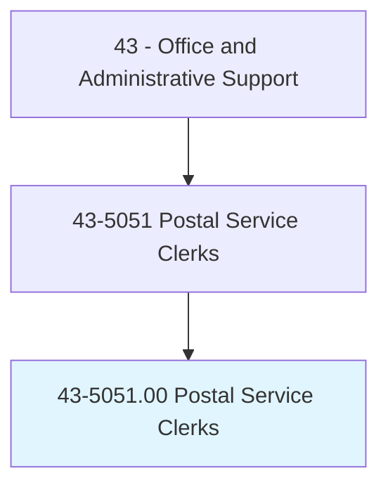
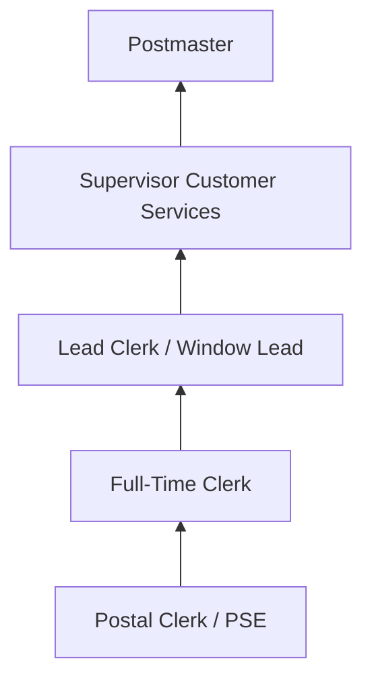
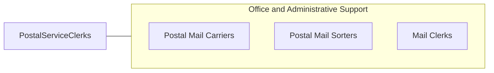

# Postal Service Clerks

> Perform any combination of tasks in a United States Postal Service (USPS) post office, such as receive letters and parcels; sell postage and revenue stamps, postal cards, and stamped envelopes; fill out and sell money orders; place mail in pigeon holes of mail rack or in bags; and examine mail for correct postage.

## Overview

Postal Service Clerks work in USPS post offices serving customers at retail windows and sorting mail in back-office operations. At the counter, they sell postage, process package shipments, issue money orders, handle registered and certified mail, answer customer questions about postal services, and process passport applications. In processing areas, they sort incoming and outgoing mail by destination.

These clerks are federal employees represented by the American Postal Workers Union (APWU), working in post offices ranging from small rural stations to large urban processing facilities. Their duties require knowledge of postal regulations, rate structures, mail classifications, shipping options, and customs requirements for international mail.

The role has evolved with declining mail volume and growing package volume driven by e-commerce. Clerks increasingly handle parcel services, compete with commercial shipping providers, and manage expanded retail services while maintaining the universal service mission of USPS.

## Classification Hierarchy

## Key Statistics

| Metric | Value |
|--------|-------|
| SOC Code | 43-5051.00 |
| Job Zone | 2 (Some Preparation) |
| Category | [Office and Administrative Support](/occupations/Administrative/index) |
| Median Annual Salary | $52,600 |
| Employment | ~75,000 |
| Projected Growth | -10% (declining) |
| Core Tasks | 30 |
| Source | O*NET |

## Core Tasks

Core task data with GraphDL semantic actions for this occupation is maintained in the data pipeline. See [O*NET 43-5051.00](https://www.onetonline.org/link/summary/43-5051.00) for detailed task information.

## Skills & Competencies

### Technical Skills
- **Postal Regulations and Rate Structures** - Expert
- **Mail Sorting and Processing** - Advanced
- **Point-of-Sale Systems** - Advanced
- **Package Handling and Shipping** - Advanced
- **Passport Processing** - Intermediate

### Soft Skills
- **Customer Service** - Critical
- **Accuracy** - Critical
- **Speed** - Essential
- **Communication** - Essential
- **Patience** - Essential

## Education & Certifications

| Requirement | Details |
|-------------|---------|
| Typical Education | High school diploma |
| Postal Exam (474) | Required for employment |
| USPS Training | On-the-job postal procedures |
| Background Check | Federal employment requirement |
| Safe Driving Record | Required for some positions |

## Career Progression

## Industry Variations

| Setting | Focus | Unique Aspects |
|---------|-------|----------------|
| Urban Post Offices | High-volume retail | Long lines; diverse services; passport processing |
| Suburban Offices | Full-service retail | Community relationships; PO boxes; package pickup |
| Rural Stations | Small office operations | Solo clerk; limited hours; multi-function role |
| Processing Facilities | Mail sorting | Automated equipment; shift work; volume focus |

## Technology & Tools

- **POS** - USPS retail point-of-sale systems
- **Sorting** - Automated sorting machines, barcode scanners
- **Tracking** - USPS tracking and scanning systems
- **Scales** - Digital postal scales

## Related Occupations

## Departments

This occupation typically works in:
- [Retail Window](/departments/PostalRetail) - Customer service counter
- [Mail Processing](/departments/MailProcessing) - Sorting operations
- [Administration](/departments/PostalAdmin) - Office management
- [Passport Services](/departments/PassportServices) - Passport acceptance

---

*Source: O*NET 43-5051.00 - ONETOccupation*
