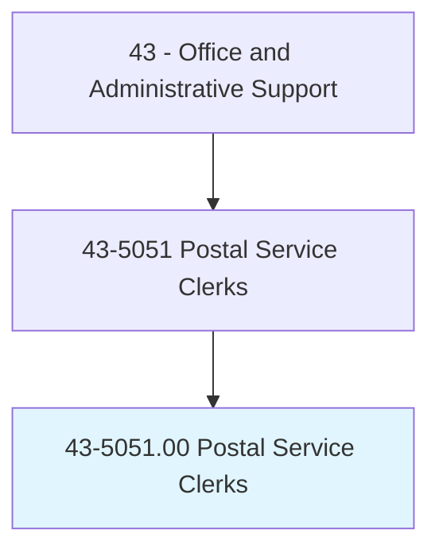
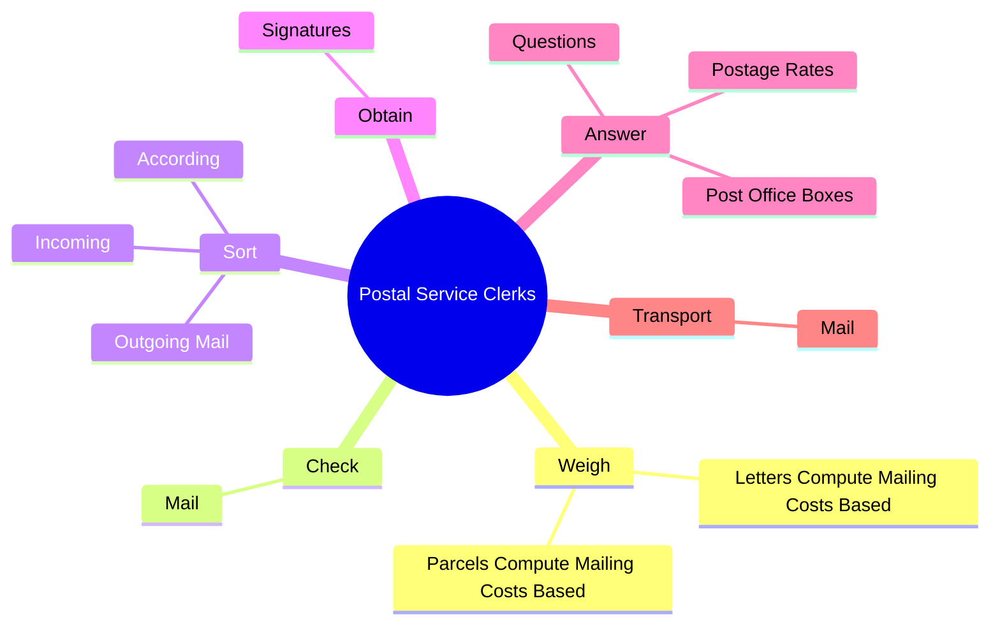
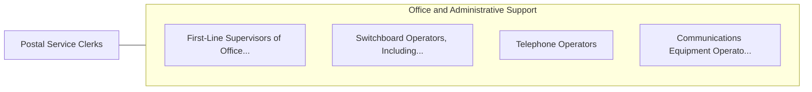

# Postal Service Clerks

> Perform any combination of tasks in a United States Postal Service (USPS) post office, such as receive letters and parcels; sell postage and revenue stamps, postal cards, and stamped envelopes; fill out and sell money orders; place mail in pigeon holes of mail rack or in bags; and examine mail for correct postage. Includes postal service clerks employed by USPS contractors.

## Overview

Postal Service Clerks is an occupation within the Office and Administrative Support category. Perform any combination of tasks in a United States Postal Service (USPS) post office, such as receive letters and parcels; sell postage and revenue stamps, postal cards, and stamped envelopes; fill out and sell money orders; place mail in pigeon holes of mail rack or in bags; and examine mail for correct postage. 

## Classification Hierarchy

## Key Statistics

| Metric | Value |
|--------|-------|
| SOC Code | 43-5051.00 |
| Category | [Office and Administrative Support](/occupations/Administrative) |
| Task Count | 78 |
| Source | O*NET |

## Core Tasks

### weigh.LettersComputeMailingCostsBased

Postal Service Clerks weigh letters compute mailing costs based as part of their core responsibilities.

**Actions:**
- `weigh.LettersComputeMailingCostsBased.on.Type`
- `weigh.LettersComputeMailingCostsBased.on.Weight`
- `weigh.LettersComputeMailingCostsBased.on.Destination`
- `weigh.LettersComputeMailingCostsBased.on.AffixCorrectPostage`

### check.Mail

Postal Service Clerks check mail as part of their core responsibilities.

**Actions:**
- `check.Mail.to.ensure.CorrectPostage`
- `check.Mail.to.packages.AreInProperConditionForMailing`
- `check.Mail.to.LettersAreInProperConditionForMailing`

### sort.Incoming

Postal Service Clerks sort incoming as part of their core responsibilities.

**Actions:**
- `sort.Incoming.to.type`
- `sort.Incoming.to.Destination`
- `sort.Incoming.to.ByH`
- `sort.Incoming.to.ByOperatingElectronicMailSorting`

## Skills & Competencies

### Technical Skills
- **Office Management** - Advanced
- **Data Entry** - Advanced
- **Records Management** - Advanced

### Soft Skills
- **Communication** - Essential
- **Problem Solving** - Essential
- **Critical Thinking** - Important
- **Teamwork** - Important
- **Adaptability** - Important

## Related Occupations

## Industries

This occupation is found across multiple industries. See [Industries](/industries) for sector-specific employment data.

## Career Progression

---

*Source: O*NET 43-5051.00 - ONETOccupation*
