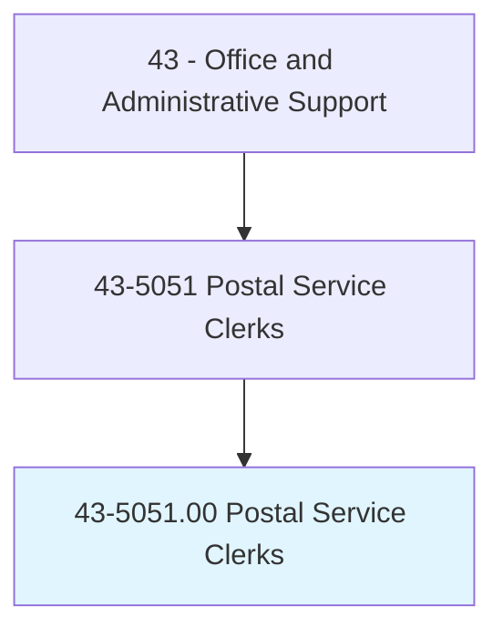
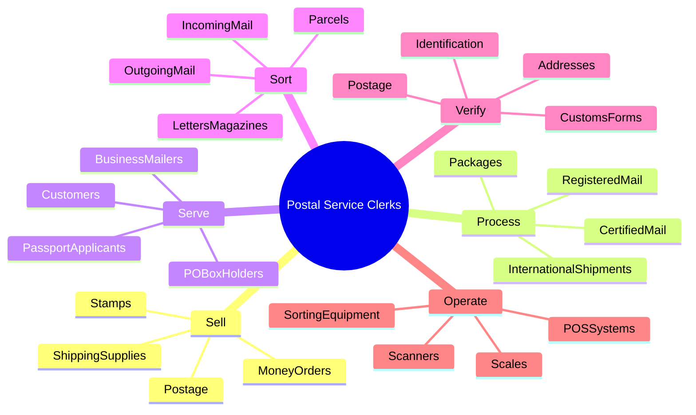
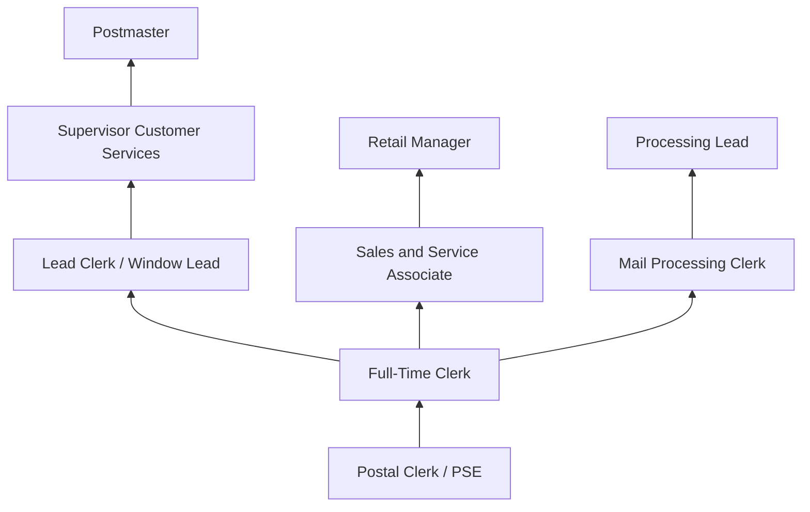
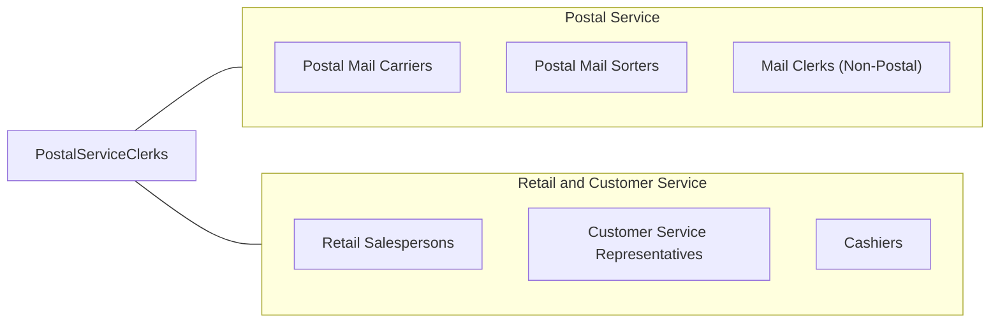

# Postal Service Clerks

> Perform any combination of tasks in a United States Postal Service (USPS) post office, such as receive letters and parcels; sell postage and revenue stamps, postal cards, and stamped envelopes; fill out and sell money orders; place mail in pigeon holes of mail rack or in bags; and examine mail for correct postage.

## Overview

Postal Service Clerks work in USPS post offices serving customers at retail windows and sorting mail in back-office operations. At the counter, they sell postage, process package shipments, issue money orders, handle registered and certified mail, answer customer questions about postal services, and process passport applications. In processing areas, they sort incoming and outgoing mail by destination.

These clerks are federal employees represented by the American Postal Workers Union (APWU), working in post offices ranging from small rural stations to large urban processing facilities. Their duties require knowledge of postal regulations, rate structures, mail classifications, shipping options, and customs requirements for international mail.

The role has evolved with declining mail volume and growing package volume driven by e-commerce. Clerks increasingly handle parcel services, compete with commercial shipping providers, and manage expanded retail services while maintaining the universal service mission of USPS. Customer service skills have become increasingly important as postal retail operations focus on service quality and revenue generation.

## Classification Hierarchy

## Key Statistics

| Metric | Value |
|--------|-------|
| SOC Code | 43-5051.00 |
| Job Zone | 2 (Some Preparation) |
| Category | [Office and Administrative Support](/occupations/Administrative/index) |
| Median Annual Salary | $52,600 |
| Salary Range | $38,000 - $65,000 |
| 10th Percentile | $38,500 |
| 90th Percentile | $64,800 |
| Employment | ~75,000 |
| Projected Growth | -10% (declining) |
| Core Tasks | 30 |
| Source | O*NET |

## Core Tasks

### sell.PostalProducts

Postal Service Clerks sell stamps, shipping services, and postal products to customers.

**Actions:**
- `sell.Postage.for.MailAndParcels` - Calculate and collect postage for shipments
- `sell.Stamps.and.StampedProducts` - Sell individual stamps, stamp sheets, and stamped envelopes
- `sell.MoneyOrders.for.SecurePayment` - Issue domestic and international money orders
- `sell.ShippingSupplies.including.Boxes` - Provide packaging materials and supplies
- `recommend.Services.based.on.CustomerNeeds` - Advise on appropriate shipping options
- `process.Payments.via.CashCardCheck` - Handle various payment methods

### process.MailShipments

Postal Service Clerks process packages and special mail services.

**Actions:**
- `process.Packages.for.DomesticShipping` - Accept and process parcels for delivery
- `process.InternationalShipments.with.CustomsForms` - Handle global mail requiring documentation
- `process.RegisteredMail.with.ChainOfCustody` - Accept valuables requiring insurance and tracking
- `process.CertifiedMail.for.ProofOfMailing` - Issue certified mail receipts and returns
- `process.PriorityMail.and.Express` - Handle expedited shipping services
- `process.Held.Mail.and.Forwarding` - Manage address changes and holds

### serve.PostalCustomers

Postal Service Clerks provide customer service at retail windows and service areas.

**Actions:**
- `serve.Customers.at.RetailWindow` - Assist walk-in customers with postal needs
- `serve.POBoxHolders.with.MailAccess` - Manage PO Box services and mail pickup
- `serve.PassportApplicants.as.AcceptanceAgent` - Process passport applications
- `serve.BusinessMailers.with.BulkServices` - Assist commercial customers with bulk mail
- `answer.Questions.about.PostalServices` - Provide information on rates, services, and policies
- `resolve.CustomerComplaints.and.Issues` - Address service problems and concerns

### sort.MailItems

Postal Service Clerks sort mail for distribution and delivery.

**Actions:**
- `sort.IncomingMail.by.POBox` - Distribute mail to post office boxes
- `sort.OutgoingMail.by.Destination` - Route mail for transportation to other facilities
- `sort.Parcels.for.CarrierRoutes` - Organize packages for delivery
- `sort.LettersAndFlats.into.Cases` - Separate mail by type and destination
- `prepare.Mail.for.Dispatch` - Bundle and stage mail for transportation
- `process.Returns.and.UndeliverableMail` - Handle mail that cannot be delivered

### verify.MailCompliance

Postal Service Clerks check mail for proper addressing, postage, and compliance.

**Actions:**
- `verify.Addresses.for.Deliverability` - Check addressing for accuracy
- `verify.Postage.is.SufficientForClass` - Confirm correct postage for weight and class
- `verify.CustomsForms.for.InternationalMail` - Review required documentation
- `verify.Identification.for.SensitiveTransactions` - Confirm ID for money orders and mail pickup
- `verify.Hazmat.Compliance.for.Parcels` - Screen packages for prohibited materials
- `verify.Mailability.per.PostalRegulations` - Ensure items meet postal standards

### operate.PostalSystems

Postal Service Clerks use point-of-sale and processing equipment.

**Actions:**
- `operate.POSSystems.for.Transactions` - Process sales and service transactions
- `operate.Scales.to.DeterminePostage` - Weigh items for rate calculation
- `operate.Scanners.for.Tracking` - Scan barcodes for package visibility
- `operate.SortingEquipment.for.MailProcessing` - Use automation for mail sorting
- `balance.Cash.Drawer.at.ShiftEnd` - Reconcile daily financial transactions
- `run.Reports.for.OfficeManagement` - Generate operational and financial reports

## Skills & Competencies

### Technical Skills
- **Postal Regulations and Rate Structures** - Expert (domestic, international, special services)
- **Mail Sorting and Processing** - Advanced (manual and automated sorting)
- **Point-of-Sale Systems** - Advanced (USPS retail systems, transaction processing)
- **Package Handling and Shipping** - Advanced (weight, dimensions, rates, restrictions)
- **Passport Processing** - Intermediate (acceptance agent procedures)
- **Money Order Processing** - Advanced (issuance, verification, cashing)
- **Customer Service** - Advanced (retail service, problem resolution)
- **Cash Handling** - Advanced (transactions, drawer management, reconciliation)

### Soft Skills
- **Customer Service** - Critical (retail window service, public interaction)
- **Accuracy** - Critical (transactions, mail sorting, compliance)
- **Speed** - Essential (efficient service, line management)
- **Communication** - Essential (explaining services, answering questions)
- **Patience** - Essential (difficult customers, complex inquiries)
- **Reliability** - Critical (attendance, consistency)
- **Multitasking** - Important (handling multiple service requests)

## Education & Certifications

| Requirement | Details |
|-------------|---------|
| Typical Education | High school diploma |
| Postal Exam (474) | Required for employment (assessment of abilities) |
| USPS Training | On-the-job training in postal procedures (2-4 weeks) |
| Background Check | Federal employment requirement |
| Safe Driving Record | Required for some positions |
| Passport Acceptance Training | For offices processing passport applications |
| Hazmat Awareness | Screening for prohibited materials |

## Career Progression

### Career Pathway Details

| Level | Title | Years Experience | Key Responsibilities |
|-------|-------|------------------|----------------------|
| Entry | PSE (Postal Support Employee) | 0-2 years | Window service, basic transactions, mail sorting |
| Career | Full-Time Clerk | 2-5 years | All window services, specialized services, training |
| Lead | Lead Clerk / SSA | 5-10 years | Window supervision, revenue, customer escalations |
| Supervisory | Supervisor Customer Services | 10+ years | Office operations, staff management, performance |
| Management | Postmaster | 15+ years | Full office responsibility, community relations |

### Alternative Career Paths

| Path | Description | Requirements |
|------|-------------|--------------|
| Mail Processing | Focus on sorting operations | Processing experience, machinery skills |
| Retail Sales | Revenue and service excellence | Sales skills, retail focus |
| Operations | Distribution and logistics | Operations experience, leadership |
| Administrative | Office management support | Administrative skills, systems knowledge |

## Industry Variations

| Setting | Focus | Unique Aspects |
|---------|-------|----------------|
| Urban Post Offices | High-volume retail | Long lines; diverse services; passport processing; multilingual needs |
| Suburban Offices | Full-service retail | Community relationships; PO boxes; package pickup; business services |
| Rural Stations | Small office operations | Solo clerk; limited hours; multi-function role; community hub |
| Contract Stations | Limited services | Retail locations; basic services; supervision by contractor |
| Airport Facilities | Express and international | Customs; overnight shipping; business travelers |
| Campus Offices | Student and faculty service | Peak periods; package volume; academic calendar |

### Urban Post Office Operations

Urban clerks handle high customer volumes with diverse service needs, including significant passport processing, international mail, and multilingual customer interactions. These offices often have specialized windows for business mailers, PO Box services, and package pickup. Managing long lines efficiently while providing quality service is essential.

### Rural Post Office Operations

Rural postal clerks often work alone or with minimal staff, handling all aspects of office operations from window service to mail sorting to administrative tasks. They develop close relationships with community members and serve as the sole access point for postal services in their areas. Many rural offices have limited hours, requiring efficiency in completing all tasks.

### Suburban Community Offices

Suburban clerks balance steady retail traffic with personalized service, often knowing regular customers by name. These offices handle significant residential package volume, PO Box services, and local business mail. Community relationships and service quality are priorities.

## Technology & Tools

### Point of Sale and Retail
- **POS Systems** - USPS retail point-of-sale systems
- **Scales** - Digital postal scales for weight and rate
- **Payment Processing** - Cash, credit/debit, check acceptance
- **Money Order Equipment** - Issuance and verification systems

### Sorting and Processing
- **Sorting Cases** - Manual letter and flat sorting
- **Barcode Scanners** - Package tracking and mail processing
- **Postage Meters** - Business mail processing
- **Automated Equipment** - Small-scale sorting systems

### Tracking and Information
- **USPS Tracking** - Package and mail visibility systems
- **Address Management** - ZIP code and address verification
- **Rate Calculator** - Postage calculation tools
- **Passport Systems** - Acceptance agent processing

## Work Environment

### Physical Setting
- Post office retail lobby and service windows
- Back-office sorting and processing areas
- Customer service environment with public interaction
- Standing work at service windows
- Mail handling areas with sorting cases

### Work Schedule
- Full-time and part-time positions available
- Variable schedules including Saturdays
- Holiday work for package season
- Split shifts in some facilities
- Extended hours during peak periods

### Physical Requirements
- Standing for extended periods at windows
- Lifting packages up to 70 lbs
- Repetitive motion in sorting activities
- Manual dexterity for transactions
- Walking between service and sorting areas

### Union Representation
- American Postal Workers Union (APWU)
- Collective bargaining agreements
- Grievance procedures
- Seniority-based bidding for positions
- Pay scales and step increases

## Related Occupations

### Related Occupation Comparison

| Occupation | Similarity | Key Difference |
|------------|------------|----------------|
| Postal Mail Carriers | High | Delivery vs retail service |
| Postal Mail Sorters | High | Processing vs customer service |
| Retail Salespersons | Medium | Private sector vs federal service |
| Customer Service Representatives | Medium | Phone/digital vs in-person service |

## Industries

- [Federal Government](/industries/PublicAdministration) - Primary Employment (USPS)

## Departments

This occupation typically works in:
- Retail Window - Customer service counter operations
- Mail Processing - Sorting and distribution
- Administration - Office management support
- Passport Services - Acceptance agent function
- Business Mail - Commercial customer services

## Performance Metrics

| Metric | Description | Typical Target |
|--------|-------------|----------------|
| Wait Time in Line (WTIL) | Customer wait time | <5 minutes target |
| Revenue | Window sales performance | Revenue goals |
| Customer Satisfaction | Mystery shopper and survey scores | High ratings |
| Transaction Accuracy | Error rate in financial transactions | Zero tolerance |
| Attendance | Reliability and schedule adherence | High attendance |

## Compensation and Benefits

### Pay Structure
- Hourly pay with grade and step progression
- Sunday premium pay
- Night differential for applicable hours
- Overtime (1.5x) for hours over 8/day
- Holiday pay premiums

### Federal Benefits
- Federal Employees Health Benefits (FEHB)
- Federal Employees Retirement System (FERS)
- Thrift Savings Plan (TSP) with employer match
- Annual leave and sick leave accrual
- Federal holidays (11 paid holidays)
- Life insurance (FEGLI)
- Career job security

---

*Source: O*NET 43-5051.00 - ONETOccupation*
