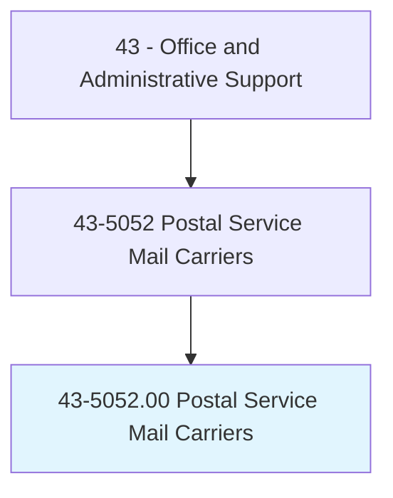
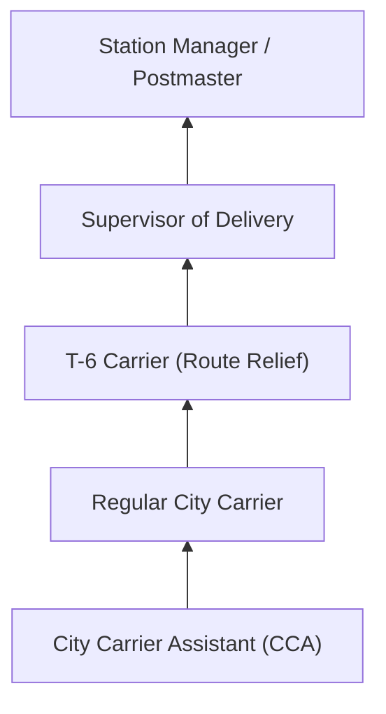
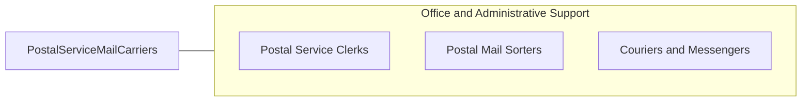

# Postal Service Mail Carriers

> Sort and deliver mail for the United States Postal Service (USPS). Deliver mail on established route by vehicle or on foot.

## Overview

Postal Service Mail Carriers sort and deliver mail along established routes, bringing letters, packages, and periodicals to residential and business addresses. They work on foot in urban areas, by vehicle in suburban and rural settings, or a combination of both. Carriers also collect outgoing mail from mailboxes, deliver certified and registered mail requiring signatures, and redirect undeliverable items.

This is a physically demanding federal position requiring carriers to walk extensive distances, carry heavy mail bags, navigate stairs, and work outdoors in all weather conditions. They begin shifts by sorting mail for their routes, loading vehicles, and planning efficient delivery sequences. Rural carriers often use their personal vehicles and cover much larger geographic areas.

Mail carriers are essential to the USPS universal service mission, serving every address in the United States six days a week. The role has evolved with growing package volume from e-commerce, increasing the weight and bulk of daily deliveries while letter volume has declined.

## Classification Hierarchy

## Key Statistics

| Metric | Value |
|--------|-------|
| SOC Code | 43-5052.00 |
| Job Zone | 2 (Some Preparation) |
| Category | [Office and Administrative Support](/occupations/Administrative/index) |
| Median Annual Salary | $54,500 |
| Employment | ~330,000 |
| Projected Growth | -4% (declining) |
| Core Tasks | 25 |
| Source | O*NET |

## Core Tasks

Core task data with GraphDL semantic actions for this occupation is maintained in the data pipeline. See [O*NET 43-5052.00](https://www.onetonline.org/link/summary/43-5052.00) for detailed task information.

## Skills & Competencies

### Technical Skills
- **Route Navigation** - Expert
- **Mail Sorting and Sequencing** - Advanced
- **Package Handling** - Advanced
- **Postal Regulations** - Advanced
- **Delivery Vehicle Operation** - Advanced

### Soft Skills
- **Physical Stamina** - Critical
- **Reliability** - Critical
- **Self-Direction** - Critical
- **Weather Resilience** - Essential
- **Customer Relations** - Essential

## Education & Certifications

| Requirement | Details |
|-------------|---------|
| Typical Education | High school diploma |
| Postal Exam (474) | Required for employment |
| Valid Driver's License | Required for vehicle routes |
| Safe Driving Record | 2-year clean record |
| Background Check | Federal employment requirement |

## Career Progression

## Industry Variations

| Setting | Focus | Unique Aspects |
|---------|-------|----------------|
| City Delivery | Walking routes | Heavy foot travel; apartment buildings; dense delivery points |
| Suburban Delivery | Mounted (vehicle) routes | Curbside delivery; longer distances; mixed walking/driving |
| Rural Delivery | Rural carrier routes | Personal vehicle; large area; fewer stops; RCA career path |
| Parcel Post | Package-focused | Amazon Sundays; heavy lifting; e-commerce volume |

## Technology & Tools

- **Scanning** - Handheld delivery scanners, GPS tracking
- **Vehicles** - LLV, Metris, ProMaster (NGDV coming)
- **Sorting** - Delivery point sequencing (DPS), flat sorting
- **Communication** - Mobile devices, route maps

## Related Occupations

## Departments

This occupation typically works in:
- Delivery Operations - Route delivery
- Station Operations - Mail sorting and dispatch
- Transportation - Vehicle operations
- Customer Service - Signature services

---

*Source: O*NET 43-5052.00 - ONETOccupation*
