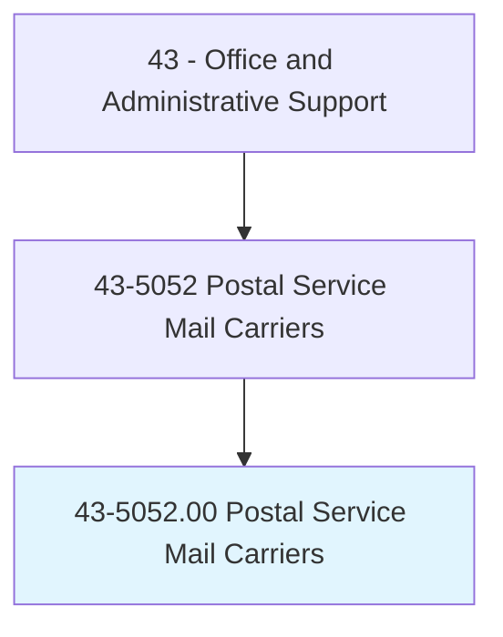
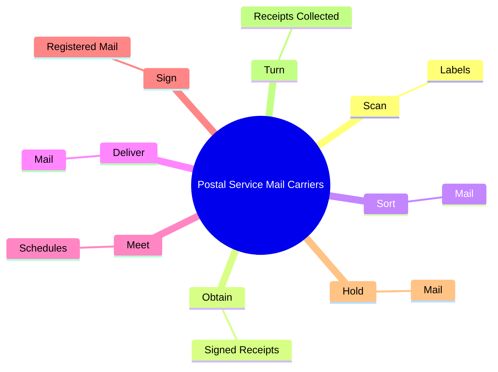
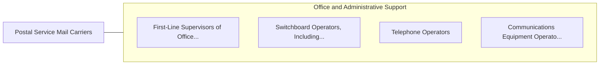

# Postal Service Mail Carriers

> Sort and deliver mail for the United States Postal Service (USPS). Deliver mail on established route by vehicle or on foot. Includes postal service mail carriers employed by USPS contractors.

## Overview

Postal Service Mail Carriers is an occupation within the Office and Administrative Support category. Sort and deliver mail for the United States Postal Service (USPS). Deliver mail on established route by vehicle or on foot.

## Classification Hierarchy

## Key Statistics

| Metric | Value |
|--------|-------|
| SOC Code | 43-5052.00 |
| Category | [Office and Administrative Support](/occupations/Administrative/index) |
| Task Count | 37 |
| Source | O*NET |

## Core Tasks

### scan.Labels

Postal Service Mail Carriers scan labels as part of their core responsibilities.

**Actions:**
- `scan.Labels.on.Letters.to.confirm.Receipt`
- `scan.Labels.on.Parcels.to.confirm.Receipt`

### obtain.SignedReceipts

Postal Service Mail Carriers obtain signed receipts as part of their core responsibilities.

**Actions:**
- `obtain.SignedReceipts.for.Registered`
- `obtain.SignedReceipts.for.Certified`
- `obtain.SignedReceipts.for.InsuredMail`
- `obtain.SignedReceipts.for.CollectAssociatedCharges`

### sort.Mail

Postal Service Mail Carriers sort mail as part of their core responsibilities.

**Actions:**
- `sort.Mail.for.Delivery`
- `sort.Mail.for.ArrangingIt.in.DeliverySequence`

## Skills & Competencies

### Technical Skills
- **Office Management** - Advanced
- **Data Entry** - Advanced
- **Records Management** - Advanced

### Soft Skills
- **Communication** - Essential
- **Problem Solving** - Essential
- **Critical Thinking** - Important
- **Teamwork** - Important
- **Adaptability** - Important

## Related Occupations

## Industries

This occupation is found across multiple industries. See [Industries](/industries) for sector-specific employment data.

## Career Progression

---

*Source: O*NET 43-5052.00 - ONETOccupation*
