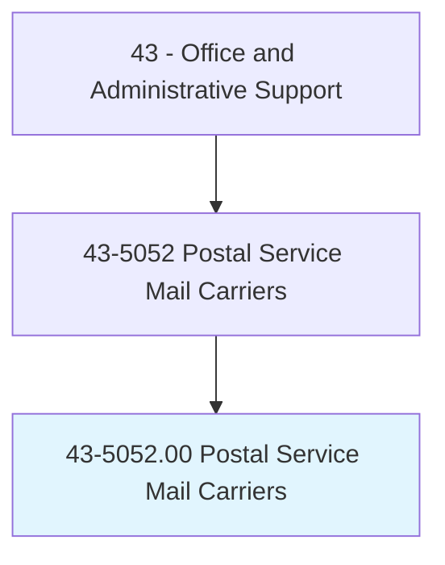
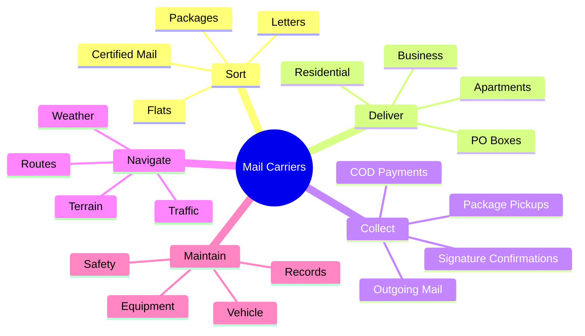
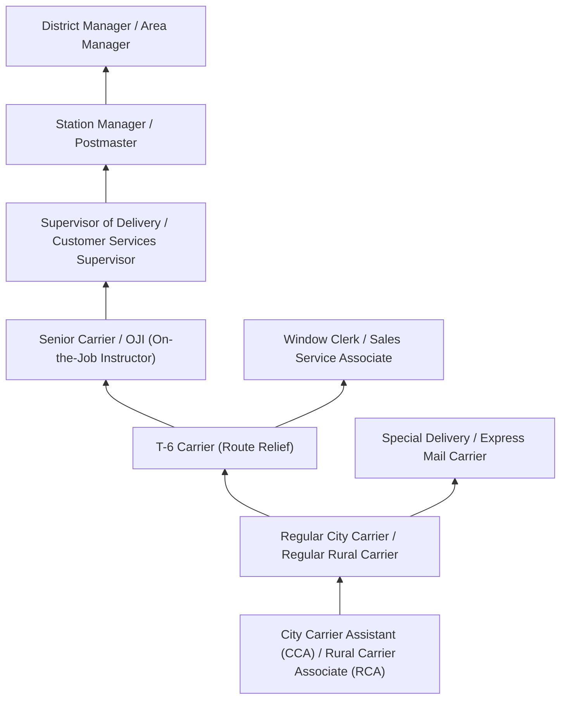
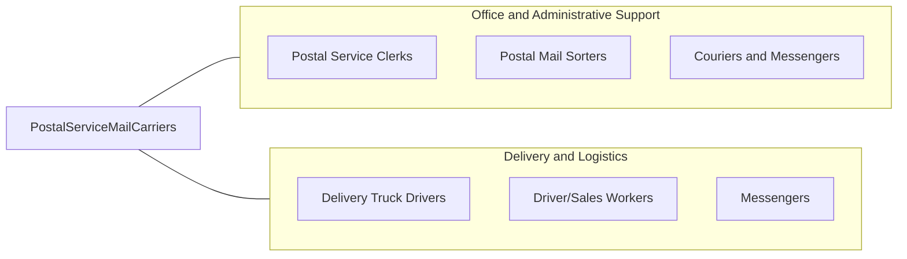

# Postal Service Mail Carriers

> Sort and deliver mail for the United States Postal Service (USPS). Deliver mail on established route by vehicle or on foot.

## Overview

Postal Service Mail Carriers sort and deliver mail along established routes, bringing letters, packages, periodicals, and parcels to residential and business addresses throughout the United States. They work on foot in urban neighborhoods, by vehicle in suburban and rural settings, or using a combination of both methods. Beyond basic delivery, carriers also collect outgoing mail from mailboxes and businesses, deliver certified, registered, and insured mail requiring signatures, attempt redelivery of undeliverable items, and provide pickup services for prepaid packages.

This is a physically demanding federal position requiring carriers to walk extensive distances, carry heavy mail bags (up to 35 pounds), navigate stairs and uneven terrain, and work outdoors in all weather conditions including extreme heat, cold, rain, and snow. Carriers begin their shifts at post offices by sorting mail into delivery sequence for their routes, loading vehicles, and planning efficient delivery patterns. Rural carriers often use their personal vehicles (with mileage compensation) and cover much larger geographic areas with fewer delivery points per mile.

Mail carriers are essential to the USPS universal service mission, which mandates delivery to every address in the United States six days a week, regardless of location or profitability. The role has evolved significantly with the explosive growth of e-commerce package volume, increasing the weight and bulk of daily deliveries while traditional letter mail has steadily declined. Carriers now deliver Amazon packages on Sundays and handle last-mile delivery for multiple e-commerce partners, transforming what was once primarily a letter-carrying job into package-focused logistics work.

## Classification Hierarchy



## Key Statistics

| Metric | Value |
|--------|-------|
| SOC Code | 43-5052.00 |
| Job Zone | 2 (Some Preparation) |
| Category | [Office and Administrative Support](/occupations/Administrative/index) |
| Median Annual Salary | $54,500 |
| Salary Range | $38,000 - $72,000 |
| 10th Percentile | $38,500 |
| 90th Percentile | $71,800 |
| Employment | ~330,000 |
| Projected Growth | -4% (declining) |
| Annual Openings | ~32,000 |
| Core Tasks | 25 |
| Source | O*NET |

## Core Tasks



### sort.MailForDelivery

Mail Carriers sort mail into delivery sequence at the post office.

**Actions:**
- `sort.Mail.into.DeliverySequence`
- `organize.Packages.for.RouteLoading`
- `verify.Addresses.on.MailPieces`
- `identify.Undeliverable.Items`

### deliver.MailOnRoute

Mail Carriers deliver mail along their assigned routes.

**Actions:**
- `deliver.Mail.to.Addresses`
- `obtain.Signatures.for.CertifiedMail`
- `collect.OutgoingMail.from.Boxes`
- `scan.Packages.for.Tracking`

## Skills & Competencies

### Technical Skills
- **Route Navigation** - Expert (efficient delivery sequencing, address location)
- **Mail Sorting and Sequencing** - Expert (DPS, flats, packages)
- **Package Handling** - Advanced (lifting, loading, damage prevention)
- **Postal Regulations** - Advanced (delivery standards, mail classes)
- **Delivery Vehicle Operation** - Advanced (LLV, ProMaster, personal vehicle)
- **Scanner/Mobile Device Operation** - Advanced (tracking, signatures)
- **GPS and Mapping** - Advanced (route optimization)
- **Customer Service** - Advanced (public interaction, problem resolution)

### Soft Skills
- **Physical Stamina** - Critical (walking 10-15 miles daily, lifting)
- **Reliability** - Critical (showing up regardless of conditions)
- **Self-Direction** - Critical (working independently on route)
- **Weather Resilience** - Critical (delivering in all conditions)
- **Customer Relations** - Essential (positive community interactions)
- **Time Management** - Essential (completing routes efficiently)
- **Safety Awareness** - Critical (dogs, traffic, hazards)
- **Problem Solving** - Important (address issues, access problems)

## Education & Certifications

| Requirement | Details |
|-------------|---------|
| Typical Education | High school diploma |
| Postal Exam (474/477) | Required for employment (95th percentile preferred) |
| Valid Driver's License | Required for mounted and rural routes |
| Safe Driving Record | 2-year clean record minimum |
| Background Check | Federal employment requirement |
| Drug Testing | Pre-employment and random testing |
| Physical Examination | Medical clearance for physical demands |
| Postal Academy Training | 1-2 weeks of classroom and on-route training |

## Career Progression



### Career Pathway Details

| Level | Title | Years Experience | Key Responsibilities |
|-------|-------|------------------|----------------------|
| Entry | CCA / RCA (Non-career) | 0-2 years | Route assistance, Sunday deliveries, substitute work |
| Career | Regular Carrier | 2-5 years | Assigned route, full benefits, union protections |
| Relief | T-6 Carrier | 4-8 years | Cover 5 routes, flexibility, route knowledge |
| Trainer | OJI / Senior Carrier | 8-12 years | Train new carriers, route evaluations |
| Supervisory | Delivery Supervisor | 10-15 years | Manage carriers, station operations, discipline |
| Management | Station Manager / Postmaster | 15+ years | Full station responsibility, budgets, community relations |

### Union Representation

| Union | Membership | Coverage |
|-------|------------|----------|
| NALC (National Association of Letter Carriers) | City carriers | Pay, benefits, working conditions |
| NRLCA (National Rural Letter Carriers' Association) | Rural carriers | Rural carrier agreements |

## Industry Variations

| Setting | Focus | Unique Aspects |
|---------|-------|----------------|
| City Delivery (Park and Loop) | Walking routes | Heavy foot travel; apartment buildings; dense delivery points; 600-800 deliveries |
| City Delivery (Mounted) | Vehicle curbside | Curbside mailboxes; limited walking; suburban density; 400-600 deliveries |
| Rural Delivery | Rural carrier routes | Personal vehicle (EMA); large area; longer distances; 300-500 deliveries |
| Parcel Post / Amazon Sundays | Package-focused | Heavy lifting; e-commerce volume; Sunday operations; vehicle loading |
| Auxiliary Routes | Overflow and growth | Newer routes; still being evaluated; may split or combine |
| Express/Priority | Time-sensitive mail | Guaranteed delivery times; tracking requirements; signature services |

### City Carrier Operations

City carriers work in urban and suburban areas, typically starting at 7:00-8:00 AM and finishing routes by 4:00-5:00 PM. Park-and-loop routes involve parking the vehicle, walking a section, returning to advance the vehicle, and repeating. Mounted routes deliver from the vehicle to curbside mailboxes. City carriers are represented by NALC and progress from CCA to career status based on seniority.

### Rural Carrier Operations

Rural carriers cover larger geographic areas with more driving between deliveries. Many use personal vehicles (with equipment allowance) and receive route-based compensation rather than hourly pay. Rural routes are evaluated annually based on mail volume and delivery points. RCAs substitute on regular routes before gaining career status as regulars retire or routes are created.

### Sunday and Holiday Delivery

E-commerce partnerships (especially Amazon) have created Sunday delivery operations staffed primarily by CCAs. Carriers deliver packages only (no letters) on Sundays, working from parcels staged the previous day. Some holidays now include package delivery as well, changing the traditional USPS six-day schedule.

## Technology & Tools

### Scanning and Tracking
- **Mobile Delivery Device (MDD)** - Handheld scanner for tracking
- **GPS Tracking** - Route monitoring and navigation
- **Informed Delivery** - Customer notification system
- **Package Pickup Scheduling** - Customer pickup requests

### Vehicles and Equipment
- **Long Life Vehicle (LLV)** - Traditional delivery vehicle (being retired)
- **Metris / ProMaster** - Newer delivery vehicles
- **Next Generation Delivery Vehicle (NGDV)** - New Oshkosh vehicles (deployment in progress)
- **Personal Vehicles** - Rural carrier option with EMA
- **Satchels and Carts** - Mail carrying equipment

### Sorting Technology
- **Delivery Point Sequencing (DPS)** - Automated letter sorting
- **Flat Sequencing System (FSS)** - Magazine and catalog sorting
- **Package Sorting** - Small package sorting systems
- **Dynamic Route Optimization** - Route planning software

### Communication
- **Postal Service Intranet** - Employee resources
- **Time and Attendance** - Clock rings, leave requests
- **Safety Reporting** - Incident documentation
- **Union Resources** - NALC/NRLCA communications

## Related Occupations



### Related Occupation Comparison

| Occupation | Similarity | Key Difference |
|------------|------------|----------------|
| Postal Service Clerks | High | Window service vs route delivery |
| Couriers and Messengers | High | Private sector vs federal employment |
| Delivery Truck Drivers | Medium | Package-only vs full mail service |
| UPS/FedEx Drivers | Medium | Private carriers vs USPS |

## Industries

- [Federal Government (USPS)](/industries/PublicAdministration) - Primary Employment
- [Postal Service](/industries/Transportation) - Core Industry

## Departments

This occupation typically works in:
- Delivery Operations - Route management and carrier supervision
- Station Operations - Mail sorting, dispatch, and local management
- Transportation - Vehicle operations and maintenance
- Customer Service - Signature services, holds, and pickups
- Safety - Incident prevention and training

## Work Environment

### Physical Setting
- Post office/station for morning sorting and vehicle loading
- Outdoor delivery throughout assigned route
- Vehicle operation (LLV, Metris, personal vehicle)
- Walking on sidewalks, driveways, stairs
- All weather conditions (heat, cold, rain, snow, ice)

### Work Schedule
- Early morning start (6:00-8:00 AM typical)
- 8-hour shifts with overtime common
- Six-day delivery (Monday-Saturday)
- Sunday Amazon/package delivery
- Holiday work varies by mail volume
- CCAs may work split shifts and irregular schedules

### Physical Demands
- Walking 10-15 miles daily on park-and-loop routes
- Lifting packages up to 70 pounds
- Carrying mail satchel (35 pounds)
- Repetitive reaching, bending, climbing stairs
- Exposure to weather extremes
- Standing for extended periods while sorting

### Work Characteristics
- Independent work on route after leaving station
- Physical demands throughout shift
- Customer interaction at delivery points
- Time pressure to complete route
- Safety awareness (dogs, traffic, slips/falls)

### Safety Considerations
- Dog bite prevention and response
- Slip, trip, and fall hazards
- Vehicle safety and defensive driving
- Heat illness and cold exposure
- Ergonomic injuries from lifting and carrying
- Personal safety in various neighborhoods

## Compensation and Benefits

### Federal Employee Benefits

| Benefit | Details |
|---------|---------|
| Health Insurance | FEHB program with agency contribution |
| Retirement | FERS pension + TSP (401k equivalent) |
| Annual Leave | 13-26 days based on service time |
| Sick Leave | 13 days per year, unlimited accumulation |
| Life Insurance | FEGLI program |
| Holidays | 11 paid federal holidays (when not delivering) |
| Uniform Allowance | Annual allowance for required uniforms |

### Career vs Non-Career Status

| Status | Pay | Benefits | Job Security |
|--------|-----|----------|--------------|
| CCA/RCA | Lower hourly, limited hours | Limited health, no retirement | Can be separated |
| Career Regular | Full hourly + step increases | Full federal benefits | Civil service protections |

## GraphDL Semantic Structure

```graphdl
Postal Service Mail Carriers perform:
- sort.Mail.into.DeliverySequence
- deliver.Mail.to.ResidentialAddresses
- deliver.Packages.to.Businesses
- collect.OutgoingMail.from.Mailboxes
- obtain.Signatures.for.CertifiedMail
- navigate.Routes.in.AllWeather
- scan.Items.for.TrackingSystem
- maintain.Vehicles.for.SafeOperation
```

---

*Source: O*NET 43-5052.00 - ONETOccupation*
